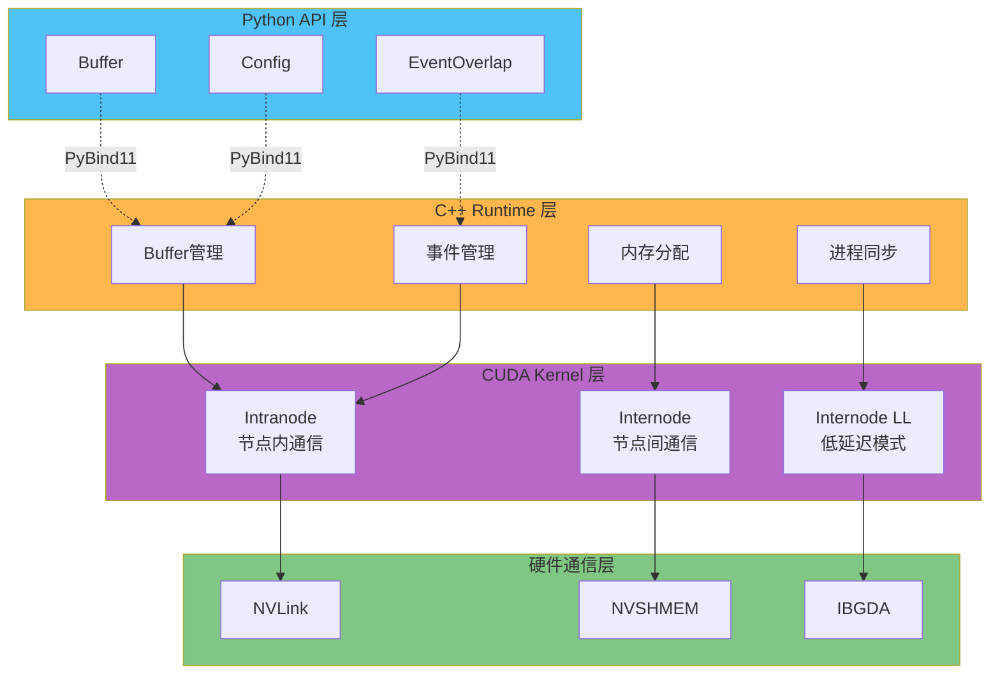
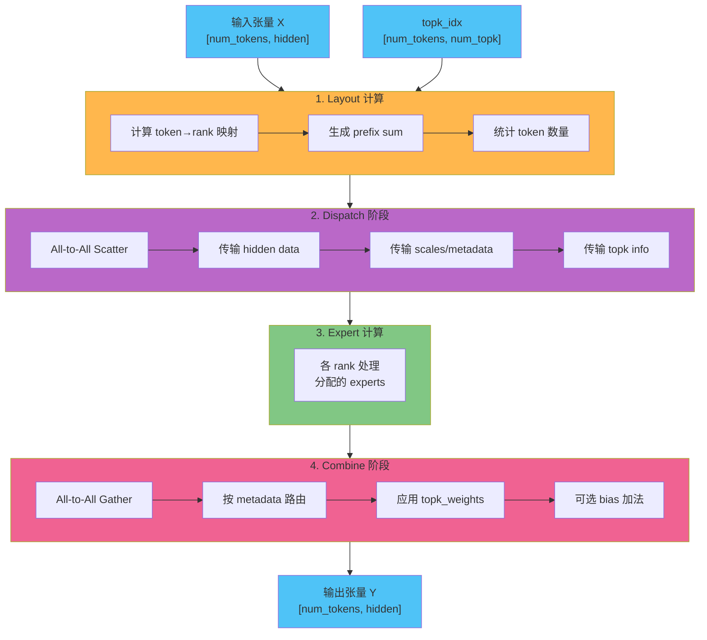
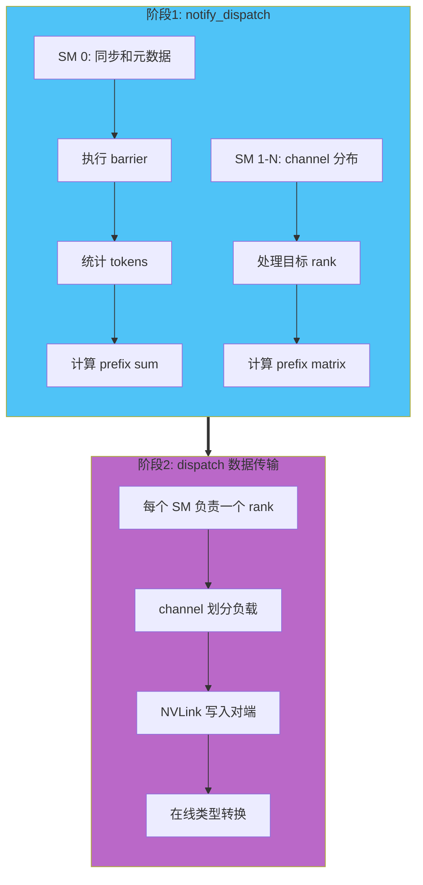
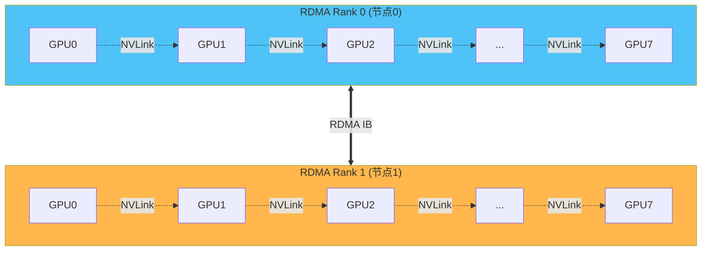
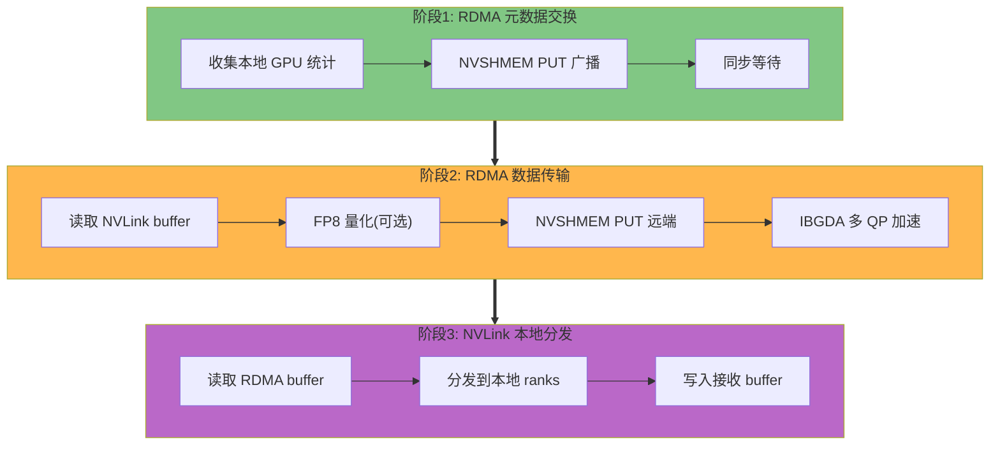
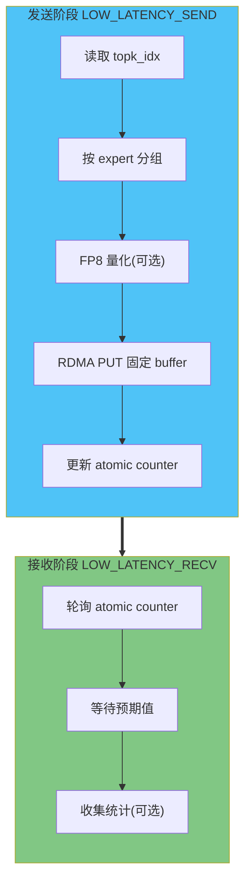
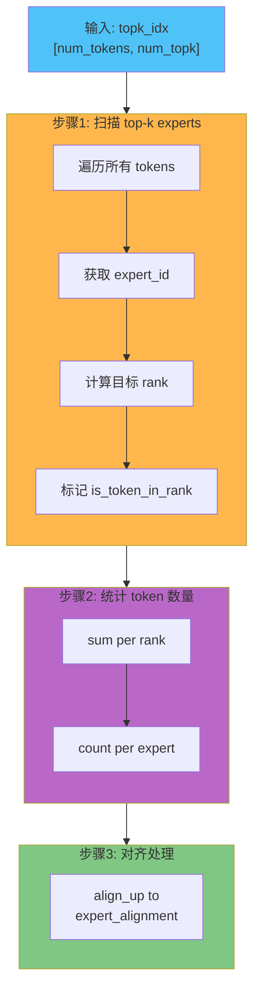

# DeepEP 架构分析文档

## 1. 项目概述

**DeepEP** 是一个专为混合专家模型(Mixture-of-Experts, MoE)和专家并行(Expert Parallelism, EP)设计的高性能通信库。它提供了高吞吐量和低延迟的All-to-All GPU内核，专门优化了MoE模型中的dispatch和combine操作。

该项目由DeepSeek团队开发，是支撑DeepSeek-V3大规模MoE训练和推理的核心基础设施。

### 核心特性

- **高吞吐量内核**: 支持NVLink域到RDMA域的非对称带宽转发
- **低延迟内核**: 主要使用RDMA通信，适用于推理解码任务（可配置是否使用NVLink加速）
- **多精度支持**: 支持FP8、BF16等低精度操作
- **通信计算重叠**: 基于hook的方法，不占用SM资源
- **可扩展性**: 支持节点内(NVLink)和节点间(RDMA)通信

### 性能指标

**节点内通信** (H800, ~160 GB/s NVLink):
- 8个EP ranks: ~153-158 GB/s

**节点间通信** (H800 + CX7 IB 400Gb/s, ~50 GB/s RDMA):
- 16-64个EP ranks: ~43-58 GB/s

**低延迟模式**:
- 8 EP ranks: 77-114 us
- 256 EP ranks: 194-360 us

### 依赖的关键技术

DeepEP 构建在多个先进的GPU通信技术之上：

#### 1. **NVSHMEM (NVIDIA Symmetric Memory)**
NVSHMEM 是 NVIDIA 提供的分布式GPU内存访问库，实现了 OpenSHMEM 标准的 GPU 扩展。

**核心能力**:
- **对称内存模型**: 所有GPU可以直接访问彼此的显存，无需CPU参与
- **单边通信**: 支持 PUT/GET 操作，发起方可以直接读写远端GPU内存
- **集合通信**: 提供 barrier、broadcast、reduction 等原语
- **多传输支持**: 同时支持 NVLink (节点内) 和 InfiniBand RDMA (节点间)

**在DeepEP中的应用**:
- 节点间数据传输的底层实现
- 低延迟模式的核心通信机制
- RDMA buffer 的对称内存管理

#### 2. **IBGDA (InfiniBand GPU Direct Async)**
IBGDA 是 NVIDIA 与 Mellanox 合作开发的技术，允许 GPU 直接发起 RDMA 操作。

**核心能力**:
- **零CPU开销**: GPU 可以直接操作 InfiniBand HCA (Host Channel Adapter)
- **多QP并行**: 支持每个GPU使用多个Queue Pair同时传输
- **低延迟**: 绕过CPU，减少PCIe往返延迟

**在DeepEP中的应用**:
- 节点间dispatch/combine的高性能数据传输
- 低延迟模式的快速RDMA操作
- 多QP并行以提升带宽利用率

#### 3. **NVLink**
NVIDIA 的高速GPU互联技术，提供节点内GPU之间的直接连接。

**核心能力**:
- **高带宽**: H800单向带宽 ~160 GB/s per GPU
- **低延迟**: 比PCIe延迟低一个数量级
- **Peer-to-Peer**: GPU之间可以直接访问彼此的显存

**在DeepEP中的应用**:
- 节点内 dispatch/combine 的主要传输路径
- 节点间通信的本地聚合/分发
- 低延迟模式的可选加速路径

#### 4. **CUDA IPC (Inter-Process Communication)**
CUDA提供的进程间共享GPU内存机制。

**核心能力**:
- **内存共享**: 不同进程可以访问同一块GPU内存
- **零拷贝**: 通过句柄 (handle) 映射，避免数据复制

**在DeepEP中的应用**:
- 节点内多进程的buffer共享
- Barrier信号的共享内存实现

#### 5. **CUDA Fabric API (可选)**
新一代GPU内存管理API，支持更灵活的内存访问模式。

**核心能力**:
- **统一寻址**: 提供跨GPU的统一虚拟地址空间
- **细粒度控制**: 更好的内存访问权限管理

**在DeepEP中的应用**:
- 作为CUDA IPC的替代方案
- 支持更大规模的GPU集群

#### 6. **TMA (Tensor Memory Accelerator, SM90+)**
Hopper架构引入的硬件加速内存拷贝单元。

**核心能力**:
- **硬件加速**: 专用硬件单元处理张量拷贝
- **高带宽**: 更高效地利用显存带宽
- **异步执行**: 不占用SM计算资源

**在DeepEP中的应用**:
- H100/H800上的向量化数据传输
- 高吞吐dispatch/combine优化

---

## 2. 系统架构

### 2.1 整体架构图



### 2.2 数据流架构



---

## 3. 核心模块详解

### 3.1 Buffer 管理模块

**位置**: `deep_ep/buffer.py` + `csrc/deep_ep.hpp/cpp`

#### 核心职责

1. **内存管理**
   - NVLink Buffer: 节点内通信缓冲区
   - RDMA Buffer: 节点间通信缓冲区 (通过NVSHMEM)
   - 支持 Fabric API (GPU Direct Storage)

2. **进程同步**
   - IPC Handle 同步 (CUDA IPC / Fabric)
   - NVSHMEM 初始化和 Unique ID 交换
   - Barrier 机制

3. **通信流管理**
   - 独立的 communication stream
   - 事件同步机制
   - 计算通信重叠支持

#### 关键数据结构

```cpp
struct Buffer {
    // 缓冲区指针
    void* buffer_ptrs[NUM_MAX_NVL_PEERS];     // NVLink buffers
    void* rdma_buffer_ptr;                     // NVSHMEM buffer
    
    // 同步信号
    int* barrier_signal_ptrs[NUM_MAX_NVL_PEERS];
    
    // 接收计数器 (CPU-GPU 通信)
    volatile int* moe_recv_counter;
    volatile int* moe_recv_expert_counter;
    volatile int* moe_recv_rdma_counter;
    
    // 拓扑信息
    int rank, rdma_rank, nvl_rank;
    int num_ranks, num_rdma_ranks, num_nvl_ranks;
    
    // 低延迟模式特定
    bool low_latency_mode;
    int low_latency_buffer_idx;  // 双缓冲
    int* mask_buffer_ptr;         // 动态 rank 屏蔽
    int* sync_buffer_ptr;         // 自定义 barrier
};
```

#### 初始化流程

```python
# 1. 创建 Buffer 对象
buffer = deep_ep.Buffer(
    group=dist_group,
    num_nvl_bytes=nvl_size,
    num_rdma_bytes=rdma_size,
    low_latency_mode=False
)

# 2. 自动执行同步
# - 交换 device IDs
# - 交换 IPC handles
# - 初始化 NVSHMEM (如果需要)
# - 设置 IBGDA QP 数量

# 3. Buffer 可用
assert buffer.runtime.is_available()
```

---

### 3.2 Intranode Kernels (节点内通信)

**位置**: `csrc/kernels/intranode.cu`

#### 核心原理

**通信模式**: NVLink peer-to-peer 直接内存访问

**Dispatch 流程**:



#### 关键优化技术

1. **Channel 并行**
   ```cuda
   // 将 tokens 分成多个 channel，每个 channel 独立处理
   int token_start_idx, token_end_idx;
   get_channel_task_range(num_tokens, num_channels, 
                          channel_id, token_start_idx, token_end_idx);
   ```

2. **Barrier 优化**
   ```cuda
   template <int kNumRanks, bool init>
   __device__ void barrier_block(int** barrier_signal_ptrs, int rank) {
       // 使用 GPU 内存的原子操作实现快速 barrier
       // 避免 CPU 参与
   }
   ```

3. **对齐和向量化**
   - 数据对齐到 128 bytes
   - 使用 int4 向量加载/存储
   - TMA (Tensor Memory Accelerator) 支持 (SM90+)

#### Combine 流程

```
1. 从多个源 rank 收集数据
2. 按照 src_idx 排序重组
3. 应用 topk_weights 加权
4. 累加到输出张量 (使用 atomicAdd)
5. 可选添加 bias
```

---

### 3.3 Internode Kernels (节点间通信)

**位置**: `csrc/kernels/internode.cu`

#### 核心原理

**通信模式**: NVSHMEM + NVLink 混合

- **RDMA 通信**: 跨节点数据传输
- **NVLink 通信**: 节点内聚合/分发

#### 拓扑结构



#### Dispatch 流程



#### SourceMeta 编码

```cpp
struct SourceMeta {
    int src_rdma_rank;                  // 源 RDMA rank
    int is_token_in_nvl_rank_bits;      // 8-bit mask for 8 NVL ranks
    
    // 编码示例: token 来自 RDMA rank 2 的 GPU 0, 3, 5
    // src_rdma_rank = 2
    // is_token_in_nvl_rank_bits = 0b00101001
};
```

这个元数据在 combine 阶段用于路由数据返回正确的 GPU。

#### 关键优化

1. **IBGDA (InfiniBand GPU Direct Async)**
   ```cuda
   nvshmemi_ibgda_put_nbi_warp<true>(
       dst_addr, src_addr, size, dst_rank, qp_id, lane_id, 0
   );
   ```
   - 直接从 GPU 发起 RDMA 操作
   - 多 QP 并行传输
   - Warp 级别的协作

2. **双层 Buffer**
   - RDMA buffer: 节点间数据缓冲
   - NVLink buffer: 节点内数据分发

3. **动态 Channel 分配**
   - 根据负载动态分配 channel
   - 平衡 NVLink 和 RDMA 带宽

---

### 3.4 Low-Latency Kernels (低延迟内核)

**位置**: `csrc/kernels/internode_ll.cu`

#### 设计目标

专为**推理解码**场景优化:
- 小 batch size (通常 128-512 tokens)
- 极低延迟要求 (< 200 us)
- 主要使用 RDMA 通信，在允许的配置下也会利用 NVLink 加速
- 支持通过环境变量 `NVSHMEM_DISABLE_P2P` 控制是否使用 NVLink
- 主要使用 RDMA 通信，在允许的配置下也会利用 NVLink 加速
- 支持通过环境变量 `NVSHMEM_DISABLE_P2P` 控制是否使用 NVLink

#### 核心特性

1. **双缓冲机制**
   ```cpp
   int low_latency_buffer_idx;  // 0 or 1
   
   // dispatch 使用 buffer 0，combine 使用 buffer 1
   // 下一次迭代切换
   ```

2. **Hook-based 通信计算重叠**
   ```python
   # dispatch 返回 recv_hook
   recv_x, handle, event, recv_hook = buffer.low_latency_dispatch(...)
   
   # 在 expert 计算前调用 hook
   if recv_hook:
       recv_hook()  # 轮询 RDMA 接收完成
   
   # expert 计算
   output = expert_forward(recv_x)
   
   # combine (同样有 hook)
   result, event, recv_hook = buffer.low_latency_combine(...)
   ```

3. **动态 Rank 屏蔽**
   ```cpp
   // 用于容错: 如果某个 rank 超时，动态屏蔽它
   void low_latency_update_mask_buffer(int rank_to_mask, bool mask);
   
   // barrier 实现会跳过被屏蔽的 rank
   if (is_rank_masked(mask_buffer_ptr, dst_rank)) {
       continue;  // 跳过这个 rank
   }
   ```

#### Dispatch 流程



#### Combine 流程

```
类似 dispatch，但数据流反向:
1. Expert 输出写入 RDMA buffer
2. 根据 src_info 路由回源 token
3. 应用 topk_weights
4. 可选零拷贝模式 (直接写入输出张量)
```

#### 关键优化

1. **预分配固定大小 Buffer**
   - 每个 rank 为每个 expert 预分配固定空间
   - 避免动态内存分配和复杂的地址计算

2. **Warp-Group 并行**
   ```cuda
   // 每个 expert 由一个 warp-group (多个 warp) 处理
   const auto warp_group_id = warp_id / num_warps_per_group;
   const auto responsible_expert_idx = sm_id * num_warp_groups + warp_group_id;
   ```

3. **轮询 vs 中断**
   - 使用主动轮询 (polling) 而非中断
   - 更低的延迟，代价是持续占用 CPU/GPU

4. **超时和容错**
   ```cuda
   auto start_time = clock64();
   uint64_t wait_recv_cost = 0;
   while (condition && 
          (wait_recv_cost = clock64() - start_time) <= NUM_TIMEOUT_CYCLES) {
       // polling
   }
   if (wait_recv_cost > NUM_TIMEOUT_CYCLES) {
       // 超时处理: 屏蔽该 rank
       atomicExch(mask_buffer_ptr + dst_rank, 1);
   }
   ```

---

### 3.5 Layout 计算模块

**位置**: `csrc/kernels/layout.cu`

#### 核心功能

在 dispatch 之前计算路由信息:

```python
num_tokens_per_rank,      # [num_ranks] 每个 rank 接收的 token 数
num_tokens_per_rdma_rank, # [num_rdma_ranks] 每个 RDMA rank 接收数
num_tokens_per_expert,    # [num_experts] 每个 expert 接收数
is_token_in_rank,         # [num_tokens, num_ranks] bool 矩阵
layout_event              # CUDA event
= buffer.get_dispatch_layout(topk_idx, num_experts)
```

#### 算法流程



#### 优化技术

- Warp-level reduction
- Shared memory 聚合
- Coalesced memory access

---

### 3.6 事件和同步机制

**位置**: `csrc/event.hpp` + `deep_ep/utils.py`

#### EventOverlap 类

```python
class EventOverlap:
    """通信计算重叠的便利封装"""
    
    def __init__(self, event: EventHandle):
        self.event = event
    
    def current_stream_wait(self):
        """当前流等待事件完成"""
        self.event.current_stream_wait()
    
    # 支持 with 语法
    def __enter__(self):
        return self
    
    def __exit__(self, ...):
        if self.event is not None:
            self.event.current_stream_wait()
```

#### 使用模式

```python
# 模式 1: 手动同步
event = buffer.dispatch(...)
# ... 其他计算 ...
event.current_stream_wait()  # 等待 dispatch 完成

# 模式 2: with 语法
event = buffer.dispatch(...)
with event:
    # 这里的计算与 dispatch 重叠
    expert_computation()
# 退出 with 时自动等待

# 模式 3: async 模式
event = buffer.dispatch(..., async_mode=True)
# dispatch 在独立 stream 上执行
# 主流继续运行
```

---

## 4. 关键技术细节

### 4.1 FP8 量化

DeepEP 支持两种 FP8 格式:
- **E4M3**: 常规 FP8 (4-bit exponent, 3-bit mantissa)
- **UE8M0**: 特殊格式 (无符号 8-bit 整数作为 scale)

#### Per-Token 量化

```cuda
// dispatch 时量化
scale = max(abs(token)) / 448.0  // E4M3 max
quantized_token = token / scale

// combine 时反量化
dequantized_token = quantized_token * scale
```

#### Scale 存储优化

```cuda
// 每 128 个元素一个 scale (channel-wise)
constexpr int kNumPerChannels = 128;
int num_scales = hidden / kNumPerChannels;

// UE8M0: 将 float scale 编码为 uint8
uint8_t encode_ue8m0(float scale);
float decode_ue8m0(uint8_t encoded_scale);
```

### 4.2 IBGDA (InfiniBand GPU Direct Async)

#### 原理

IBGDA 允许 GPU 直接发起 RDMA 操作，无需 CPU 参与:

```
传统 NVSHMEM:
GPU → PCIe → CPU → IB HCA → Network
                ↓
           RDMA 操作排队

IBGDA:
GPU → Direct Access to IB HCA → Network
      (通过 BAR 映射)
```

#### 多 QP 并行

```cuda
// 配置多个 Queue Pair (QP) 用于并行传输
int qps_per_rank = num_rc_per_pe * num_devices_initialized;

// 并行发起多个 QP 上的传输
for (int qp_id = 0; qp_id < qps_per_rank; qp_id++) {
    nvshmemi_ibgda_put_nbi_warp(
        dst_addr, src_addr, size, dst_rank, qp_id, ...
    );
}

// Quiet: 确保所有操作完成
nvshmemi_ibgda_quiet(dst_rank, qp_id);
```

### 4.3 Barrier 实现

#### GPU-only Barrier

```cuda
template <int kNumRanks, bool init = false>
__device__ void barrier_block(int** barrier_signal_ptrs, int rank) {
    __shared__ int barrier_signals[kNumRanks];
    
    if (init) {
        // 初始化: 每个 rank 重置自己的信号
        if (threadIdx.x == 0) {
            for (int i = 0; i < kNumRanks; i++) {
                barrier_signals[i] = 0;
            }
        }
    }
    
    // Phase 1: 通知其他 ranks
    if (threadIdx.x < kNumRanks && threadIdx.x != rank) {
        atomicAdd(barrier_signal_ptrs[threadIdx.x] + rank, 1);
    }
    __syncthreads();
    
    // Phase 2: 等待其他 ranks 通知
    if (threadIdx.x == 0) {
        for (int i = 0; i < kNumRanks; i++) {
            if (i != rank) {
                while (barrier_signal_ptrs[rank][i] < expected_count) {
                    // spin wait
                }
            }
        }
    }
    __syncthreads();
}
```

### 4.4 内存访问优化

#### Load/Store 指令选择

```cuda
// Global memory with cache control
template <typename T>
__device__ T ld_volatile_global(const T* addr) {
    return *((volatile T*)addr);
}

template <typename T>
__device__ void st_na_global(T* addr, T val) {
    // Non-allocating store (不污染 L2 cache)
    #ifndef DISABLE_AGGRESSIVE_PTX_INSTRS
    asm volatile("st.global.cs.L2::no_allocate %0, %1;" 
                 : : "l"(addr), "r"(val));
    #else
    *addr = val;
    #endif
}

// System-level atomics (跨 CPU-GPU)
template <typename T>
__device__ T ld_acquire_sys_global(const T* addr) {
    T val;
    asm volatile("ld.acquire.sys.global.b32 %0, [%1];" 
                 : "=r"(val) : "l"(addr));
    return val;
}
```

#### TMA (Tensor Memory Accelerator)

```cuda
// SM90+ 特性: 硬件加速的张量内存拷贝
#ifndef DISABLE_SM90_FEATURES
template <int kNumBytes>
__device__ void tma_load(void* dst, const void* src) {
    // 使用 TMA 硬件单元
    // 更高带宽，更低延迟
}
#endif
```

### 4.5 Warp-level 原语

```cuda
// Warp reduce sum
__device__ int warp_reduce_sum(int val) {
    #pragma unroll
    for (int offset = 16; offset > 0; offset /= 2) {
        val += __shfl_down_sync(0xffffffff, val, offset);
    }
    return val;
}

// Elect one thread in warp (通常是 lane 0)
__device__ bool elect_one_sync() {
    return __match_any_sync(0xffffffff, 1) == 0xffffffff && 
           get_lane_id() == 0;
}

// Warp-level copy
#define UNROLLED_WARP_COPY(num, lane_id, count, dst, src, ld_fn, st_fn) \
    _Pragma("unroll") \
    for (int i = lane_id * num; i < count; i += 32 * num) { \
        auto tmp = ld_fn(src + i); \
        st_fn(dst + i, tmp); \
    }
```

---

## 5. 性能优化策略

### 5.1 通信计算重叠

**策略 1: 独立 Stream**
```python
# dispatch 和 expert 计算在不同 stream
comm_stream = buffer.get_comm_stream()
event = buffer.dispatch(..., async_mode=True)
# comm_stream 上执行 dispatch
# 主流继续执行其他计算
with event:
    expert_forward()  # 等待 dispatch 完成
```

**策略 2: Hook-based (低延迟模式)**
```python
recv_x, handle, event, recv_hook = buffer.low_latency_dispatch(...)
# dispatch 立即返回
# 在计算前调用 hook 确保数据到达
if recv_hook:
    recv_hook()  # 轮询接收
expert_output = expert_forward(recv_x)
```

### 5.2 负载均衡

**Channel 机制**:
```cuda
// 将 tokens 分成 num_channels 个 channel
// 每个 SM/warp 处理一个 channel
// 动态平衡各 channel 负载
get_channel_task_range(num_tokens, num_channels, 
                       channel_id, start_idx, end_idx);
```

**SM 分配**:
```python
# 可配置 SM 数量
Buffer.set_num_sms(20)  # 使用 20 个 SM
config = Config(num_sms=20, ...)
```

### 5.3 内存带宽优化

1. **对齐**: 所有数据对齐到 128 bytes
2. **Coalescing**: 连续线程访问连续内存
3. **向量化**: 使用 int4/int2 向量 load/store
4. **Cache 控制**: 使用 PTX 指令控制 L2 cache

### 5.4 延迟优化 (低延迟模式)

1. **预分配固定 buffer**: 避免动态地址计算
2. **轮询接收**: 主动轮询而非被动等待
3. **主要使用 RDMA**: 减少 NVLink hop，但在允许的配置下也会利用 NVLink 加速
4. **超时机制**: 快速检测和跳过慢 rank

---

## 6. 使用示例

### 6.1 基本用法 (节点内)

```python
import torch
import torch.distributed as dist
import deep_ep

# 初始化分布式环境
dist.init_process_group(backend='nccl')
group = dist.new_group()

# 创建 buffer
nvl_buffer_size = 256 * 1024 * 1024  # 256 MB
buffer = deep_ep.Buffer(
    group=group,
    num_nvl_bytes=nvl_buffer_size
)

# MoE forward
x = torch.randn(4096, 7168, dtype=torch.bfloat16, device='cuda')
topk_idx = routing(x)  # [4096, 8]

# Layout 计算
num_tokens_per_rank, _, num_tokens_per_expert, is_token_in_rank, _ = \
    buffer.get_dispatch_layout(topk_idx, num_experts=64)

# Dispatch
# Config参数: (num_sms, nvl_send_chunk, nvl_recv_chunk, rdma_send_chunk, rdma_recv_chunk)
config = deep_ep.Config(20, 6, 256, 6, 128)  # 8 ranks示例
recv_x, recv_x_scales, handle, event = buffer.dispatch(
    x=x,
    topk_idx=topk_idx,
    topk_weights=topk_weights,
    num_tokens_per_rank=num_tokens_per_rank,
    is_token_in_rank=is_token_in_rank,
    num_tokens_per_expert=num_tokens_per_expert,
    config=config
)

# Expert 计算
with event:  # 等待 dispatch 完成
    expert_output = expert_forward(recv_x)

# Combine
output, combine_event = buffer.combine(
    x=expert_output,
    handle=handle,
    topk_weights=topk_weights,
    config=config
)
```

### 6.2 节点间通信

```python
# 创建 buffer (包含 RDMA)
rdma_buffer_size = 1024 * 1024 * 1024  # 1 GB
buffer = deep_ep.Buffer(
    group=group,
    num_nvl_bytes=nvl_buffer_size,
    num_rdma_bytes=rdma_buffer_size
)

# 获取 RDMA layout
num_tokens_per_rdma_rank = ...  # 额外的 RDMA level 统计

# Dispatch (internode)
recv_x, recv_x_scales, handle, event = buffer.internode_dispatch(
    x=x,
    topk_idx=topk_idx,
    topk_weights=topk_weights,
    num_tokens_per_rank=num_tokens_per_rank,
    num_tokens_per_rdma_rank=num_tokens_per_rdma_rank,
    is_token_in_rank=is_token_in_rank,
    num_tokens_per_expert=num_tokens_per_expert,
    config=config
)

# Combine (internode)
output, combine_event = buffer.internode_combine(
    x=expert_output,
    handle=handle,
    topk_weights=topk_weights,
    config=config
)
```

### 6.3 低延迟模式 (推理)

```python
# 创建低延迟 buffer
buffer = deep_ep.Buffer(
    group=group,
    num_rdma_bytes=rdma_buffer_size,
    low_latency_mode=True,
    num_qps_per_rank=num_experts  # 每个 expert 一个 QP
)

# 清理 buffer (首次或 batch 改变时)
buffer.clean_low_latency_buffer(
    num_max_dispatch_tokens_per_rank=512,
    hidden=7168,
    num_experts=64
)

# Dispatch with hook
recv_x, recv_x_scales, handle, event, recv_hook = \
    buffer.low_latency_dispatch(
        x=x,
        topk_idx=topk_idx,
        num_max_dispatch_tokens_per_rank=512,
        num_experts=64,
        use_fp8=True,
        return_recv_hook=True
    )

# 调用 hook 确保数据到达
if recv_hook:
    recv_hook()

# Expert 计算
expert_output = expert_forward(recv_x)

# Combine with hook
output, combine_event, recv_hook = buffer.low_latency_combine(
    x=expert_output,
    topk_idx=topk_idx,
    topk_weights=topk_weights,
    handle=handle,
    num_max_dispatch_tokens_per_rank=512,
    num_experts=64,
    return_recv_hook=True
)

if recv_hook:
    recv_hook()
```

---

## 7. 配置和调优

### 7.1 关键配置参数

```python
class Config:
    num_sms: int                           # 使用的 SM 数量 (通常 20)
    num_max_nvl_chunked_send_tokens: int   # NVLink 发送端 chunk 大小
    num_max_nvl_chunked_recv_tokens: int   # NVLink 接收端 chunk 大小
    num_max_rdma_chunked_send_tokens: int  # RDMA 发送端 chunk 大小
    num_max_rdma_chunked_recv_tokens: int  # RDMA 接收端 chunk 大小

# 示例：
# Intranode (8 ranks): Config(20, 6, 256, 6, 128)
# Internode (16 ranks): Config(20, 36, 288, 20, 128)
# Internode (64 ranks): Config(20, 32, 288, 8, 128)
```

### 7.2 环境变量

**NVSHMEM 配置**:
```bash
# IBGDA 相关
export NVSHMEM_IB_ENABLE_IBGDA=1
export NVSHMEM_IBGDA_NUM_RC_PER_PE=24  # 每个 PE 的 QP 数

# QP 深度 (必须 > 在途 WR 数)
export NVSHMEM_QP_DEPTH=1024

# 禁用 P2P (低延迟模式可能需要)
export NVSHMEM_DISABLE_P2P=0/1

# 内存相关
export NVSHMEM_CUMEM_GRANULARITY=536870912  # 512 MB
export NVSHMEM_MAX_TEAMS=7
```

**编译选项**:
```bash
# SM 架构
export TORCH_CUDA_ARCH_LIST="9.0"  # H100/H800
export TORCH_CUDA_ARCH_LIST="8.0"  # A100

# 禁用 SM90 特性 (Ampere)
export DISABLE_SM90_FEATURES=1

# 禁用激进 PTX 指令
export DISABLE_AGGRESSIVE_PTX_INSTRS=1

# topk_idx 位数
export TOPK_IDX_BITS=64  # or 32
```

### 7.3 性能调优建议

**Training (高吞吐)**:
- 使用 internode kernels (跨节点) 或 intranode kernels (节点内)
- num_sms = 20-40
- chunk sizes 根据 rank 数量调整 (参考 get_dispatch_config/get_combine_config)
- buffer 大小通过 Config.get_nvl_buffer_size_hint() 和 get_rdma_buffer_size_hint() 计算

**Inference Prefill**:
- 同 training 配置
- 启用 FP8 量化可减少带宽需求

**Inference Decode (低延迟)**:
- 使用 low_latency kernels
- num_qps_per_rank = num_local_experts (每个 expert 一个 QP)
- num_max_dispatch_tokens_per_rank 根据最大 batch 设置
- NVSHMEM_QP_DEPTH >= (num_max_dispatch_tokens_per_rank + 1) * 2
- 考虑启用 hook-based 重叠以提高吞吐

---

## 8. 与 DeepSeek-V3 的关系

DeepEP 是为 DeepSeek-V3 架构设计的通信库，针对其特定需求优化:

### 8.1 DeepSeek-V3 MoE 配置

- **总 experts**: 256
- **Active experts**: top-8
- **Group-limited gating**: top-4 groups
- **Hidden dimension**: 7168
- **EP parallelism**: 通常 64-256 ranks

### 8.2 关键优化对应

1. **Group-limited gating**
   - 限制每个 token 只能选择特定 groups 的 experts
   - DeepEP 的 asymmetric bandwidth forwarding 优化这个模式

2. **高维度 (7168)**
   - 带宽密集型
   - DeepEP 的向量化和 TMA 加速

3. **大规模并行 (256 ranks)**
   - 需要高效的 RDMA 和多级拓扑
   - DeepEP 的 RDMA + NVLink 混合架构

---

## 9. 总结

DeepEP 是一个高度优化的 MoE 通信库，具有以下特点:

**三种通信模式**: intranode (NVLink), internode (RDMA+NVLink), low-latency (纯 RDMA)

**高性能**: 
- Intranode: ~155 GB/s (接近硬件峰值)
- Internode: ~43-58 GB/s (RDMA 带宽限制)
- Low-latency: <200 us (256 ranks)

**灵活性**:
- 支持 FP8/BF16
- 可配置 SM 和 channel 数量
- 支持通信计算重叠

**鲁棒性**:
- 超时检测和容错
- 动态 rank 屏蔽
- 完善的错误检查

**可扩展性**:
- 支持数百个 ranks
- 多级拓扑 (NVLink + RDMA)
- 高效的元数据交换

DeepEP 是大规模 MoE 训练和推理的关键基础设施组件，充分利用现代 GPU 和网络硬件的能力。
