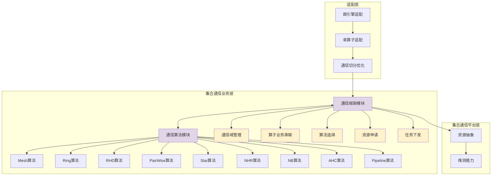
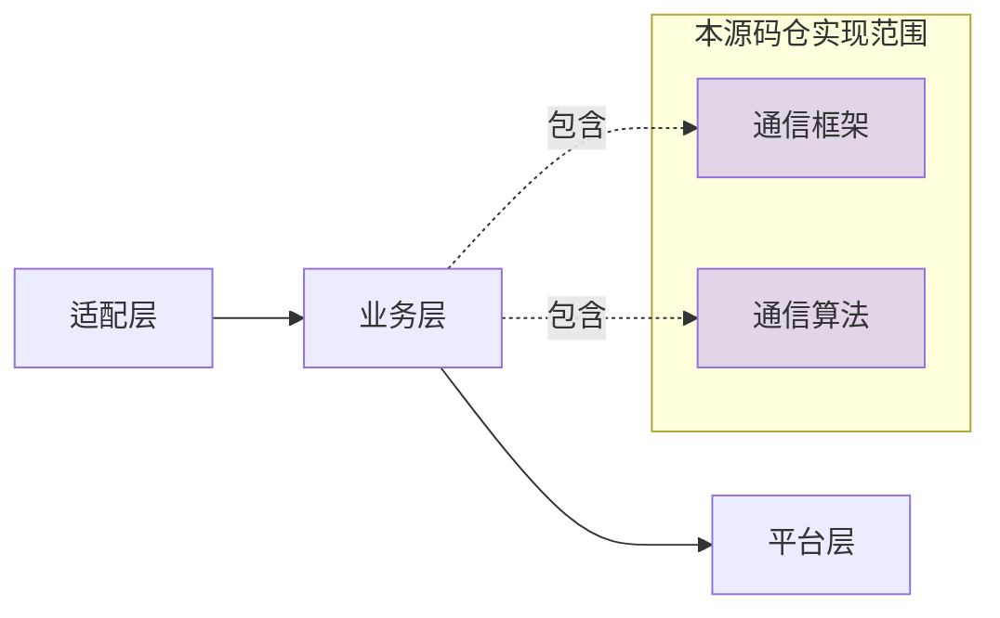
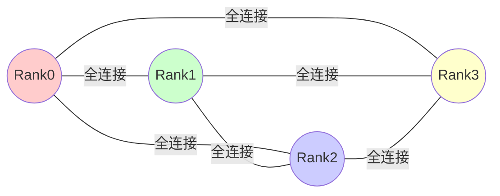
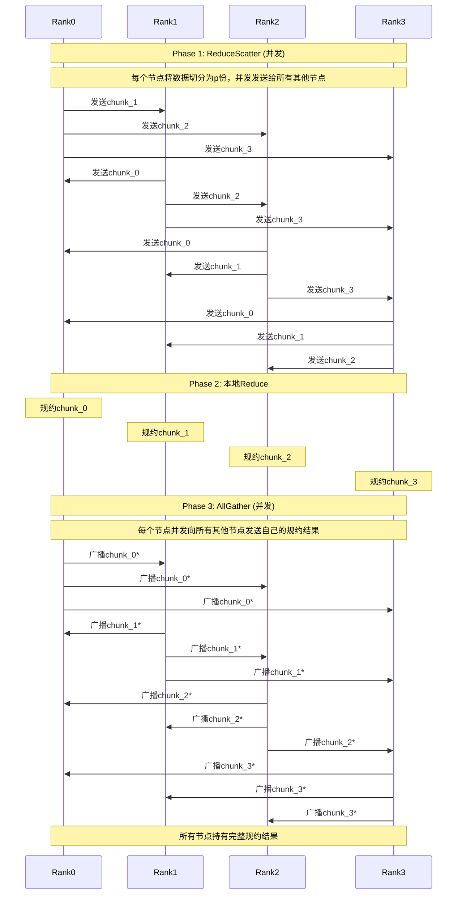
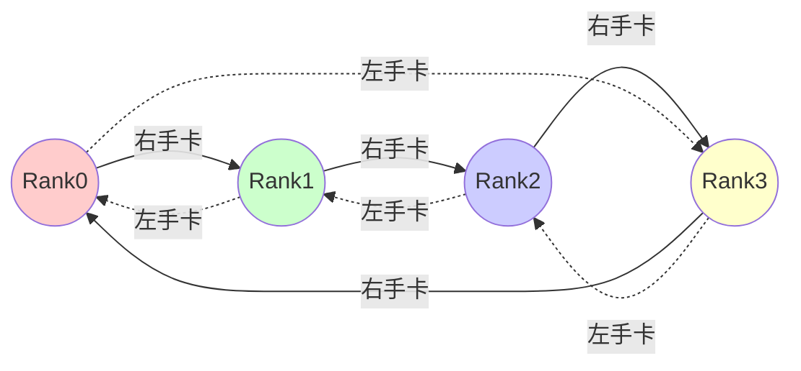
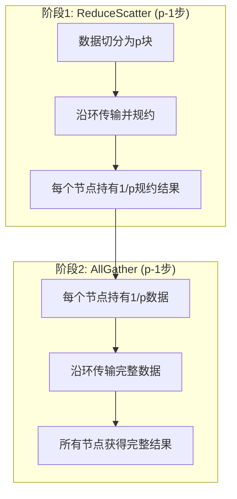
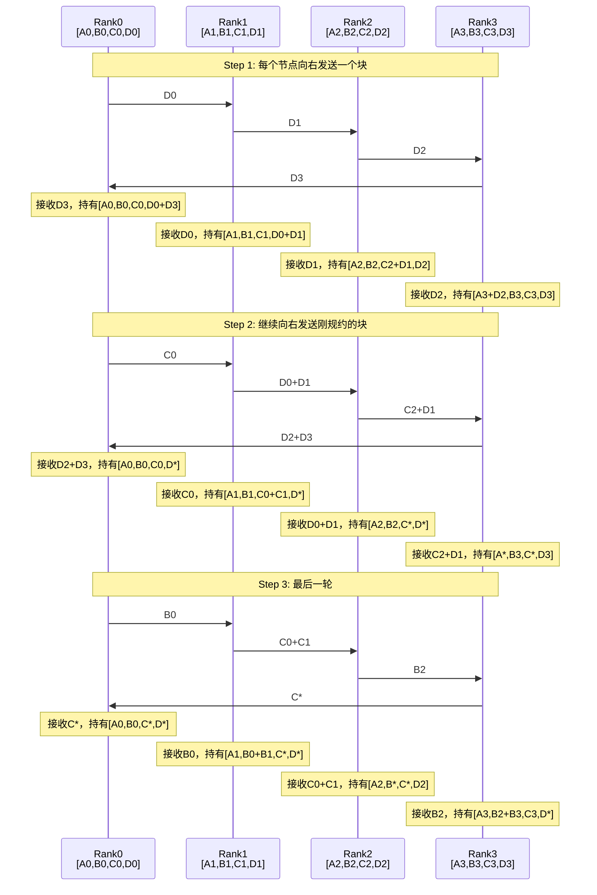
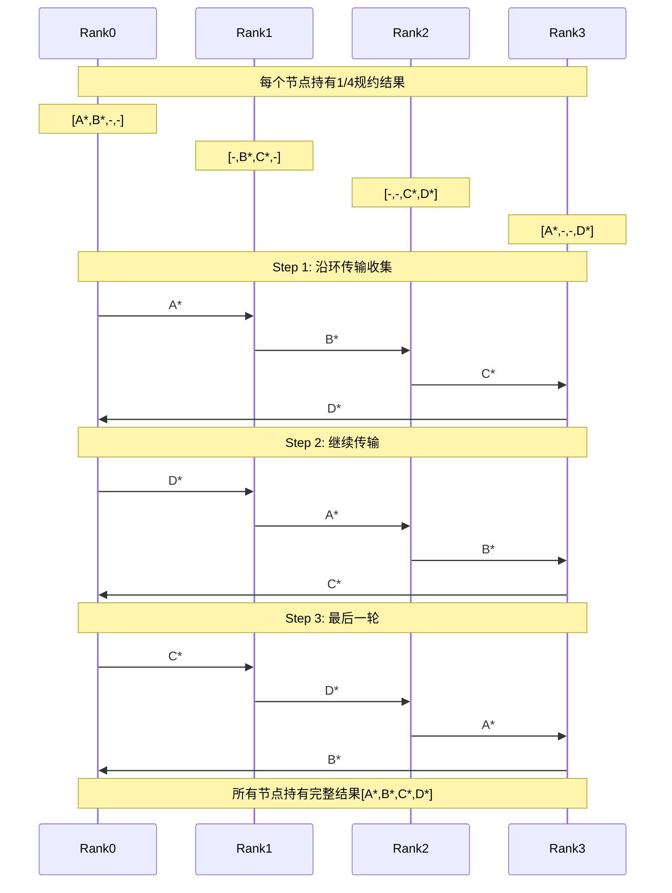

<!-- 文章来自仓库 cann-hccl/HCCL设计文档.md，经整理发布为博客文章 -->


<!--more-->

# HCCL (Huawei Collective Communication Library) 设计文档

## 1. 项目概述

### 1.1 项目简介

HCCL（Huawei Collective Communication Library，华为集合通信库）是基于昇腾AI处理器的高性能集合通信库，为单机多卡及多机多卡环境提供高效的数据并行和模型并行集合通信方案。

开源代码库：https://gitee.com/ascend/cann-hccl

**版本信息：** 配套CANN软件版本发行

**许可证：** CANN Open Software License Agreement Version 1.0

### 1.2 核心特性

- ✅ **高性能通信算法**：支持9种拓扑算法（Mesh、Ring、RHD、PairWise、Star、NHR、NB、AHC、Pipeline）
- ✅ **灵活的通信模式**：支持单机多卡和多机多卡场景
- ✅ **智能算法选择**：根据通信域信息和数据量自动选择最优算法
- ✅ **分层网络优化**：支持Server内和Server间分级通信
- ✅ **多种集合操作**：AllReduce、AllGather、ReduceScatter、Broadcast等

### 1.3 系统架构



## 2. 核心架构设计

### 2.1 三层架构模型

HCCL采用分层设计，从上到下分为三个核心层次：



#### 2.1.1 适配层

**职责：**
- 图引擎与单算子的对接适配
- 通信操作的切分与优化
- 任务分发策略制定

#### 2.1.2 集合通信业务层（本仓核心）

**通信框架模块：**
- 通信域（Communicator）生命周期管理
- 集合通信算子的业务流程编排
- 算法选择策略与调度
- 与平台层协作完成资源申请
- 任务下发与执行管理

**通信算法模块：**
- 实现9种核心集合通信算法
- 资源消耗计算与评估
- 基于通信域信息的任务编排
- 算法性能模型（α-β模型）实现

#### 2.1.3 集合通信平台层

**职责：**
- NPU硬件资源抽象与管理
- HCCS链路资源管理
- 通信日志与性能监控
- 错误诊断与恢复机制

### 2.2 目录结构

```
cann-hccl/
├── src/domain/collective_communication/
│   ├── algorithm/          # 通信算法实现
│   └── framework/          # 通信框架实现
├── inc/hccl/              # 对外头文件
│   ├── hccl.h
│   └── hccl_types.h
├── docs/                   # 算法原理文档
├── test/                   # 测试代码
├── cmake/                  # 编译配置
└── build.sh               # 编译脚本
```

## 3. 集合通信算法详解

HCCL的核心竞争力在于其丰富的集合通信算法库，针对不同的网络拓扑、节点规模和数据量提供最优解决方案。

### 3.1 性能评估模型

HCCL采用 **α-β模型（Hockney模型）** 进行性能评估：

$$
T = \alpha + n\beta + n\gamma
$$

**参数说明：**
- **α**：节点间的固定时延（启动开销）
- **β**：每byte数据传输耗时（带宽倒数）
- **n**：通信数据大小（bytes）
- **γ**：每byte数据规约计算耗时
- **p**：通信域节点个数

### 3.2 Mesh 算法

#### 3.2.1 算法原理



**特点：**
- **拓扑：** FullMesh互联，NPU间全连接
- **时间复杂度：** O(1)
- **适用场景：** Server内通信，小规模集群
- **优势：** 一步完成通信，延迟最低
- **劣势：** 资源开销大，难以扩展到大规模

#### 3.2.2 执行流程示例（以AllReduce为例）

**说明：** Mesh算法支持所有集合通信原语（AllReduce、AllGather、ReduceScatter、Broadcast、Reduce、Scatter、Gather等），此处以AllReduce为典型示例展示执行流程。



**执行流程详细描述：**

**Phase 1: ReduceScatter（并发执行）**
- **数据准备**: 每个节点将自己的n字节数据切分为p个chunk，每个chunk大小为n/p字节
- **并发发送**: 
  - Rank0保留chunk_0，将chunk_1发送给Rank1，chunk_2发送给Rank2，chunk_3发送给Rank3
  - Rank1保留chunk_1，将chunk_0发送给Rank0，chunk_2发送给Rank2，chunk_3发送给Rank3
  - Rank2保留chunk_2，将chunk_0发送给Rank0，chunk_1发送给Rank1，chunk_3发送给Rank3
  - Rank3保留chunk_3，将chunk_0发送给Rank0，chunk_1发送给Rank1，chunk_2发送给Rank2
- **通信特点**: 全连接并发，所有通信同时进行，利用FullMesh拓扑的双向带宽

**Phase 2: 本地Reduce（本地计算）**
- Rank0对接收到的所有chunk_0进行规约：chunk_0* = chunk_0(R0) + chunk_0(R1) + chunk_0(R2) + chunk_0(R3)
- Rank1对接收到的所有chunk_1进行规约：chunk_1* = chunk_1(R0) + chunk_1(R1) + chunk_1(R2) + chunk_1(R3)
- Rank2对接收到的所有chunk_2进行规约：chunk_2* = chunk_2(R0) + chunk_2(R1) + chunk_2(R2) + chunk_2(R3)
- Rank3对接收到的所有chunk_3进行规约：chunk_3* = chunk_3(R0) + chunk_3(R1) + chunk_3(R2) + chunk_3(R3)
- 此时每个节点持有1/p的完整规约结果

**Phase 3: AllGather（并发执行）**
- **并发广播**: 
  - Rank0将chunk_0*并发发送给Rank1, Rank2, Rank3
  - Rank1将chunk_1*并发发送给Rank0, Rank2, Rank3
  - Rank2将chunk_2*并发发送给Rank0, Rank1, Rank3
  - Rank3将chunk_3*并发发送给Rank0, Rank1, Rank2
- **最终状态**: 所有节点持有完整的规约结果[chunk_0*, chunk_1*, chunk_2*, chunk_3*]
- **通信特点**: 全连接并发，充分利用FullMesh拓扑的所有链路

**其他原语：**
- **AllGather**: 直接执行Phase 3（并发收集所有节点数据）
- **ReduceScatter**: 执行Phase 1 + Phase 2（并发规约后分散）
- **Broadcast**: 根节点向所有节点并发发送完整数据
- **Gather**: 所有节点向根节点并发发送数据

#### 3.2.3 性能模型

| 操作 | 耗时公式 | 说明 |
|------|---------|------|
| Scatter | $\alpha + \frac{1}{p}n\beta$ | 一步完成，根节点向p个节点并发发送，每节点接收n/p数据 |
| Gather | $\alpha + \frac{1}{p}n\beta$ | 一步完成，p个节点向根节点并发发送，根节点接收全部数据 |
| Broadcast | $2\alpha + \frac{2}{p}n\beta$ | Scatter + AllGather实现（两步），每步传输部分数据 |
| Reduce | $2\alpha + \frac{2}{p}n\beta + \frac{p-1}{p}n\gamma$ | ReduceScatter + Gather实现，需规约所有输入数据 |
| ReduceScatter | $\alpha + \frac{1}{p}n\beta + \frac{p-1}{p}n\gamma$ | 一步完成，并发规约并分发，每节点接收n/p结果 |
| AllGather | $\alpha + \frac{1}{p}n\beta$ | 一步完成，全连接并发传输，每节点发送n/p数据 |
| AllReduce | $2\alpha + \frac{2}{p}n\beta + \frac{p-1}{p}n\gamma$ | ReduceScatter + AllGather两阶段，总共两步通信 |

### 3.3 Ring 算法

#### 3.3.1 算法原理



**特点：**
- **拓扑：** 环形结构，每个节点只与左右邻居通信
- **时间复杂度：** O(p-1) - 线性复杂度
- **适用场景：** 
  - Server内和Server间通信
  - 小规模集群或小数据量
  - 网络拥塞场景
  - Pipeline不适用的场景

#### 3.3.2 执行流程示例（以AllReduce为例）

**说明：** Ring算法支持多种集合通信原语（AllReduce、AllGather、ReduceScatter、Broadcast、Reduce、Scatter、Gather等），此处以AllReduce为典型示例展示执行流程。

##### 两阶段概览



##### 详细执行步骤（4节点示例）

**阶段1: ReduceScatter（p-1=3步完成）**

Ring算法的ReduceScatter阶段：每个节点在每一步都向右邻居发送一个数据块，并接收左邻居的数据块进行规约。经过p-1步后，每个节点持有一个完整规约的数据块。



**注意：** 上述简化示例未完整展示。实际上ReduceScatter需要p-1=3步，每步每个节点都在某个特定位置进行规约。最终：
- Rank0持有A块的完整规约结果A*
- Rank1持有B块的完整规约结果B*  
- Rank2持有C块的完整规约结果C*
- Rank3持有D块的完整规约结果D*

**阶段2: AllGather（3步完成）**



**执行流程详细描述：**

**阶段1: ReduceScatter（p-1=3步完成）**

Ring算法的核心思想：数据切分为p块，每个节点在每一步向右邻居发送一个块，从左邻居接收一个块并规约。经过p-1步后，每个节点持有一个完整规约的数据块。

- **初始状态**: 
  - Rank0持有[A0, B0, C0, D0]
  - Rank1持有[A1, B1, C1, D1]
  - Rank2持有[A2, B2, C2, D2]
  - Rank3持有[A3, B3, C3, D3]

- **Step 1**: 
  - 发送：R0→D0→R1, R1→D1→R2, R2→D2→R3, R3→D3→R0
  - 规约：每个节点将接收的D块与本地D块规约
  - 结果：R0持有D0+D3, R1持有D0+D1, R2持有D1+D2, R3持有D2+D3
  - 数据流向：环形顺时针流动

- **Step 2**: 
  - 发送：R0→C0→R1, R1→(D0+D1)→R2, R2→(C2+D1)→R3, R3→(D2+D3)→R0
  - 规约：每个节点将接收的块与本地对应块规约
  - 关键：R2完成D块的完整规约D* = D0+D1+D2+D3
  - 数据流向：继续顺时针，规约块逐步完成


