<!-- 文章来自仓库 cann-hccl/HCCL设计文档.md，完整版本 -->

<!--more-->

# HCCL (Huawei Collective Communication Library) 设计文档

## 1. 项目概述

### 1.1 项目简介

HCCL（Huawei Collective Communication Library，华为集合通信库）是基于昇腾AI处理器的高性能集合通信库，为单机多卡及多机多卡环境提供高效的数据并行和模型并行集合通信方案。

开源代码库：https://gitee.com/ascend/cann-hccl

**版本信息：** 配套CANN软件版本发行

**许可证：** CANN Open Software License Agreement Version 1.0

### 1.2 核心特性

- ✅ **高性能通信算法**：支持9种拓扑算法（Mesh、Ring、RHD、PairWise、Star、NHR、NB、AHC、Pipeline）
- ✅ **灵活的通信模式**：支持单机多卡和多机多卡场景
- ✅ **智能算法选择**：根据通信域信息和数据量自动选择最优算法
- ✅ **分层网络优化**：支持Server内和Server间分级通信
- ✅ **多种集合操作**：AllReduce、AllGather、ReduceScatter、Broadcast等

### 1.3 系统架构

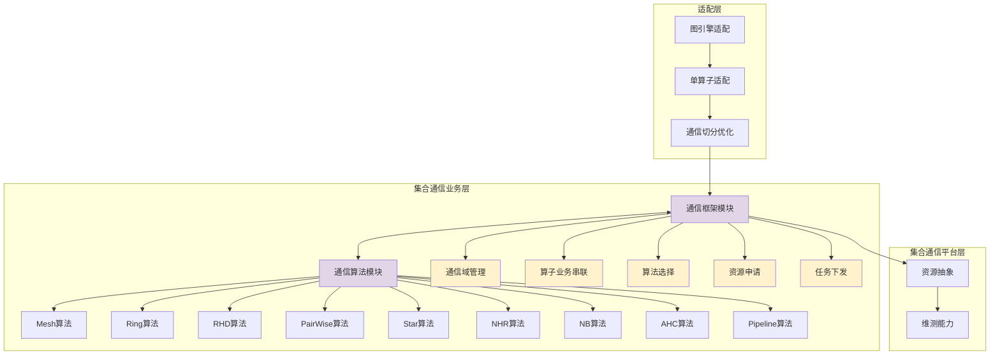

## 2. 核心架构设计

### 2.1 三层架构模型

HCCL采用分层设计，从上到下分为三个核心层次：

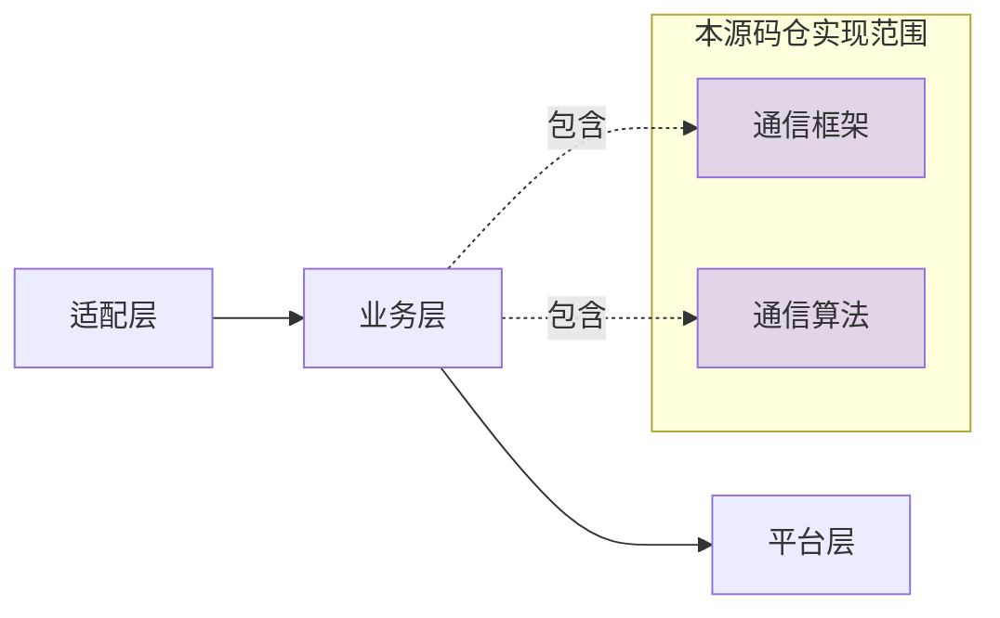

#### 2.1.1 适配层

**职责：**
- 图引擎与单算子的对接适配
- 通信操作的切分与优化
- 任务分发策略制定

#### 2.1.2 集合通信业务层（本仓核心）

**通信框架模块：**
- 通信域（Communicator）生命周期管理
- 集合通信算子的业务流程编排
- 算法选择策略与调度
- 与平台层协作完成资源申请
- 任务下发与执行管理

**通信算法模块：**
- 实现9种核心集合通信算法
- 资源消耗计算与评估
- 基于通信域信息的任务编排
- 算法性能模型（α-β模型）实现

#### 2.1.3 集合通信平台层

**职责：**
- NPU硬件资源抽象与管理
- HCCS链路资源管理
- 通信日志与性能监控
- 错误诊断与恢复机制

### 2.2 目录结构

```
cann-hccl/
├── src/domain/collective_communication/
│   ├── algorithm/          # 通信算法实现
│   └── framework/          # 通信框架实现
├── inc/hccl/              # 对外头文件
│   ├── hccl.h
│   └── hccl_types.h
├── docs/                   # 算法原理文档
├── test/                   # 测试代码
├── cmake/                  # 编译配置
└── build.sh               # 编译脚本
```

## 3. 集合通信算法详解

HCCL的核心竞争力在于其丰富的集合通信算法库，针对不同的网络拓扑、节点规模和数据量提供最优解决方案。

### 3.1 性能评估模型

HCCL采用 **α-β模型（Hockney模型）** 进行性能评估：

$$
T = \alpha + n\beta + n\gamma
$$

**参数说明：**
- **α**：节点间的固定时延（启动开销）
- **β**：每byte数据传输耗时（带宽倒数）
- **n**：通信数据大小（bytes）
- **γ**：每byte数据规约计算耗时
- **p**：通信域节点个数

### 3.2 Mesh 算法

#### 3.2.1 算法原理

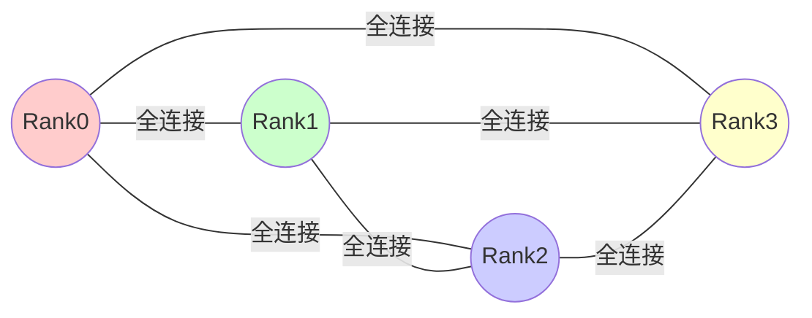

**特点：**
- **拓扑：** FullMesh互联，NPU间全连接
- **时间复杂度：** O(1)
- **适用场景：** Server内通信，小规模集群
- **优势：** 一步完成通信，延迟最低
- **劣势：** 资源开销大，难以扩展到大规模

#### 3.2.2 执行流程示例（以AllReduce为例）

**说明：** Mesh算法支持所有集合通信原语（AllReduce、AllGather、ReduceScatter、Broadcast、Reduce、Scatter、Gather等），此处以AllReduce为典型示例展示执行流程。

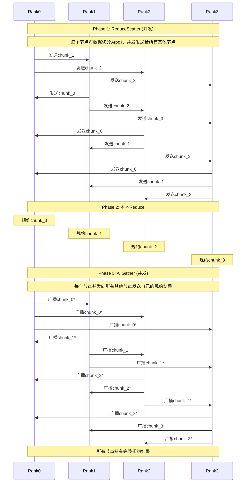

**执行流程详细描述：**

**Phase 1: ReduceScatter（并发执行）**
- **数据准备**: 每个节点将自己的n字节数据切分为p个chunk，每个chunk大小为n/p字节
- **并发发送**: 
  - Rank0保留chunk_0，将chunk_1发送给Rank1，chunk_2发送给Rank2，chunk_3发送给Rank3
  - Rank1保留chunk_1，将chunk_0发送给Rank0，chunk_2发送给Rank2，chunk_3发送给Rank3
  - Rank2保留chunk_2，将chunk_0发送给Rank0，chunk_1发送给Rank1，chunk_3发送给Rank3
  - Rank3保留chunk_3，将chunk_0发送给Rank0，chunk_1发送给Rank1，chunk_2发送给Rank2
- **通信特点**: 全连接并发，所有通信同时进行，利用FullMesh拓扑的双向带宽

**Phase 2: 本地Reduce（本地计算）**
- Rank0对接收到的所有chunk_0进行规约：chunk_0* = chunk_0(R0) + chunk_0(R1) + chunk_0(R2) + chunk_0(R3)
- Rank1对接收到的所有chunk_1进行规约：chunk_1* = chunk_1(R0) + chunk_1(R1) + chunk_1(R2) + chunk_1(R3)
- Rank2对接收到的所有chunk_2进行规约：chunk_2* = chunk_2(R0) + chunk_2(R1) + chunk_2(R2) + chunk_2(R3)
- Rank3对接收到的所有chunk_3进行规约：chunk_3* = chunk_3(R0) + chunk_3(R1) + chunk_3(R2) + chunk_3(R3)
- 此时每个节点持有1/p的完整规约结果

**Phase 3: AllGather（并发执行）**
- **并发广播**: 
  - Rank0将chunk_0*并发发送给Rank1, Rank2, Rank3
  - Rank1将chunk_1*并发发送给Rank0, Rank2, Rank3
  - Rank2将chunk_2*并发发送给Rank0, Rank1, Rank3
  - Rank3将chunk_3*并发发送给Rank0, Rank1, Rank2
- **最终状态**: 所有节点持有完整的规约结果[chunk_0*, chunk_1*, chunk_2*, chunk_3*]
- **通信特点**: 全连接并发，充分利用FullMesh拓扑的所有链路

**其他原语：**
- **AllGather**: 直接执行Phase 3（并发收集所有节点数据）
- **ReduceScatter**: 执行Phase 1 + Phase 2（并发规约后分散）
- **Broadcast**: 根节点向所有节点并发发送完整数据
- **Gather**: 所有节点向根节点并发发送数据

#### 3.2.3 性能模型

| 操作 | 耗时公式 | 说明 |
|------|---------|------|
| Scatter | $\alpha + \frac{1}{p}n\beta$ | 一步完成，根节点向p个节点并发发送，每节点接收n/p数据 |
| Gather | $\alpha + \frac{1}{p}n\beta$ | 一步完成，p个节点向根节点并发发送，根节点接收全部数据 |
| Broadcast | $2\alpha + \frac{2}{p}n\beta$ | Scatter + AllGather实现（两步），每步传输部分数据 |
| Reduce | $2\alpha + \frac{2}{p}n\beta + \frac{p-1}{p}n\gamma$ | ReduceScatter + Gather实现，需规约所有输入数据 |
| ReduceScatter | $\alpha + \frac{1}{p}n\beta + \frac{p-1}{p}n\gamma$ | 一步完成，并发规约并分发，每节点接收n/p结果 |
| AllGather | $\alpha + \frac{1}{p}n\beta$ | 一步完成，全连接并发传输，每节点发送n/p数据 |
| AllReduce | $2\alpha + \frac{2}{p}n\beta + \frac{p-1}{p}n\gamma$ | ReduceScatter + AllGather两阶段，总共两步通信 |

### 3.3 Ring 算法

#### 3.3.1 算法原理

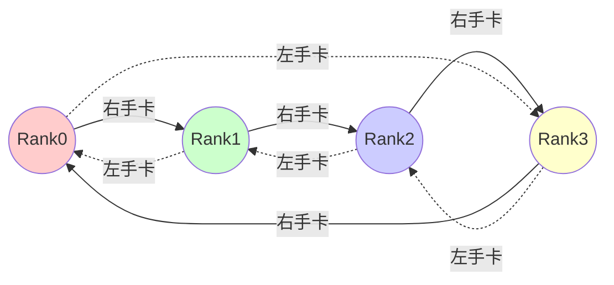

**特点：**
- **拓扑：** 环形结构，每个节点只与左右邻居通信
- **时间复杂度：** O(p-1) - 线性复杂度
- **适用场景：** 
  - Server内和Server间通信
  - 小规模集群或小数据量
  - 网络拥塞场景
  - Pipeline不适用的场景

#### 3.3.2 执行流程示例（以AllReduce为例）

**说明：** Ring算法支持多种集合通信原语（AllReduce、AllGather、ReduceScatter、Broadcast、Reduce、Scatter、Gather等），此处以AllReduce为典型示例展示执行流程。

##### 两阶段概览

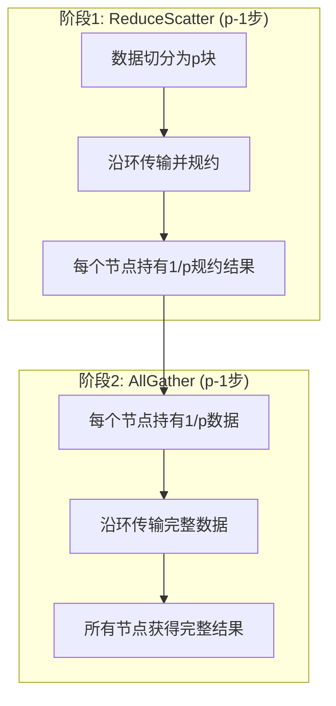

##### 详细执行步骤（4节点示例）

**阶段1: ReduceScatter（p-1=3步完成）**

Ring算法的ReduceScatter阶段：每个节点在每一步都向右邻居发送一个数据块，并接收左邻居的数据块进行规约。经过p-1步后，每个节点持有一个完整规约的数据块。

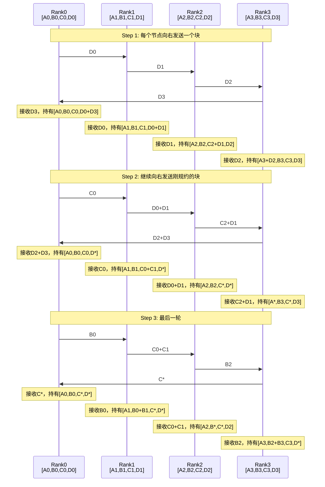

**注意：** 上述简化示例未完整展示。实际上ReduceScatter需要p-1=3步，每步每个节点都在某个特定位置进行规约。最终：
- Rank0持有A块的完整规约结果A*
- Rank1持有B块的完整规约结果B*  
- Rank2持有C块的完整规约结果C*
- Rank3持有D块的完整规约结果D*

**阶段2: AllGather（3步完成）**

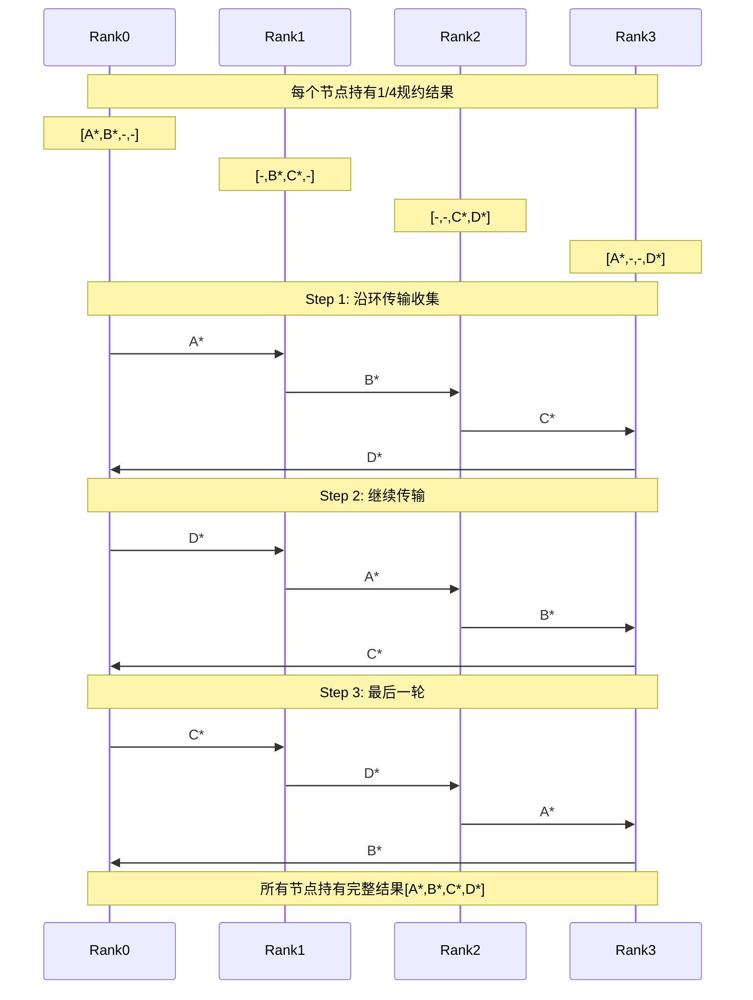

**执行流程详细描述：**

**阶段1: ReduceScatter（p-1=3步完成）**

Ring算法的核心思想：数据切分为p块，每个节点在每一步向右邻居发送一个块，从左邻居接收一个块并规约。经过p-1步后，每个节点持有一个完整规约的数据块。

- **初始状态**: 
  - Rank0持有[A0, B0, C0, D0]
  - Rank1持有[A1, B1, C1, D1]
  - Rank2持有[A2, B2, C2, D2]
  - Rank3持有[A3, B3, C3, D3]

- **Step 1**: 
  - 发送：R0→D0→R1, R1→D1→R2, R2→D2→R3, R3→D3→R0
  - 规约：每个节点将接收的D块与本地D块规约
  - 结果：R0持有D0+D3, R1持有D0+D1, R2持有D1+D2, R3持有D2+D3
  - 数据流向：环形顺时针流动

- **Step 2**: 
  - 发送：R0→C0→R1, R1→(D0+D1)→R2, R2→(C2+D1)→R3, R3→(D2+D3)→R0
  - 规约：每个节点将接收的块与本地对应块规约
  - 关键：R2完成D块的完整规约D* = D0+D1+D2+D3
  - 数据流向：继续顺时针，规约块逐步完成

- **Step 3**: 
  - 发送：R0→B0→R1, R1→(C0+C1)→R2, R2→B2→R3, R3→C*→R0
  - 规约：R0完成D*的接收，R1和R2完成更多规约
  - 注：完整算法需继续执行直到所有块规约完成

- **最终状态**（经过p-1步后）:
  - Rank0持有A* = A0+A1+A2+A3
  - Rank1持有B* = B0+B1+B2+B3
  - Rank2持有C* = C0+C1+C2+C3
  - Rank3持有D* = D0+D1+D2+D3

**阶段2: AllGather（p-1=3步完成）**

AllGather阶段的目标：将每个节点持有的唯一规约结果块收集到所有节点。

- **初始状态**:
  - Rank0持有[A*, -, -, -]（实际在位置0）
  - Rank1持有[-, B*, -, -]（实际在位置1）
  - Rank2持有[-, -, C*, -]（实际在位置2）
  - Rank3持有[-, -, -, D*]（实际在位置3）

- **Step 1**:
  - 发送：R0→A*→R1, R1→B*→R2, R2→C*→R3, R3→D*→R0
  - 接收：每个节点接收一个新的规约块
  - 结果：R0持有[A*,-,-,D*], R1持有[A*,B*,-,-], R2持有[-,B*,C*,-], R3持有[-,-,C*,D*]

- **Step 2**:
  - 发送：R0→D*→R1, R1→A*→R2, R2→B*→R3, R3→C*→R0
  - 接收：每个节点再接收一个规约块
  - 结果：R0持有[A*,-,C*,D*], R1持有[A*,B*,D*,-], R2持有[A*,B*,C*,-], R3持有[-,B*,C*,D*]

- **Step 3**:
  - 发送：R0→C*→R1, R1→D*→R2, R2→A*→R3, R3→B*→R0
  - 接收：每个节点接收最后一个缺失的块
  - 结果：所有节点持有[A*, B*, C*, D*]

- **通信特点**:
  - 每步只使用环上的单向链路
  - 数据沿环顺时针流动
  - 每步传输的数据量为n/p字节
  - 无需规约操作，纯数据传输

**其他原语执行方式：**
- **Broadcast**: 数据不切分，沿环传输p-1步，每步传输完整数据
- **Reduce**: 类似Broadcast，沿环传输并规约，最终根节点得到结果
- **AllGather**: 仅执行阶段2，数据切分后沿环收集
- **ReduceScatter**: 仅执行阶段1，数据切分后沿环规约

#### 3.3.3 性能模型

| 操作 | 耗时公式 | 说明 |
|------|---------|------|
| Scatter | $(p-1)\alpha + \frac{p-1}{p}n\beta$ | 沿环传输p-1步，每步传输1/p数据 |
| Gather | $(p-1)\alpha + \frac{p-1}{p}n\beta$ | 沿环传输p-1步，每步传输1/p数据 |
| Broadcast | $(p-1)\alpha + (p-1)n\beta$ | 沿环传输p-1步，每步传输完整数据 |
| Reduce | $(p-1)\alpha + (p-1)n\beta + (p-1)n\gamma$ | 沿环传输p-1步，每步传输完整数据并规约 |
| ReduceScatter | $(p-1)\alpha + \frac{p-1}{p}n\beta + \frac{p-1}{p}n\gamma$ | 数据切分为p块，沿环传输p-1步并规约 |
| AllGather | $(p-1)\alpha + \frac{p-1}{p}n\beta$ | 数据切分为p块，沿环传输p-1步收集 |
| AllReduce | $2(p-1)\alpha + 2\frac{p-1}{p}n\beta + \frac{p-1}{p}n\gamma$ | ReduceScatter(p-1步) + AllGather(p-1步) |

### 3.4 RHD (Recursive Halving-Doubling) 算法

#### 3.4.1 算法原理

递归二分和倍增算法，通过对数级的通信步数实现高效通信。

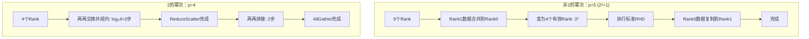

**特点：**
- **时间复杂度：** $O(\lceil \log_2 N \rceil)$ - 对数复杂度
- **适用场景：**
  - 大规模集群（Server数量多）
  - Server数量为2的幂次时性能最优
  - 中小数据量通信

#### 3.4.2 通信步骤示例（p=4，以AllReduce为例）

**说明：** RHD算法支持多种集合通信原语（AllReduce、ReduceScatter、AllGather、Broadcast、Reduce等），此处以AllReduce为典型示例展示通信步骤。

**ReduceScatter阶段（Recursive Halving）：**

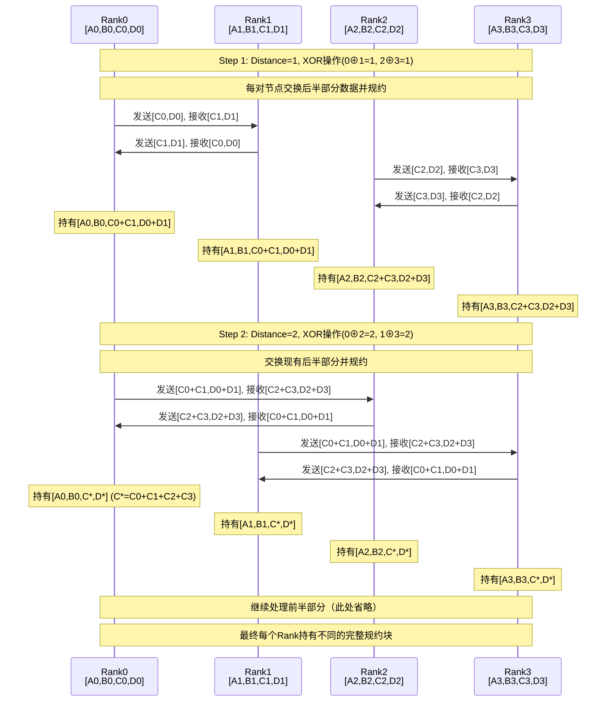

**AllGather阶段（Recursive Doubling）：**

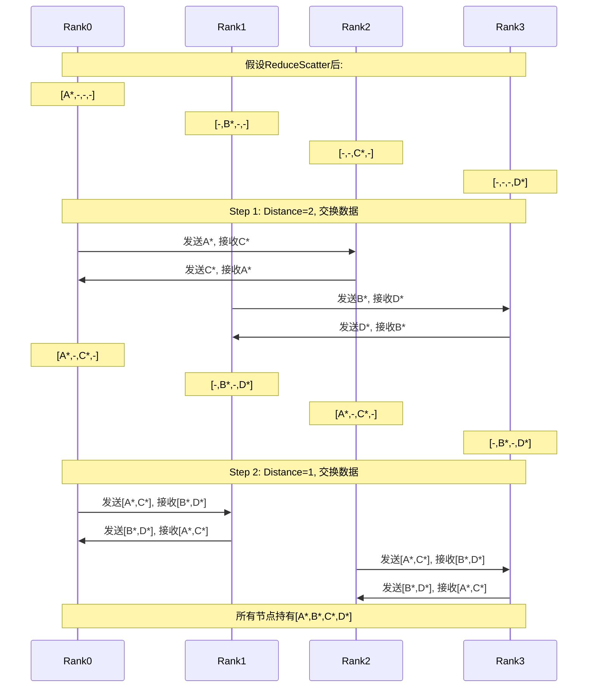

**详细执行流程说明：**

**ReduceScatter阶段详解（Recursive Halving）：**

该阶段核心思想是通过递归对半分组（Distance Halving）将数据分散规约到各个节点。距离distance采用指数递减模式：p/2 → p/4 → ... → 1。

**初始状态：** 每个节点持有完整数据[A,B,C,D]，需要对4个块分别规约，最终每个节点持有其中一个完整规约块。

**Step 1 (Distance=2)：** 节点分为两组：{R0,R1} ↔ {R2,R3}。通过XOR找到通信对（Rank XOR 2），每个节点负责处理一半数据。
- **R0 ↔ R2通信**：R0发送后半部分[C,D]并接收同样位置的[C,D]，对接收数据执行规约操作（C←C+C, D←D+D），同时接收R2的前半部分[A,B]并规约到本地前半部分
- **R1 ↔ R3通信**：同样的交换和规约操作
- **处理后状态**：
  - R0持有[A0+A2, B0+B2, C0+C2, D0+D2]，但仅负责前半部分（后半部分将被丢弃）
  - R1持有[A1+A3, B1+B3, C1+C3, D1+D3]，仅负责前半部分
  - R2持有[A0+A2, B0+B2, C0+C2, D0+D2]，仅负责后半部分
  - R3持有[A1+A3, B1+B3, C1+C3, D1+D3]，仅负责后半部分
- **数据缩减**：每个节点从4个块缩减为2个有效块

**Step 2 (Distance=1)：** 在上一步的基础上继续对半分组。R0↔R1处理前半部分{A,B}，R2↔R3处理后半部分{C,D}。
- **R0 ↔ R1通信**：交换和规约B块（R0最终持有完整规约的A块，R1持有B块）
- **R2 ↔ R3通信**：交换和规约D块（R2最终持有完整规约的C块，R3持有D块）
- **处理后状态**：
  - R0: [A0+A1+A2+A3, -, -, -]（简写为[A*, -, -, -]）
  - R1: [-, B0+B1+B2+B3, -, -]（简写为[-, B*, -, -]）
  - R2: [-, -, C0+C1+C2+C3, -]（简写为[-, -, C*, -]）
  - R3: [-, -, -, D0+D1+D2+D3]（简写为[-, -, -, D*]）
- **数据缩减**：每个节点从2个块缩减为1个完整规约块

**ReduceScatter特点**：log₂p步递归对半，每步数据量减半，所有节点同时工作，通信和计算高度重叠。

**AllGather阶段详解（Recursive Doubling）：**

该阶段核心思想是通过递归加倍距离（Distance Doubling）收集所有规约结果。距离distance采用指数递增模式：1 → 2 → 4 → ...。

**初始状态：** ReduceScatter完成后，每个节点持有一个完整规约块：R0持有[A*,-,-,-]，R1持有[-,B*,-,-]，R2持有[-,-,C*,-]，R3持有[-,-,-,D*]。

**Step 1 (Distance=2)：** 首先在距离为2的节点间交换数据。通过XOR找到通信对（Rank XOR 2）。
- **R0 ↔ R2通信**：R0发送A*并接收C*，R2发送C*并接收A*
- **R1 ↔ R3通信**：R1发送B*并接收D*，R3发送D*并接收B*
- **通信后状态**：
  - R0: [A*, -, C*, -]（持有第0和第2块的完整规约结果）
  - R1: [-, B*, -, D*]（持有第1和第3块）
  - R2: [A*, -, C*, -]（持有第0和第2块）
  - R3: [-, B*, -, D*]（持有第1和第3块）
- **数据增长**：每个节点从1个块增长为2个块

**Step 2 (Distance=1)：** 在距离为1的相邻节点间交换数据，完成最终收集。
- **R0 ↔ R1通信**：R0发送[A*,C*]并接收[B*,D*]，R1发送[B*,D*]并接收[A*,C*]
- **R2 ↔ R3通信**：R2发送[A*,C*]并接收[B*,D*]，R3发送[B*,D*]并接收[A*,C*]
- **最终状态**：所有节点持有[A*, B*, C*, D*]，即所有数据的完整规约结果

**AllGather特点**：log₂p步递归加倍，每步传输数据量倍增（1块→2块→4块），无需计算操作，纯粹的数据收集。

**RHD算法整体特点**：
1. **对数级复杂度**：总共2log₂p步通信（ReduceScatter log₂p步 + AllGather log₂p步）
2. **XOR通信模式**：每步通过Rank XOR Distance确定通信对，保证无冲突并行
3. **数据量变化**：ReduceScatter递减（n → n/2 → n/4 → ...），AllGather递增（n/p → 2n/p → 4n/p → ...）
4. **最优性**：对于2的幂次节点数，是理论最优算法（最少通信步数）
5. **限制条件**：仅适用于节点数为2的幂次（非2幂次需要额外步骤处理）

**其他原语执行方式：**
- **Broadcast**: 采用Distance Halving策略，从根节点开始递归扩散
- **ReduceScatter**: 仅执行ReduceScatter阶段（Recursive Halving）
- **AllGather**: 仅执行AllGather阶段（Recursive Doubling）

#### 3.4.3 性能模型

**2的幂次（p = 2^k）：**

| 操作 | 耗时公式 | 说明 |
|------|---------|------|
| Broadcast | $\lceil \log_2 p \rceil\alpha + \lceil \log_2 p \rceil n\beta$ | Distance Halving策略，log₂p步，每步传输完整n字节数据 |
| ReduceScatter | $\log_2 p \cdot \alpha + \frac{p-1}{p}n\beta + \frac{p-1}{p}n\gamma$ | Vector Doubling + Distance Halving，log₂p步递归对半交换 |
| AllGather | $\log_2 p \cdot \alpha + \frac{p-1}{p}n\beta$ | Distance Doubling策略，log₂p步，每步数据量倍增 |
| AllReduce | $2\log_2 p \cdot \alpha + 2\frac{p-1}{p}n\beta + \frac{p-1}{p}n\gamma$ | ReduceScatter(log₂p步) + AllGather(log₂p步)，规约一次 |

**非2的幂次（需要额外步骤）：**

$$
\text{AllReduce} = (2\lfloor \log_2 p \rfloor + 2)\alpha + (2\frac{p'-1}{p'} + 2)n\beta + (\frac{p'-1}{p'} + 1)n\gamma
$$

其中 $p' = 2^{\lfloor \log_2 p \rfloor}$

### 3.5 PairWise 算法

#### 3.5.1 算法原理

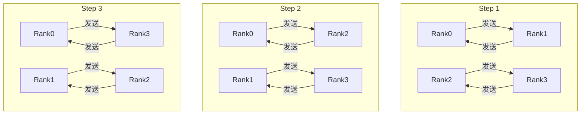

**算法原理说明：**

PairWise算法是专为**AllToAll/AllToAllV算子**设计的高效通信策略，核心目标是**避免网络端口拥塞**。在AllToAll操作中，每个节点需要向其他所有节点发送数据，传统方法可能导致某个节点同时向多个目标发送（"一打多"现象），造成端口带宽竞争和拥塞。

**核心机制：配对交换（Pairwise Exchange）**

PairWise通过将p个节点的通信组织为 **(p-1)轮配对交换**，每轮确保：
1. **无冲突并行**：每个节点在每轮只与一个对端通信
2. **端口独占**：避免多流竞争单个网络端口
3. **循环配对**：通过固定的配对模式覆盖所有节点对

**配对模式（以4节点为例）：**

- **Step 1**：{R0 ↔ R1}, {R2 ↔ R3}
  - Rank0与Rank1双向交换数据
  - Rank2与Rank3双向交换数据
  - 两对通信完全并行，无干扰

- **Step 2**：{R0 ↔ R2}, {R1 ↔ R3}
  - 配对方式改变，Rank0与Rank2交换
  - Rank1与Rank3交换
  - 依然保持两两配对，无冲突

- **Step 3**：{R0 ↔ R3}, {R1 ↔ R2}
  - 最后一轮配对，Rank0与Rank3交换
  - Rank1与Rank2交换
  - 完成所有节点对的通信

**数学规律：**
- 对于p个节点，需要 **(p-1)轮** 完成所有节点对的交换
- 第k轮（k=1,2,...,p-1），节点i与节点(i+k) mod p通信
- 每轮p/2对节点同时通信（p为偶数）

**优势分析：**

1. **避免端口拥塞**：传统AllToAll可能某节点同时向多个目标发送，导致单端口多流竞争；PairWise确保每节点每轮只有一条连接
2. **RDMA友好**：RDMA环境下，点对点独占通信可获得最佳性能
3. **大数据量优化**：数据量大时，端口拥塞影响显著，PairWise优势明显
4. **可预测性能**：通信模式固定，延迟和带宽使用可精确预测

**局限性：**
- **步数多**：需要p-1步，相比RHD的log₂p步要多（但每步更高效）
- **小数据不适用**：小数据量时，启动开销(α)占主导，多步数劣势明显
- **专用算子**：主要用于AllToAll，不适用于AllReduce等需要规约的场景

**特点：**
- **专用场景：** AllToAll、AllToAllV算子
- **时间复杂度：** O(p-1) - 线性复杂度
- **关键优势：** 避免"一打多"现象（单端口多流竞争）
- **适用场景：**
  - 大数据量通信
  - RDMA网络环境
  - 需避免端口拥塞的场景

#### 3.5.2 性能模型

定义 $n_{ij}$ 为节点i发送给节点j的数据量：

$$
T = (p-1)\alpha + \beta \sum_{k=1}^{p-1} \max_{i}(n_{i,i+k})
$$

### 3.6 Star 算法

#### 3.6.1 算法原理

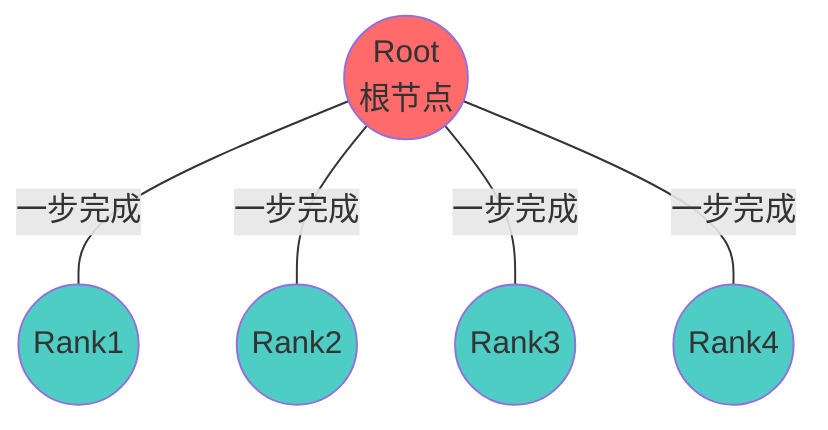

**算法原理说明：**

Star算法是最简单直接的集合通信算法，采用**星型拓扑**结构，所有通信都通过**中心根节点（Root）**进行。适用于**Server内高带宽全连接**或**有明确根节点**的通信场景。

**核心特点：单步完成（O(1)复杂度）**

Star算法的核心优势是**一步到位**：根节点直接与所有其他节点通信，无需多跳转发。这在高带宽、低延迟的网络环境下性能最优。

**典型应用场景：**

1. **Broadcast（广播）**：
   - Root节点持有数据，需要发送给所有其他节点
   - 执行：Root → {R1, R2, R3, R4}同时发送
   - 一步完成，耗时 = α + nβ（一次延迟 + 传输时间）

2. **Reduce（规约到根节点）**：
   - 所有节点的数据需要规约到Root
   - 执行：{R1, R2, R3, R4} → Root同时发送并在Root规约
   - 一步完成，耗时 = α + nβ + nγ（延迟 + 传输 + 规约）

3. **Gather（收集到根节点）**：
   - 所有节点的数据收集到Root（无需规约）
   - 执行：{R1, R2, R3, R4} → Root同时发送
   - 一步完成，耗时 = α + nβ

4. **Scatter（分发）**：
   - Root将不同数据块分发给不同节点
   - 执行：Root → {R1, R2, R3, R4}同时发送不同块
   - 一步完成，耗时 = α + (n/p)β（每个节点接收n/p大小数据）

**网络拓扑要求：**

- **物理全连接**：Root与所有节点直接相连（如Server内NVLink/PCIe全连接）
- **高带宽链路**：链路带宽足够高，可支持Root同时多流发送而不拥塞
- **低延迟**：单跳延迟小，一步通信开销可接受

**优势：**

1. **最优时间复杂度**：O(1)，理论上最快
2. **逻辑简单**：无需复杂调度和同步
3. **Server内最优**：Server内NPU通过NVLink全连接，Star是首选

**局限性：**

1. **根节点瓶颈**：Root需要同时与p-1个节点通信，带宽压力大
   - 发送带宽：Root需发送(p-1)×n数据（Broadcast场景）
   - 接收带宽：Root需接收(p-1)×n数据（Reduce场景）
2. **不适合Server间**：跨Server通信带宽有限，Root瓶颈严重
3. **无负载均衡**：所有流量集中在Root，其他节点链路利用率低
4. **不支持AllToAll**：AllToAll需要所有节点对通信，Star无法高效实现

**适用原语限制：**

✅ **适用**：Broadcast、Reduce、Gather、Scatter（有明确根节点的单向通信）
❌ **不适用**：AllReduce、AllGather、ReduceScatter、AllToAll（需要所有节点间通信）

**特点：**
- **拓扑：** 星型或全连接
- **时间复杂度：** O(1) - 单步完成
- **适用算子：** Broadcast、Reduce、Gather、Scatter
- **适用场景：** Server内通信，有根节点的操作

#### 3.6.2 性能模型

$$
T = \alpha + n\beta
$$

非常简洁，仅一步通信完成。

### 3.7 NHR (Nonuniform Hierarchical Ring) 算法

#### 3.7.1 算法原理

非均衡的层次环算法，通过构建N棵生成树实现高效通信。

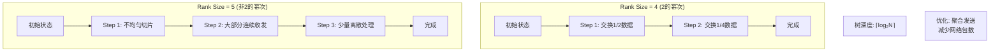

**算法原理说明：**

NHR（Nonuniform Hierarchical Ring）算法是**非均衡的层次化环算法**，专门解决**节点数不是2的幂次**时的高效通信问题。传统RHD算法要求节点数为2的幂次，否则性能大幅下降；NHR通过**N棵生成树**和**不均匀切片**策略，在任意节点数下都能保持对数级复杂度。

**核心创新：N棵生成树（N Spanning Trees）**

NHR的关键思想是构建**N = ⌈log₂p⌉棵生成树**，每棵树负责一部分数据的通信：
- **树的深度**：⌈log₂p⌉（与节点数对数相关）
- **树的结构**：每棵树根据节点编号和步数动态确定父子关系
- **数据分配**：将总数据均匀或非均匀切分到N棵树

**2的幂次 vs 非2的幂次对比：**

**场景1：Rank Size = 4（2的幂次）**
- **Step 1**：交换1/2数据（距离=2）
  - R0 ↔ R2，R1 ↔ R3
  - 每个节点交换一半数据
- **Step 2**：交换1/4数据（距离=1）
  - R0 ↔ R1，R2 ↔ R3
  - 每个节点再交换剩余的一半
- **完成**：2步（log₂4=2），每步数据量递减

**场景2：Rank Size = 5（非2的幂次）**
- **问题**：不能均匀对半分，需要不均匀切片
- **Step 1**：不均匀切片（某些节点交换2/5，某些交换3/5）
  - 根据树结构动态确定交换量
- **Step 2**：大部分连续收发（利用连续内存，减少小包）
  - 聚合发送优化，减少网络包数
- **Step 3**：少量离散处理（处理不对齐部分）
  - 完成剩余数据交换
- **完成**：3步（⌈log₂5⌉=3），虽然不均匀但保持对数复杂度

**关键技术：聚合发送优化（Aggregated Send）**

NHR的另一个优化是针对**小数据包场景**：
- **问题**：多棵树可能产生大量小数据包，网络包头开销大
- **解决**：在小数据场景下，采用**单棵树策略**，将所有数据通过一棵树传输
- **效果**：减少网络包数量，降低协议栈开销

**流量分布优化：**

NHR算法设计时考虑了**物理位置相近性**：
- **最大流量**：尽量安排在物理位置相近的节点间（如同Server内）
- **减少冲突**：通过树结构避免多流竞争同一链路
- **层次化友好**：适配Server内+Server间的层次化网络

**适用场景：**

1. **大规模集群**：Server数量多，节点数往往不是2的幂次
2. **非对称拓扑**：节点数任意（5、6、7等），不受2的幂次限制
3. **小数据包通信**：聚合发送优化提升小包性能
4. **层次化网络**：流量分布优化适配收敛比网络

**与RHD对比：**

| 维度 | RHD | NHR |
|------|-----|-----|
| 节点数要求 | 必须是2的幂次 | 任意节点数 |
| 时间复杂度 | O(log₂p) | O(⌈log₂p⌉) |
| 数据切分 | 均匀 | 可能不均匀 |
| 小数据优化 | 无 | 单棵树策略 |
| 实现复杂度 | 低 | 中等 |

**算法优势：**

1. **通用性强**：任意节点数都能高效运行
2. **对数复杂度**：保持⌈log₂p⌉步通信，接近理论最优
3. **灵活优化**：可根据数据量、网络拓扑调整策略
4. **工程实用**：大规模集群中节点数变化常见，NHR适应性好

**特点：**
- **时间复杂度：** $O(\lceil \log_2 N \rceil)$
- **关键优势：**
  - 无论节点数是否为2的幂次，均保持对数复杂度
  - 最大流量集中在物理位置相近节点间
  - 减少流量冲突
  - 小数据包场景优化（单棵树策略）
- **适用场景：** 大规模集群，Server数量多

#### 3.7.2 性能模型

| 操作 | 耗时公式 | 说明 |
|------|---------|------|
| ReduceScatter | $\lceil \log_2 p \rceil\alpha + \frac{p-1}{p}n\beta + \frac{p-1}{p}n\gamma$ | N棵生成树，树深度⌈log₂p⌉，聚合发送减少包数 |
| AllGather | $\lceil \log_2 p \rceil\alpha + \frac{p-1}{p}n\beta$ | 与ReduceScatter对称，⌈log₂p⌉步收集，无规约开销 |
| AllReduce | $2\lceil \log_2 p \rceil\alpha + 2\frac{p-1}{p}n\beta + \frac{p-1}{p}n\gamma$ | ReduceScatter(⌈log₂p⌉步) + AllGather(⌈log₂p⌉步) |
| Scatter | $\lceil \log_2 p \rceil\alpha + \frac{p-1}{p}n\beta$ | 小数据包场景优化，采用单棵树策略，⌈log₂p⌉步完成 |
| Broadcast | $2\lceil \log_2 p \rceil\alpha + 2\frac{p-1}{p}n\beta$ | Scatter(⌈log₂p⌉步) + AllGather(⌈log₂p⌉步)实现 |

### 3.8 NB (Nonuniform Bruck) 算法

#### 3.8.1 算法原理

非均匀的数据块通信算法，通过动态调整步长的多重环状结构实现高效通信。

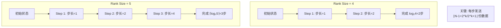

**算法原理说明：**

NB（Nonuniform Bruck）算法是**非均匀Bruck算法**，是对经典Bruck算法的改进，专门解决**任意节点数**下的高效集合通信。与NHR类似，NB也是为了克服RHD算法对2的幂次节点数的限制，但采用了不同的技术路线：**动态步长多重环**。

**核心机制：动态步长递增（Dynamic Distance Increment）**

NB算法的核心特点是**步长按指数递增**：1 → 2 → 4 → 8 → ...
- **第k步**：每个节点与距离为2^(k-1)的节点通信
- **通信模式**：节点i与节点(i+2^(k-1)) mod p通信
- **数据量**：第k步发送 ⌊(p-1+2^k)/2^(k+1)⌋ 份数据（非均匀）

**2的幂次 vs 非2的幂次对比：**

**场景1：Rank Size = 4（2的幂次）**
- **初始状态**：每个节点持有1份数据，需收集其他3份
- **Step 1（步长=1）**：
  - R0 ↔ R1，R2 ↔ R3
  - 每个节点交换1份数据，现在各持有2份
- **Step 2（步长=2）**：
  - R0 ↔ R2，R1 ↔ R3
  - 每个节点交换2份数据，现在各持有4份（全部数据）
- **完成**：2步（log₂4=2），每步数据量加倍

**场景2：Rank Size = 5（非2的幂次）**
- **初始状态**：每个节点持有1份数据，需收集其他4份
- **Step 1（步长=1）**：
  - R0 ↔ R1，R1 ↔ R2，R2 ↔ R3，R3 ↔ R4，R4 ↔ R0（环状）
  - 每个节点交换1份，现在各持有2份
  - **数据量**：⌊(5-1+2)/4⌋ = 1份
- **Step 2（步长=2）**：
  - R0 ↔ R2，R1 ↔ R3，R2 ↔ R4，R3 ↔ R0，R4 ↔ R1
  - 每个节点交换2份，现在各持有3或4份
  - **数据量**：⌊(5-1+4)/8⌋ = 1份（但实际交换的是2份，因为有部分重复）
- **Step 3（步长=4）**：
  - R0 ↔ R4，R1 ↔ R0，R2 ↔ R1，R3 ↔ R2，R4 ↔ R3
  - 补齐剩余数据，所有节点持有全部5份
  - **数据量**：⌊(5-1+8)/16⌋ = 0或1份（少量补充）
- **完成**：3步（⌈log₂5⌉=3），通过非均匀数据量分配完成

**关键公式：每步发送数据量**

第k步发送数据量 = ⌊(N-1+2^k)/2^(k+1)⌋ 份

**公式解释：**
- **N-1**：总共需要收集的其他节点数据份数
- **2^k**：当前步的"覆盖范围"补偿
- **2^(k+1)**：归一化因子
- **向下取整**：确保数据量为整数

**示例（N=5）：**
- k=1: ⌊(5-1+2)/4⌋ = ⌊7/4⌋ = 1
- k=2: ⌊(5-1+4)/8⌋ = ⌊8/8⌋ = 1
- k=3: ⌊(5-1+8)/16⌋ = ⌊12/16⌋ = 0（剩余数据很少）

**与RHD和NHR对比：**

| 维度 | RHD | NHR | NB |
|------|-----|-----|-----|
| 节点数要求 | 2的幂次 | 任意 | 任意 |
| 时间复杂度 | O(log₂p) | O(⌈log₂p⌉) | O(⌈log₂p⌉) |
| 通信模式 | XOR | N棵生成树 | 动态步长环 |
| 额外通信量 | 无 | 少量 | 几乎无 |
| 实现复杂度 | 低 | 中 | 中 |

**NB的关键优势：**

1. **避免额外通信量增长**：
   - RHD在非2幂次节点时需要额外通信步骤
   - NHR可能产生不均匀切片导致部分通信量增加
   - NB通过动态调整每步数据量，最小化额外开销

2. **环状结构简单**：
   - 相比NHR的N棵树，NB的环状结构更直观
   - 实现上更容易理解和调试

3. **数学精确性**：
   - 通过精确公式计算每步数据量
   - 保证理论最优或接近最优的通信量

**适用场景：**

1. **大规模集群**：节点数任意，不受2的幂次限制
2. **通信量敏感场景**：需要严格控制通信量，避免额外开销
3. **对数复杂度要求**：要求⌈log₂p⌉步完成，接近理论最优

**算法流程特点：**

- **逐步聚合**：每一步都在前一步基础上聚合更多数据
- **步长倍增**：1→2→4→...，类似二进制展开
- **非均匀但最优**：虽然每步数据量可能不同，但总通信量接近理论下界

**特点：**
- **时间复杂度：** $O(\lceil \log_2 N \rceil)$
- **关键优势：**
  - 不同节点数下均保持对数通信步数
  - 避免额外通信数据量增长（相比RHD）
- **适用场景：** 大规模集群，Server数量多

#### 3.8.2 性能模型

| 操作 | 耗时公式 | 说明 |
|------|---------|------|
| ReduceScatter | $\lceil \log_2 p \rceil\alpha + \frac{p-1}{p}n\beta + \frac{p-1}{p}n\gamma$ | 动态步长多重环，⌈log₂p⌉步，第k步传输⌊(p-1+2^k)/2^(k+1)⌋份数据 |
| AllGather | $\lceil \log_2 p \rceil\alpha + \frac{p-1}{p}n\beta$ | 步长递增(1→2→4→...)，⌈log₂p⌉步，无额外通信量 |
| AllReduce | $2\lceil \log_2 p \rceil\alpha + 2\frac{p-1}{p}n\beta + \frac{p-1}{p}n\gamma$ | ReduceScatter(⌈log₂p⌉步) + AllGather(⌈log₂p⌉步) |
| Scatter | $\lceil \log_2 p \rceil\alpha + \frac{p-1}{p}n\beta$ | 动态步长散发，⌈log₂p⌉步完成，每步传输量不均匀 |
| Broadcast | $2\lceil \log_2 p \rceil\alpha + 2\frac{p-1}{p}n\beta$ | Scatter(⌈log₂p⌉步) + AllGather(⌈log₂p⌉步)实现 |

### 3.9 AHC (Asymmetric Hierarchical Concatenate) 算法

#### 3.9.1 算法原理

层次化集合通信算法，专门处理非对称层次化网络拓扑。

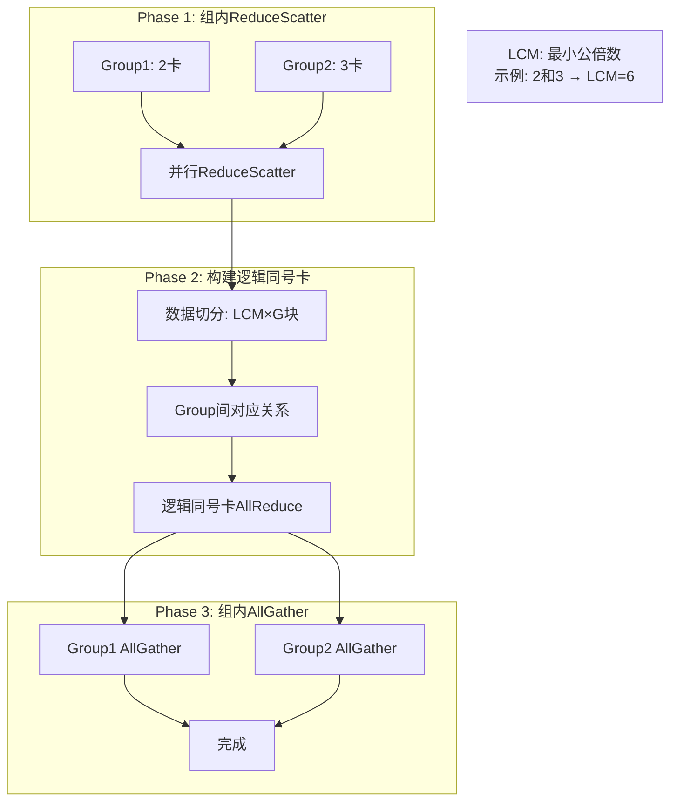

**特点：**
- **适用场景：**
  - 层次化网络拓扑
  - 不同层次间NPU数量不对称
  - 层次间存在带宽收敛
- **关键技术：**
  - 基于拓扑的计算单元重新分组
  - 逻辑同号卡概念
  - 非均匀数据块切分

#### 3.9.2 执行流程示例（以AllReduce为例）

**说明：** AHC算法主要应用于AllReduce、ReduceScatter等需要跨层次通信的场景，此处以AllReduce为典型示例。

**场景：** 5个Rank，分为2组（Group1: 2卡，Group2: 3卡）

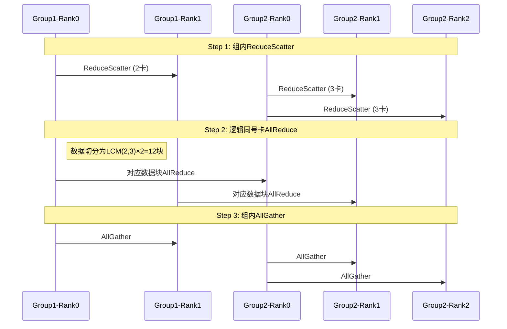

**详细执行流程说明：**

AHC算法专门解决**层次化非对称网络拓扑**的集合通信问题。当不同层次间的计算单元数量不对称时（如Group1有2卡，Group2有3卡），传统算法无法直接应用。AHC通过**逻辑同号卡**概念和**LCM数据切分**实现高效通信。

**初始状态：** 
- Group1: Rank0和Rank1各持有完整数据[A,B,C,D,E,F]
- Group2: Rank0、Rank1、Rank2各持有完整数据[A,B,C,D,E,F]
- 目标：所有5个Rank最终持有所有数据的规约结果

**Phase 1: 组内ReduceScatter阶段**

每个Group内部独立执行ReduceScatter，将数据规约并分散到各个成员节点。

- **Group1 (2卡) 执行**：
  - 使用Ring或RHD算法在G1R0和G1R1间执行ReduceScatter
  - G1R0持有前半部分规约结果：[A*, B*, C*]
  - G1R1持有后半部分规约结果：[D*, E*, F*]
  - 注：此处的*表示Group1内部的局部规约（仅2个节点的规约）

- **Group2 (3卡) 执行**：
  - 使用Ring算法在G2R0、G2R1、G2R2间执行ReduceScatter
  - G2R0持有第1份：[A*, B*]
  - G2R1持有第2份：[C*, D*]
  - G2R2持有第3份：[E*, F*]
  - 注：此处的*表示Group2内部的局部规约（仅3个节点的规约）

- **阶段特点**：各组内部并行执行，无跨组通信，充分利用组内高带宽链路

**Phase 2: 跨组逻辑同号卡AllReduce阶段**

这是AHC算法的核心创新，通过**LCM(Least Common Multiple)数据切分**和**逻辑同号卡映射**实现跨组通信。

- **LCM切分原理**：
  - Group1有2卡，Group2有3卡，LCM(2,3) = 6
  - 数据被切分为 LCM × G = 6 × 2 = 12 个逻辑块
  - 这样确保每个物理节点都能负责整数个逻辑块

- **逻辑同号卡映射**：
  - G1R0（逻辑编号0）对应 G2R0（逻辑编号0）：负责块0-5的规约
  - G1R1（逻辑编号1）对应 G2R1（逻辑编号1）：负责块6-11的规约
  - G2R2作为额外节点，将其数据分配给对应的逻辑同号卡处理

- **跨组AllReduce执行**：
  - G1R0 ↔ G2R0之间对对应数据块执行AllReduce（规约并交换结果）
  - G1R1 ↔ G2R1之间对对应数据块执行AllReduce
  - G2R2的数据通过环状通信或直接发送方式参与规约
  - 执行后，逻辑同号卡持有跨组完整规约结果

- **阶段特点**：跨组通信量最小化，仅在逻辑对应节点间进行，避免全连接通信

**Phase 3: 组内AllGather阶段**

将跨组规约的结果在各组内部收集，使所有节点都持有完整的最终结果。

- **Group1 AllGather**：
  - G1R0和G1R1执行AllGather
  - 将各自持有的部分规约结果交换
  - 最终G1R0和G1R1都持有完整的全局规约结果[A*, B*, C*, D*, E*, F*]

- **Group2 AllGather**：
  - G2R0、G2R1、G2R2执行AllGather
  - 三个节点间交换各自持有的规约结果
  - 最终所有节点都持有完整的全局规约结果[A*, B*, C*, D*, E*, F*]

- **阶段特点**：再次利用组内高带宽，快速完成数据广播，无额外规约计算

**AHC算法整体特点：**

1. **非对称拓扑适应性**：通过LCM切分解决不同组卡数不一致问题
2. **三阶段分治**：组内→跨组→组内，最小化高延迟跨组通信量
3. **逻辑同号卡创新**：虚拟化物理节点映射，实现负载均衡
4. **带宽分层利用**：组内用高带宽链路，跨组用有限带宽链路，充分适应收敛比网络
5. **复杂度权衡**：虽然增加了数据切分复杂度，但显著减少了跨层通信开销，在层次化网络中性能优异

**典型应用场景：**
- 多机多卡训练（机器间带宽 << 机器内带宽）
- Pod内训练（Pod间带宽收敛）
- 边缘计算集群（不同边缘节点计算能力不对称）

#### 3.9.3 性能模型

采用NB算法作为组内和组间算法时：

$$
T_{ReduceScatter} = 2(\lceil \log_2(m+d) \rceil + \lceil \log_2 G \rceil)\alpha + 2(\frac{m+d-1}{m+d} + \frac{(G-1)C}{Gm})n\beta + (\frac{m+d-1}{m+d} + \frac{G-1}{Gm})n\gamma
$$

**参数说明：**
- m：最小分组卡数
- d：最大分组与最小分组的差值
- G：分组数
- C：组间带宽相对组内带宽的收敛比

### 3.10 Pipeline 算法

#### 3.10.1 算法原理

流水线并行算法，充分利用Server内和Server间链路的并发能力。

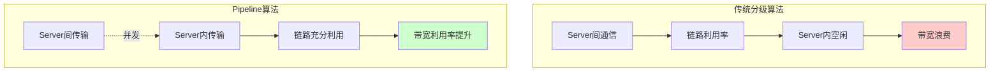

**核心思想：** 挖掘通信算法的数据依赖，通过流水并行解决带宽利用不足问题。

#### 3.10.2 流水线执行示例（以AllGather为例）

**说明：** Pipeline算法主要应用于AllReduce、AllGather、ReduceScatter等大数据量场景，此处以AllGather为典型示例展示流水线并发机制。

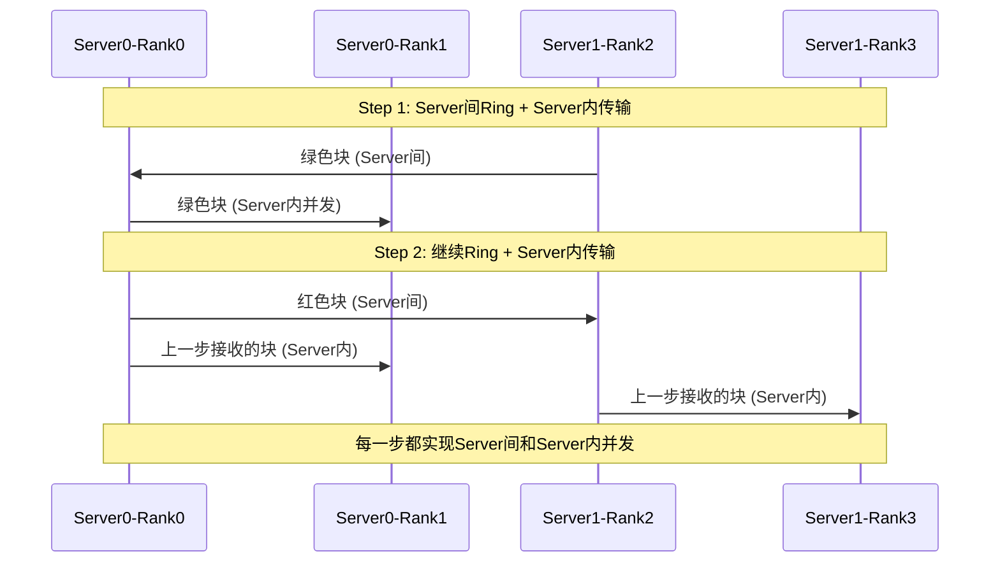

**详细执行流程说明：**

Pipeline算法的核心目标是**解决带宽利用率不足问题**，特别是在层次化网络拓扑中（Server内高带宽 + Server间低带宽），传统分级算法会导致某一时刻只有一层链路工作，另一层链路空闲。Pipeline通过**挖掘数据依赖关系**，实现跨层并发，充分利用所有链路带宽。

**场景设置：**
- 4个Rank分布在2个Server上：Server0包含Rank0和Rank1，Server1包含Rank2和Rank3
- Server内带宽：高（如NVLink 600GB/s）
- Server间带宽：低（如RDMA 100Gb/s = 12.5GB/s，收敛比约48:1）
- 初始状态：每个Rank持有不同数据块，需执行AllGather收集所有数据

**传统分级算法的问题：**
1. **阶段1**：Server间通信时，Server内链路完全空闲
2. **阶段2**：Server内通信时，Server间链路完全空闲
3. **结果**：链路利用率低，总时间 = Server间时间 + Server内时间

**Pipeline算法的创新：**

通过**数据依赖分析**，发现：当Rank0从Rank2接收到一个数据块后，可以**立即**将该数据块转发给Server内的Rank1，而无需等待所有Server间通信完成。这样Server间和Server内通信可以**流水线并发**。

**Step-by-Step执行流程（AllGather示例）：**

**初始状态：**
- S0R0持有：[红色块]
- S0R1持有：[蓝色块]
- S1R2持有：[绿色块]
- S1R3持有：[黄色块]
- 目标：所有Rank持有[红、蓝、绿、黄]全部数据

**Step 1：第一轮并发传输**
- **Server间Ring通信**：
  - S1R2 → S0R0：发送绿色块（跨Server，走低带宽链路）
  - S0R0 → S1R2：发送红色块（跨Server）
- **Server内并发通信**（与上述同时进行）：
  - S0R0 → S0R1：发送红色块（Server内，走高带宽链路）
  - S1R2 → S1R3：发送绿色块（Server内）

- **Step 1后状态**：
  - S0R0：[红、绿]
  - S0R1：[蓝、红]
  - S1R2：[绿、红]
  - S1R3：[黄、绿]

- **并发效果**：Server间传输绿色块的同时，Server内也在传输红色/绿色块，两层链路都在工作

**Step 2：第二轮并发传输**
- **Server间Ring通信**：
  - S0R0 → S1R2：发送[红、绿]中的绿色块（S0R0刚收到的）
  - S1R2 → S0R0：发送[绿、红]中的红色块
  - 注意：S0R0可以立即转发上一步刚收到的绿色块，无需等待

- **Server内并发通信**：
  - S0R0 → S0R1：发送绿色块（S0R0在Step 1收到的）
  - S0R1 → S0R0：发送蓝色块
  - S1R2 → S1R3：发送红色块（S1R2在Step 1收到的）
  - S1R3 → S1R2：发送黄色块

- **Step 2后状态**：
  - S0R0：[红、绿、蓝]
  - S0R1：[蓝、红、绿]
  - S1R2：[绿、红、黄]
  - S1R3：[黄、绿、红]

**Step 3：第三轮并发传输**
- **Server间Ring通信**：
  - S0R0 → S1R2：发送蓝色块
  - S1R2 → S0R0：发送黄色块

- **Server内并发通信**：
  - S0R0 → S0R1：发送蓝色块或黄色块
  - S1R2 → S1R3：发送蓝色块或黄色块

- **最终状态**：所有Rank持有[红、蓝、绿、黄]完整数据

**Pipeline核心机制：**

1. **数据流水**：数据块像流水线一样流动，刚到达的数据立即转发，无需等待批次完成
2. **双层并发**：每个时间片内，Server间和Server内链路同时传输不同数据
3. **依赖解耦**：通过分析数据依赖，将"Server间完成→Server内开始"的串行依赖解耦为并发
4. **带宽充分利用**：高带宽链路（Server内）和低带宽链路（Server间）同时工作，总时间约等于 max(Server间时间, Server内时间)，而非二者之和

**性能对比（假设数据量S，Server间带宽β_inter，Server内带宽β_intra）：**

- **传统分级算法总时间**：$T = \frac{S}{\beta_{inter}} + \frac{S}{\beta_{intra}}$
- **Pipeline算法总时间**：$T \approx \max(\frac{S}{\beta_{inter}}, \frac{S}{\beta_{intra}})$
- **加速比**：当 β_intra >> β_inter 时，加速比接近 $\frac{\beta_{intra} + \beta_{inter}}{\beta_{intra}} \approx 1 + \frac{\beta_{inter}}{\beta_{intra}}$

例如收敛比48:1的场景，理论加速比可达1.02倍，但实际大数据量场景下加速更明显。

**Pipeline算法特点：**

1. **适用场景广泛**：AllReduce、AllGather、ReduceScatter等多种原语都可应用
2. **收敛比敏感**：收敛比越大（Server内外带宽差异越大），Pipeline优势越明显
3. **实现复杂度高**：需要精细管理数据依赖和调度，代码复杂度较高
4. **内存开销**：需要额外缓冲区存储流水线中的中间数据
5. **延迟隐藏**：通过并发隐藏跨层通信延迟，特别适合大数据量场景

**关键特性：**
- **AllReduce**: Server间Ring(ReduceScatter+AllGather) 并发 Server内FullMesh
- **ReduceScatter**: Server间Ring 并发 Server内传输
- **AllGather**: Server间Ring 并发 Server内传输

#### 3.10.3 性能模型

| 操作 | 耗时公式 | 说明 |
|------|---------|------|
| ReduceScatter | $\max(\frac{s}{p}\beta_{inter} + \alpha_{inter}, \frac{s}{p}\beta_{intra} + \alpha_{intra}) \times (p_{inter}-1) + \frac{s}{p}\beta_{intra} + \alpha_{intra}$ | Server间Ring和Server内Mesh并发，每步取较慢者，最后补一次Server内传输 |
| AllGather | $\max(\frac{s}{p}\beta_{inter} + \alpha_{inter}, \frac{s}{p}\beta_{intra} + \alpha_{intra}) \times (p_{inter}-1) + \frac{s}{p}\beta_{intra} + \alpha_{intra}$ | 与ReduceScatter对称，流水线式并发收集数据 |
| AllReduce | $2 \times (\max(\frac{s}{p}\beta_{inter} + \alpha_{inter}, \frac{s}{p}\beta_{intra} + \alpha_{intra}) \times (p_{inter}-1) + \frac{s}{p}\beta_{intra} + \alpha_{intra})$ | ReduceScatter + AllGather，两阶段流水并发充分利用带宽 |

**参数说明：**
- s：总数据量
- p：总卡数
- $p_{inter}$：Server数量
- $\beta_{inter}$、$\alpha_{inter}$：Server间链路参数
- $\beta_{intra}$、$\alpha_{intra}$：Server内链路参数

### 3.11 算法选择策略

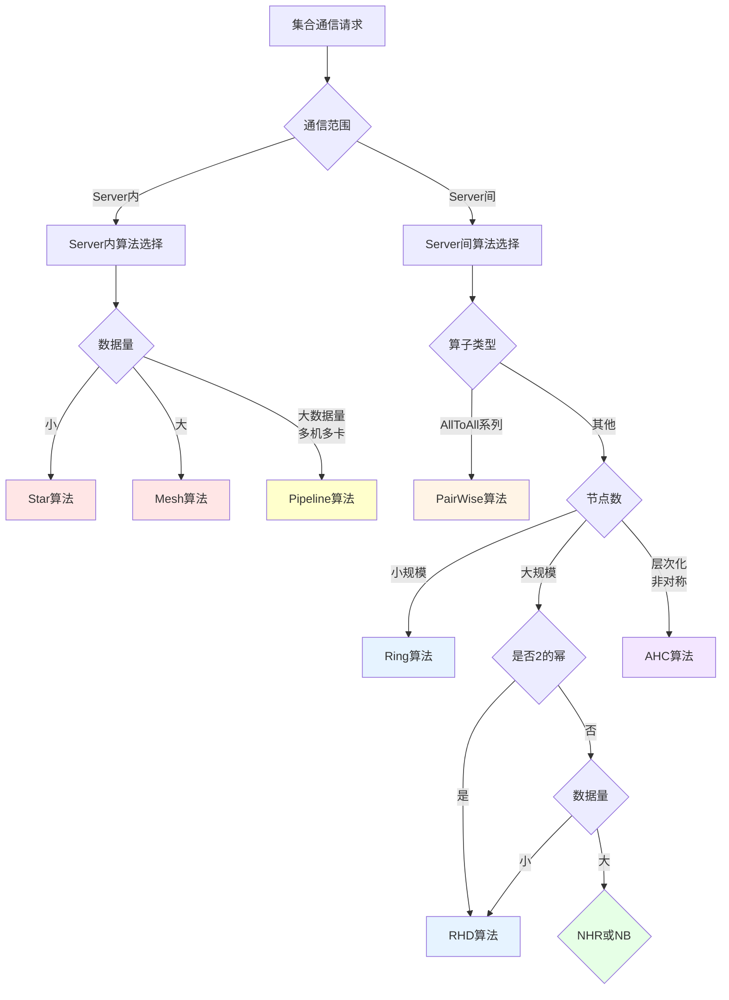

## 4. 集合通信原语

### 4.1 核心原语列表

| 原语 | 描述 | 主要算法 |
|------|------|---------|
| **AllReduce** | 所有节点规约后广播结果 | Mesh, Ring, RHD, NHR, NB, AHC, Pipeline |
| **AllGather** | 所有节点收集全部数据 | Mesh, Ring, RHD, NHR, NB, Pipeline |
| **ReduceScatter** | 规约后散发到各节点 | Mesh, Ring, RHD, NHR, NB, AHC, Pipeline |
| **Broadcast** | 根节点向所有节点广播 | Mesh, Ring, RHD, NHR, NB, Star |
| **Reduce** | 所有节点向根节点规约 | Mesh, Ring, RHD, Star |
| **Scatter** | 根节点散发数据到各节点 | Mesh, Ring, NHR, NB, Star |
| **Gather** | 所有节点向根节点收集 | Mesh, Ring, Star |
| **AllToAll** | 所有节点间全交换 | PairWise |
| **AllToAllV** | 所有节点间变长全交换 | PairWise |

### 4.2 原语语义说明

```mermaid
graph LR
    subgraph "AllReduce"
        AR1[R0:A0] --> ARS[Sum]
        AR2[R1:A1] --> ARS
        AR3[R2:A2] --> ARS
        ARS --> ARR1[R0:Sum]
        ARS --> ARR2[R1:Sum]
        ARS --> ARR3[R2:Sum]
    end
    
    subgraph "AllGather"
        AG1[R0:A0] --> AGR1[R0:A0+A1+A2]
        AG2[R1:A1] --> AGR2[R1:A0+A1+A2]
        AG3[R2:A2] --> AGR3[R2:A0+A1+A2]
    end
    
    subgraph "ReduceScatter"
        RS1[R0:A0] --> RSS[Sum切分]
        RS2[R1:A1] --> RSS
        RS3[R2:A2] --> RSS
        RSS --> RSR1[R0:Sum_part0]
        RSS --> RSR2[R1:Sum_part1]
        RSS --> RSR3[R2:Sum_part2]
    end
```

## 5. 通信框架设计

### 5.1 通信域管理

```mermaid
classDiagram
    class Communicator {
        -int commId
        -int rank
        -int size
        -CommunicatorType type
        +Create()
        +Destroy()
        +GetRank()
        +GetSize()
    }
    
    class CommunicatorGroup {
        -List~Communicator~ comms
        +CreateGroup()
        +SplitGroup()
        +FreeGroup()
    }
    
    class RankInfo {
        -int rankId
        -int deviceId
        -string hostName
        -NetworkInfo netInfo
    }
    
    Communicator "1" --> "*" RankInfo
    CommunicatorGroup "1" --> "*" Communicator
```

### 5.2 算子执行流程

```mermaid
sequenceDiagram
    participant User as 用户调用
    participant Framework as 通信框架
    participant AlgoSelector as 算法选择器
    participant Algorithm as 通信算法
    participant Platform as 通信平台
    
    User->>Framework: HcclAllReduce(...)
    Framework->>Framework: 参数校验
    Framework->>AlgoSelector: 请求算法选择
    
    AlgoSelector->>AlgoSelector: 分析通信域信息
    AlgoSelector->>AlgoSelector: 评估数据量
    AlgoSelector->>AlgoSelector: 应用选择策略
    AlgoSelector-->>Framework: 返回算法类型
    
    Framework->>Algorithm: 执行算法
    Algorithm->>Algorithm: 计算资源需求
    Algorithm->>Algorithm: 生成任务编排
    
    Algorithm->>Platform: 申请资源
    Platform-->>Algorithm: 返回资源句柄
    
    Algorithm->>Platform: 下发任务
    Platform->>Platform: 执行通信
    Platform-->>Algorithm: 返回执行结果
    
    Algorithm-->>Framework: 算法执行完成
    Framework-->>User: 返回结果
```

### 5.3 算法选择器设计

```mermaid
graph TB
    Input[输入参数] --> Analyzer[参数分析器]
    
    Analyzer --> Topo[拓扑信息分析]
    Analyzer --> Data[数据量分析]
    Analyzer --> Op[算子类型分析]
    
    Topo --> Rules[选择规则库]
    Data --> Rules
    Op --> Rules
    
    Rules --> Model[性能模型评估]
    Model --> Decision[决策引擎]
    
    Decision --> Output[输出算法]
    
    subgraph "规则库"
        R1[拓扑规则]
        R2[数据量规则]
        R3[算子规则]
        R4[历史优化]
    end
    
    Rules -.包含.-> R1
    Rules -.包含.-> R2
    Rules -.包含.-> R3
    Rules -.包含.-> R4
```

## 6. 编译与构建系统

### 6.1 编译流程

```mermaid
graph TB
    Start[开始编译] --> CheckEnv{检查环境}
    
    CheckEnv -->|CANN已安装| CheckDeps[检查依赖]
    CheckEnv -->|未安装| Error1[报错退出]
    
    CheckDeps --> CMake[CMake配置]
    CMake --> Gen[生成构建文件]
    
    Gen --> CompileKernel{编译模式}
    
    CompileKernel -->|--aicpu| Kernel[编译ccl_kernel.so]
    CompileKernel -->|默认| Full[完整编译]
    
    Kernel --> InstallK[安装Kernel]
    Full --> CompileFramework[编译通信框架]
    CompileFramework --> CompileAlgo[编译通信算法]
    CompileAlgo --> Package[打包.run文件]
    
    Package --> Output[生成输出]
    InstallK --> Output
    
    Output --> End[编译完成]
```

### 6.2 主要编译选项

```bash
# 基础编译
bash build.sh --nlohmann_path /path/to/nlohmann/include

# 仅编译AICPU Kernel
bash build.sh --nlohmann_path /path --aicpu

# 编译并运行测试
bash build.sh --nlohmann_path /path --test

# 使能地址消毒器（用于内存检测）
bash build.sh --nlohmann_path /path --asan

# 使能代码覆盖率
bash build.sh --nlohmann_path /path --cov

# 指定CANN包路径
bash build.sh --nlohmann_path /path -p /usr/local/Ascend/ascend-toolkit/latest
```

### 6.3 依赖关系

```mermaid
graph TB
    HCCL[HCCL库] --> CANN[CANN开发套件包]
    HCCL --> SDK[CANN SDK包]
    HCCL --> JSON[nlohmann/json]
    
    CANN --> Runtime[CANN Runtime]
    CANN --> Driver[NPU驱动]
    CANN --> Firmware[NPU固件]
    
    SDK --> GTest[Google Test]
    
    Build[构建系统] --> Python[Python ≥ 3.7]
    Build --> GCC[GCC ≥ 7.3]
    Build --> CMake[CMake ≥ 3.16]
    
    style HCCL fill:#ff6b6b
    style CANN fill:#4ecdc4
    style SDK fill:#95e1d3
    style JSON fill:#f38181
```

## 7. 测试与验证

### 7.1 测试分层架构

```mermaid
graph TB
    subgraph "单元测试层"
        UT1[算法单元测试]
        UT2[框架单元测试]
        UT3[工具类单元测试]
    end
    
    subgraph "集成测试层"
        IT1[算子集成测试]
        IT2[多算法联合测试]
        IT3[异常场景测试]
    end
    
    subgraph "系统测试层"
        ST1[单机多卡测试]
        ST2[多机多卡测试]
        ST3[性能基准测试]
    end
    
    subgraph "工具测试层"
        TT1[HCCL Test工具]
        TT2[性能分析工具]
    end
    
    UT1 --> IT1
    UT2 --> IT2
    UT3 --> IT3
    
    IT1 --> ST1
    IT2 --> ST2
    IT3 --> ST3
    
    ST1 --> TT1
    ST2 --> TT1
    ST3 --> TT2
```

### 7.2 HCCL Test 工具

**功能测试示例：**

```bash
# 8卡AllReduce功能测试
mpirun -n 8 ./bin/all_reduce_test -b 8K -e 64M -f 2 -d fp32 -o sum -p 8
```

**参数说明：**
- `-b`: 起始数据量（8KB）
- `-e`: 结束数据量（64MB）
- `-f`: 增量系数（每次2倍）
- `-d`: 数据类型（fp32）
- `-o`: 规约操作（sum）
- `-p`: 参与NPU数量（8）

**输出指标：**
- `check_result`: 功能正确性（success/fail）
- `aveg_time`: 平均执行时间（微秒）
- `alg_bandwidth`: 算法带宽（GB/s）
- `data_size`: 单NPU数据量（Bytes）

### 7.3 LLT测试命令

```bash
# 运行所有LLT测试
sh build.sh --nlohmann_path /path/to/nlohmann/include --test

# 运行特定测试套件
sh build.sh --nlohmann_path /path --open_hccl_test
sh build.sh --nlohmann_path /path --executor_hccl_test
sh build.sh --nlohmann_path /path --executor_reduce_hccl_test
sh build.sh --nlohmann_path /path --executor_pipeline_hccl_test

# 使能内存检测
sh build.sh --nlohmann_path /path --test --asan
```

## 8. 性能优化策略

### 8.1 算法级优化

```mermaid
mindmap
  root((性能优化))
    算法选择
      拓扑感知
      数据量自适应
      负载均衡
    内存优化
      零拷贝技术
      内存池管理
      DMA直接访问
    并发优化
      流水线并行
      多流并发
      异步执行
    网络优化
      拥塞控制
      流量调度
      QoS保证
```

### 8.2 关键性能指标

| 指标 | 说明 | 目标 |
|------|------|------|
| **带宽利用率** | 实际带宽/理论带宽 | > 90% |
| **通信延迟** | 端到端通信时间 | 最小化 |
| **可扩展性** | 节点数增加时的性能保持 | 接近线性 |
| **负载均衡** | 各节点负载方差 | < 10% |
| **内存开销** | 额外内存消耗 | < 20% |

### 8.3 性能调优参数

**环境变量：**
```bash
# 算法选择策略
export HCCL_ALGO=<algo_name>

# 流水线深度
export HCCL_PIPELINE_DEPTH=<depth>

# 并发流数量
export HCCL_STREAM_NUM=<num>

# 日志级别
export ASCEND_SLOG_PRINT_TO_STDOUT=1
export ASCEND_GLOBAL_LOG_LEVEL=<level>
```

## 9. 安全与可靠性

### 9.1 安全措施

```mermaid
graph TB
    subgraph "编译安全"
        S1[栈保护 -fstack-protector]
        S2[位置无关代码 -fPIC]
        S3[RELRO保护]
        S4[NX保护]
    end
    
    subgraph "运行安全"
        R1[输入参数校验]
        R2[内存边界检查]
        R3[资源泄漏检测]
        R4[异常捕获与处理]
    end
    
    subgraph "通信安全"
        C1[端口认证]
        C2[数据完整性校验]
        C3[访问控制]
    end
    
    S1 --> Build[构建产物]
    S2 --> Build
    S3 --> Build
    S4 --> Build
    
    Build --> Deploy[部署]
    
    R1 --> Runtime[运行时]
    R2 --> Runtime
    R3 --> Runtime
    R4 --> Runtime
    
    Deploy --> Runtime
    
    C1 --> Comm[通信层]
    C2 --> Comm
    C3 --> Comm
    
    Runtime --> Comm
```

### 9.2 错误处理机制

```mermaid
stateDiagram-v2
    [*] --> Normal: 初始化
    Normal --> DetectError: 检测到错误
    DetectError --> Classify: 分类错误
    
    Classify --> Recoverable: 可恢复错误
    Classify --> Fatal: 致命错误
    
    Recoverable --> Retry: 重试机制
    Retry --> Success: 重试成功
    Retry --> Fallback: 重试失败
    Fallback --> Alternative: 切换备用方案
    Alternative --> Normal
    
    Success --> Normal
    
    Fatal --> Log: 记录日志
    Log --> Cleanup: 资源清理
    Cleanup --> [*]: 退出
```

### 9.3 日志与调试

**日志级别：**
- ERROR: 错误信息
- WARNING: 警告信息
- INFO: 一般信息
- DEBUG: 调试信息

**关键日志点：**
1. 通信域创建/销毁
2. 算法选择决策
3. 资源申请/释放
4. 任务执行状态
5. 性能统计信息

## 10. 版本管理与兼容性

### 10.1 版本策略

```mermaid
timeline
    title HCCL版本演进
    section CANN 8.x
        标签v8.0.0 : 基础算法 : Mesh/Ring/RHD
        标签v8.0.1 : 新增PairWise/Star
    section CANN 9.x
        标签v9.0.0 : 新增NHR/NB
        标签v9.0.1 : 新增AHC
    section CANN 10.x
        标签v10.0.0 : Pipeline优化
        标签v10.0.1 : 性能优化
```

### 10.2 兼容性矩阵

| HCCL版本 | CANN版本 | 固件版本 | 支持硬件 |
|---------|---------|---------|---------|
| v8.0.x | 8.0.x | 对应CANN | Atlas 800/900 |
| v9.0.x | 9.0.x | 对应CANN | Atlas 800/900 |
| v10.0.x | 10.0.x | 对应CANN | Atlas 800/900/新硬件 |

### 10.3 升级与回滚

```bash
# 安装自定义HCCL包
./CANN-hccl_alg-<version>-linux.<arch>.run

# 回滚到上一个版本
./CANN-hccl_alg-<version>-linux.<arch>.run --rollback
```

**注意：** 回滚仅支持回退到上一次安装的版本状态。

## 11. 扩展与定制开发

### 11.1 新算法集成流程

```mermaid
graph TB
    Start[开始] --> Design[算法设计]
    Design --> Implement[实现算法类]
    
    Implement --> Interface[实现算法接口]
    Interface --> Resource[资源计算逻辑]
    Resource --> Schedule[任务编排逻辑]
    
    Schedule --> Register[注册到框架]
    Register --> Selector[更新选择器规则]
    
    Selector --> UnitTest[单元测试]
    UnitTest --> IntegTest[集成测试]
    IntegTest --> PerfTest[性能测试]
    
    PerfTest --> Doc[文档编写]
    Doc --> End[完成]
```

### 11.2 算法接口规范

```cpp
// 伪代码示例
class CollectiveAlgorithm {
public:
    // 初始化算法
    virtual Status Init(const AlgorithmConfig& config) = 0;
    
    // 计算资源需求
    virtual Status CalculateResource(ResourceInfo& resource) = 0;
    
    // 生成任务编排
    virtual Status GenerateTaskSchedule(TaskSchedule& schedule) = 0;
    
    // 执行算法
    virtual Status Execute(const ExecuteContext& context) = 0;
    
    // 清理资源
    virtual Status Cleanup() = 0;
};
```

### 11.3 贡献指南

1. **Issue讨论：** 新特性需先通过Issue讨论方案
2. **CLA签署：** 首次贡献需签署CLA协议
3. **代码规范：** 遵循项目代码规范
4. **测试覆盖：** 提供完整的单元测试和集成测试
5. **文档更新：** 同步更新相关文档
6. **PR模板：** 按模板填写PR信息

## 12. 参考资料

### 12.1 官方文档

- [集合通信用户指南](https://hiascend.com/document/redirect/CannCommunityHcclUg)
- [集合通信源码定制开发指南](https://cann-doc.obs.cn-north-4.myhuaweicloud.com/hccl/)
- [环境变量参考](https://hiascend.com/document/redirect/CannCommunityEnvRef)
- [HCCL性能测试工具用户指南](https://hiascend.com/document/redirect/CannCommunityToolHcclTest)

### 12.2 技术文章

- [HCCL—昇腾高性能集合通信库简介](https://www.hiascend.com/zh/developer/techArticles/20240809-1)
- [HCCL集合通信算法开发Hello World示例](https://www.hiascend.com/zh/developer/techArticles/20240903-1)
- [HCCL集合通信常见问题定位思路](https://www.hiascend.com/zh/developer/techArticles/20240930-1)
- [深度学习的分布式训练与集合通信（一）](https://www.hiascend.com/zh/developer/techArticles/20241111-1)
- [深度学习的分布式训练与集合通信（二）](https://www.hiascend.com/zh/developer/techArticles/20241122-1)

### 12.3 培训视频

- [昇腾集合通信系列教程——什么是HCCL](https://www.bilibili.com/video/BV1MMmWYkEfS/)
- [昇腾集合通信系列教程——常见集合通信原语](https://www.bilibili.com/video/BV1YtUWYQEq2/)
- [昇腾集合通信系列教程——集合通信典型算法](https://www.bilibili.com/video/BV1XEz5YeE3A/)
- [HCCL设计原理和实现系列](https://www.bilibili.com/video/BV1w4sVeFEsB/)

### 12.4 性能基准

**典型场景性能（以AllReduce为例）：**

| 节点数 | 数据量 | 算法 | 带宽利用率 | 延迟 |
|-------|--------|------|-----------|------|
| 8 (单机) | 1GB | Mesh | >95% | <1ms |
| 16 (2机) | 1GB | Pipeline | >90% | <2ms |
| 64 (8机) | 1GB | NHR | >85% | <5ms |
| 128 (16机) | 1GB | NB | >80% | <10ms |

## 13. 总结

### 13.1 核心优势

1. **丰富的算法库**：9种算法覆盖各种场景
2. **智能算法选择**：基于α-β模型的性能评估
3. **层次化设计**：清晰的三层架构
4. **高性能实现**：充分利用硬件特性
5. **开放可扩展**：支持自定义算法开发

### 13.2 应用场景

```mermaid
mindmap
  root((HCCL应用))
    深度学习
      分布式训练
      数据并行
      模型并行
      流水线并行
    高性能计算
      科学计算
      大规模仿真
      图计算
    大数据
      分布式处理
      MapReduce
      Spark集成
```

### 13.3 未来展望

- **算法优化**：持续优化现有算法性能
- **新算法引入**：引入更多先进算法
- **智能调度**：基于AI的算法选择
- **异构支持**：支持更多硬件平台
- **生态建设**：与更多框架深度集成

---

