# HCCL与NCCL All2All算法实现对比分析

## 1. All2All在大模型专家并行中的应用

### 1.1 专家并行（MoE）简介

**MoE (Mixture of Experts)** 是一种高效的大模型架构，通过条件计算显著扩展模型容量而不成比例增加计算量。

**核心思想：**
- 将模型分成多个"专家"（Expert）子网络
- 每个token通过**路由器（Router）**动态选择少数几个专家处理
- 不同token可能选择不同的专家组合

**MoE架构示例：**

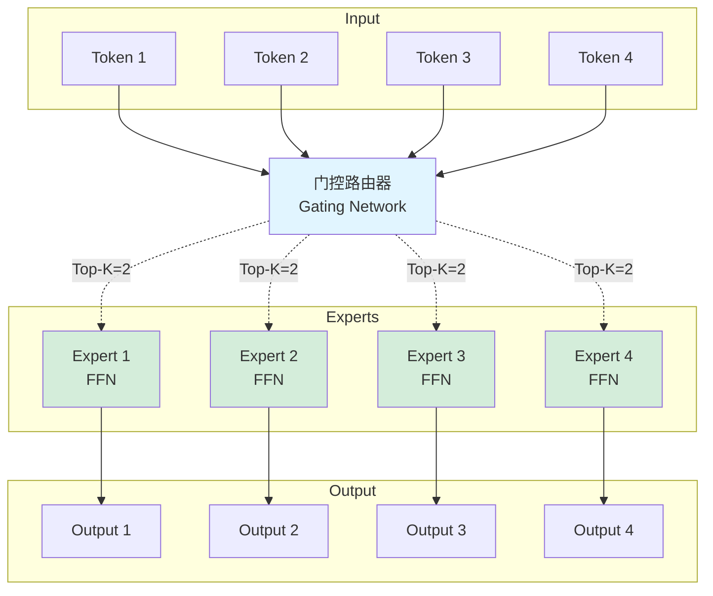

**关键参数：**
- **E (Expert数量)**：通常为64-256个专家
- **K (Top-K)**：每个token选择的专家数量，通常为1-2个
- **容量因子（Capacity Factor）**：控制每个专家处理的最大token数，通常为1.0-1.25

### 1.2 为什么需要All2All通信？

在**专家并行**场景下，专家分布在不同的GPU上，每个GPU持有一部分专家。当token需要被特定专家处理时，必须进行跨GPU的数据重分配。

**问题场景：**

```
初始状态（按数据并行切分）：
GPU 0: [Token 0, Token 1, Token 2, Token 3] + [Expert 0, Expert 1]
GPU 1: [Token 4, Token 5, Token 6, Token 7] + [Expert 2, Expert 3]

路由决策后（每个token选择Top-1专家）：
Token 0 → Expert 2 (在GPU 1上)
Token 1 → Expert 1 (在GPU 0上)
Token 2 → Expert 3 (在GPU 1上)
Token 3 → Expert 0 (在GPU 0上)
Token 4 → Expert 1 (在GPU 0上)
Token 5 → Expert 2 (在GPU 1上)
Token 6 → Expert 0 (在GPU 0上)
Token 7 → Expert 3 (在GPU 1上)

需要的数据移动：
GPU 0需要发送：Token 0, Token 2 → GPU 1
GPU 0需要接收：Token 4, Token 6 ← GPU 1
GPU 1需要发送：Token 4, Token 6 → GPU 0
GPU 1需要接收：Token 0, Token 2 ← GPU 0
```

这正是**All2All通信**的典型应用场景！

### 1.3 MoE中的All2All工作流程

MoE层的完整计算流程包含**两次All2All通信**：

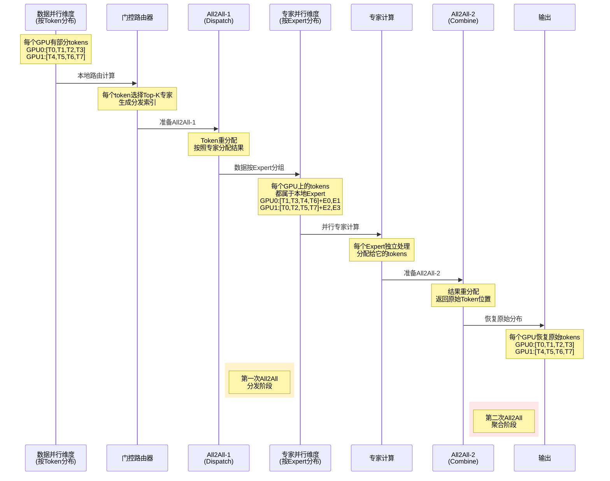

**详细步骤说明：**

**Step 1: 本地路由计算**
```python
# 输入: [batch_size, seq_len, hidden_dim]
# 路由器计算每个token的专家分配
router_logits = router_network(input)  # [batch_size, seq_len, num_experts]
top_k_indices = torch.topk(router_logits, k=K, dim=-1)  # [batch_size, seq_len, K]

# 示例输出：
# Token 0 → [Expert 2, Expert 5]
# Token 1 → [Expert 1, Expert 4]
# ...
```

**Step 2: 准备All2All-1（Dispatch）**
```python
# 计算发送/接收的数据量
# send_counts[i]: 发送给GPU i的token数量
# recv_counts[i]: 从GPU i接收的token数量

send_counts = compute_send_counts(top_k_indices, expert_parallel_size)
# 例如：send_counts = [4, 2, 3, 1] (发送给4个GPU的token数量)

# 重排token，按目标GPU分组
dispatched_tokens = permute_tokens_by_expert(input, top_k_indices)
```

**Step 3: 执行All2All-1通信**
```python
# All2All通信：每个GPU与所有其他GPU交换数据
# 输入：[local_tokens, hidden_dim] 按目标GPU分组
# 输出：[received_tokens, hidden_dim] 来自所有GPU，属于本地Expert

expert_input = all_to_all(
    dispatched_tokens,
    send_counts=send_counts,
    recv_counts=recv_counts,
    group=expert_parallel_group
)

# 通信模式示例（4 GPU，每个GPU发送给每个GPU）：
# GPU0 → GPU0: 2 tokens  GPU0 → GPU1: 3 tokens  GPU0 → GPU2: 1 token  GPU0 → GPU3: 2 tokens
# GPU1 → GPU0: 1 token   GPU1 → GPU1: 4 tokens  GPU1 → GPU2: 2 tokens GPU1 → GPU3: 1 token
# GPU2 → GPU0: 3 tokens  GPU2 → GPU1: 2 tokens  GPU2 → GPU2: 1 token  GPU2 → GPU3: 2 tokens
# GPU3 → GPU0: 2 tokens  GPU3 → GPU1: 1 token   GPU3 → GPU2: 4 tokens GPU3 → GPU3: 1 token
```

**Step 4: 专家计算**
```python
# 每个GPU上只计算本地的专家
# 所有收到的tokens都属于本地专家

expert_output = []
for expert_id in local_expert_ids:
    # 获取分配给该专家的tokens
    expert_tokens = expert_input[expert_assignment == expert_id]
    
    # 专家FFN计算
    output = expert_ffn[expert_id](expert_tokens)
    expert_output.append(output)

expert_output = torch.cat(expert_output, dim=0)
```

**Step 5: 执行All2All-2通信（Combine）**
```python
# 反向All2All：将结果返回到原始GPU
# 注意：send_counts和recv_counts与All2All-1相反

final_output = all_to_all(
    expert_output,
    send_counts=recv_counts,  # 反向！
    recv_counts=send_counts,  # 反向！
    group=expert_parallel_group
)
```

**Step 6: 重组输出**
```python
# 将tokens恢复到原始顺序
output = unpermute_tokens(final_output, original_indices)
# 应用门控权重
output = output * gate_weights
# 输出shape: [batch_size, seq_len, hidden_dim]
```

### 1.4 All2All通信特点分析

**通信模式：**

在MoE场景下，All2All通信具有以下特点：

**1. 不均衡性（Imbalance）**
```python
# 理想情况（完美负载均衡）：
send_counts = [256, 256, 256, 256]  # 每个GPU发送相同数量

# 实际情况（路由导致的不均衡）：
send_counts = [412, 89, 301, 174]   # 发送量差异很大
recv_counts = [203, 387, 145, 241]  # 接收量也不均衡
```

**不均衡的影响：**
- 某些GPU可能过载（分配了太多tokens）
- 导致负载不均衡，整体速度受最慢GPU限制
- 需要**容量因子**和**辅助损失**来缓解

**2. 动态性（Dynamic）**
```python
# 每个batch的路由结果都不同
Batch 1: Token 0 → Expert 3
Batch 2: Token 0 → Expert 7  # 同一位置的token可能路由到不同expert
```

**动态性的挑战：**
- 无法预先知道通信模式
- All2All的send_counts每次都需要重新计算
- 难以利用静态优化技术

**3. 细粒度（Fine-grained）**
```python
# 每个token独立路由，通信粒度小
# 不同于按层或按模型块的粗粒度通信

# 例如：hidden_dim=4096, token数=1024
# 单个token数据量: 4096 * 2 bytes (FP16) = 8KB
# 总通信量: 8KB * 1024 = 8MB (相对较小)
```

**细粒度的优势与劣势：**
- ✅ 灵活性高，可以精确控制计算分配
- ❌ 通信开销占比更大（相对于计算）
- ❌ 更依赖高效的All2All实现

**4. 高频次（Frequent）**
```python
# 在Transformer架构中，每个MoE层都需要2次All2All
# 典型模型: 每隔N层有1个MoE层

# 例如：GPT-MoE-1.3T
# - 总层数: 96层
# - MoE层: 每2层插入1个MoE层 → 48个MoE层
# - 每层2次All2All → 96次All2All通信/forward pass

# 训练时还有backward，通信次数翻倍：
# 总All2All次数: 96 * 2 = 192次/iteration
```

**高频次的影响：**
- All2All延迟直接影响整体训练速度
- 即使单次All2All只需几百微秒，累积也很可观
- 必须优化All2All性能

### 1.5 MoE中All2All的性能挑战

**挑战1: 负载不均衡**

```python
# 容量因子（Capacity Factor）机制
capacity_per_expert = (total_tokens / num_experts) * capacity_factor

# capacity_factor = 1.0: 严格平均分配
# capacity_factor = 1.25: 允许25%的超额

# 问题：当某expert超容量时，tokens会被丢弃
dropped_tokens = tokens[tokens_per_expert > capacity]
```

**解决方案：**
- 使用辅助损失（Load Balancing Loss）引导路由均衡
- 增加容量因子（以内存为代价）
- 使用更智能的路由策略（如Expert Choice）

**挑战2: 通信开销**

```python
# 通信时间占比分析
# 假设：hidden_dim=4096, 8个GPU, 每GPU 512 tokens

# All2All数据量:
data_per_token = 4096 * 2  # FP16
total_data = 512 * 8 * data_per_token = 32MB

# 带宽: 100GB/s (NVLink)
comm_time = 32MB / 100GB/s = 0.32ms

# 专家FFN计算时间（粗略估计）:
# FFN计算量: 512 tokens * 4096 dim * 4 (FFN expansion) * 2 (两层)
# = 16M FLOPs
compute_time = 16M / 300TFLOPS = 0.05ms  # A100 GPU

# 通信占比: 0.32 / (0.32 + 0.05) = 86% ！
```

**优化方向：**
- 提高All2All实现效率（本文重点）
- 增加专家容量（更多计算隐藏通信）
- 使用层次化专家并行（减少通信距离）

**挑战3: 内存碎片**

```python
# All2All后，tokens在内存中不连续
# 示例：
before_a2a = [T0, T1, T2, T3, T4, T5, T6, T7]  # 连续
after_a2a  = [T1, T4, T0, T6, T3, T7, T2, T5]  # 打乱

# 影响：
# - 后续操作需要gather/scatter
# - 缓存效率下降
# - 可能需要额外的permutation开销
```

### 1.6 实际案例：GPT-MoE和Switch Transformer

**GPT-MoE（Google）：**
- 模型规模：1.3T参数
- 专家数量：2048个专家
- Top-K：K=2
- 专家并行度：64 GPU
- All2All通信：关键瓶颈，占总时间30-40%

**Switch Transformer（Google）：**
- 模型规模：1.6T参数
- 专家数量：2048个专家
- Top-K：K=1（简化通信）
- 关键优化：降低K减少All2All数据量

**DeepSpeed-MoE（Microsoft）：**
- PR-MoE：分层专家放置，减少跨节点All2All
- ZeRO-Offload：与MoE结合，优化内存和通信

### 1.7 本文关注点

鉴于All2All在MoE中的核心地位，**高效的All2All实现直接决定了MoE模型的训练效率**。本文将深入对比HCCL和NCCL两个主流集合通信库的All2All实现，包括：

1. **算法策略**：Pairwise、FullMesh、Staged等不同算法
2. **性能优化**：并发、流水线、内存管理
3. **适用场景**：不同规模、拓扑下的最佳选择
4. **实现细节**：底层机制、同步方式、数据路径

这些分析将帮助理解如何在MoE等应用场景中充分发挥All2All性能。

---

## 2. All2All通信原语概述

All2All（AlltoAll）是一种重要的集合通信原语，在分布式深度学习、分布式数据处理等场景中广泛应用。除了前文介绍的MoE专家并行，All2All还应用于：

- **张量重排**：改变数据分布方式（如从数据并行转为模型并行）
- **分布式矩阵转置**：科学计算中的FFT、矩阵分解等
- **数据洗牌**：分布式排序、采样等操作

本文对比分析华为CANN-HCCL和NVIDIA NCCL两个主流集合通信库中All2All算法的实现方案。

## 3. HCCL All2All算法实现分析

### 3.1 算法概览

HCCL在AlltoAll实现中提供了**多种算法变体**，针对不同的硬件拓扑、数据规模和通信模式进行了优化：

1. **Pairwise算法** - 分步点对点通信
2. **Direct FullMesh算法** - 直接全连接通信  
3. **Staged Pairwise算法** - 分层/分阶段通信
4. **AIV优化算法** - 针对特定硬件（910B/91093）的All-In-Vector加速

本节将重点分析前4种主要算法的实现机制。

### 3.2 算法详细分析

#### 3.2.1 Pairwise算法

**核心思想：**
- 将多对多通信分解为多个单对单通信步骤
- 每一步中，每个节点只从一个节点接收数据，向一个节点发送数据
- 避免RDMA链路上的资源竞争

**通信模式：**
```
步骤k：节点i从节点(i-k)接收数据，向节点(i+k)发送数据
```

**算法流程图：**

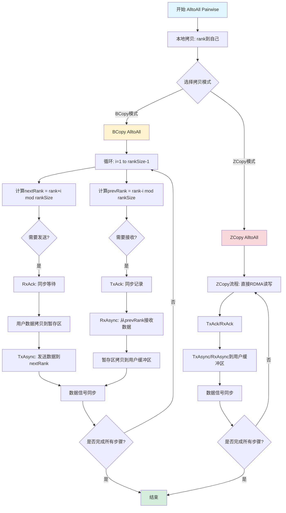

**算法执行步骤详解：**

**Step 1: 本地拷贝 (Local Copy)**
- 将当前rank的发送缓冲区数据直接拷贝到自己的接收缓冲区
- 这是最快的路径，不涉及网络通信
- 示例：Rank 0 将要发送给自己的数据从 sendBuffer[0] 拷贝到 recvBuffer[0]

**Step 2: 选择拷贝模式**
- **BCopy模式 (Buffer Copy)**：需要通过中间暂存缓冲区（Scratch Buffer）进行数据传输
  - 适用场景：数据量较大，超过CCL缓冲区大小时
  - 工作原理：用户数据 → 暂存区 → 网络传输 → 对端暂存区 → 对端用户缓冲区
- **ZCopy模式 (Zero Copy)**：直接通过RDMA读写用户缓冲区，无需中间拷贝
  - 适用场景：数据量较小，可以直接映射用户内存时
  - 工作原理：用户数据 → 网络传输 → 对端用户缓冲区

**Step 3-N: Pairwise通信循环 (i = 1 to rankSize-1)**

每一轮中：

**3.1 计算通信对象**
```
prevRank = (rank + rankSize - i) % rankSize  // 接收数据的来源
nextRank = (rank + i) % rankSize              // 发送数据的目标
```
示例（8个rank，当前rank=2，i=3）：
- prevRank = (2 + 8 - 3) % 8 = 7  (从rank 7接收)
- nextRank = (2 + 3) % 8 = 5      (向rank 5发送)

**3.2 同步准备 (BCopy模式)**
- **TxAck (Transmit Acknowledge)**：发送端记录同步点，表示准备好发送
- **RxAck (Receive Acknowledge)**：接收端等待同步点，表示准备好接收
- 这确保了发送方和接收方的时序协调

**3.3 数据传输 (BCopy模式)**
- 发送路径：
  1. 用户发送缓冲区 → 本地暂存区 (HcclD2DMemcpyAsync)
  2. 本地暂存区 → 对端暂存区 (TxAsync通过Transport层)
- 接收路径：
  1. 对端暂存区 → 本地暂存区 (RxAsync通过Transport层)
  2. 本地暂存区 → 用户接收缓冲区 (HcclD2DMemcpyAsync)

**3.4 数据传输 (ZCopy模式)**
- 发送路径：用户发送缓冲区 → 对端用户接收缓冲区 (TxAsync直接RDMA写)
- 接收路径：对端用户发送缓冲区 → 本地用户接收缓冲区 (RxAsync直接RDMA读)

**3.5 数据信号同步**
- **TxDataSignal**：发送端标记数据发送完成
- **RxDataSignal**：接收端等待数据接收完成
- **TxWaitDone/RxWaitDone**：确保本轮传输彻底完成才进入下一轮

**专有名词解释：**
- **Transport**：传输层抽象，封装了底层的通信机制（如RDMA、PCIe等）
- **RDMA (Remote Direct Memory Access)**：远程直接内存访问，允许一个节点直接读写另一个节点的内存，无需CPU介入
- **D2D (Device to Device)**：设备到设备的内存拷贝，通常指GPU/NPU之间的直接拷贝
- **Stream**：异步执行流，可以理解为一个任务队列，多个stream可以并发执行

**时间复杂度：**
$$
T_{pairwise} = (p-1)\alpha + \beta\cdot\sum_{k=1}^{p-1}\max_{i}(n_{i,i+k})
$$

**公式解释：**
- **第一项 $(p-1)\alpha$**：表示总的通信启动开销
  - 需要 $(p-1)$ 轮通信步骤
  - 每轮都有启动延迟 $\alpha$（包括同步开销）
  
- **第二项 $\beta\cdot\sum_{k=1}^{p-1}\max_{i}(n_{i,i+k})$**：表示总的数据传输时间
  - $\sum_{k=1}^{p-1}$：累加所有 $(p-1)$ 轮的传输时间
  - $\max_{i}(n_{i,i+k})$：第k轮中，所有节点对的最大数据量（瓶颈）
  - $\beta$ 是带宽的倒数（$\beta = 1/B$），数据量 × $\beta$ = 传输时间
  
- **性能特点**：
  - 通信轮次多（$O(p)$），延迟累积明显
  - 但每轮无端口竞争，带宽利用充分
  - 适合大数据量场景（$\beta$项占主导）

其中：
- $p$ = 节点数
- $\alpha$ = 通信延迟（启动开销）
- $\beta$ = 带宽倒数（$1/带宽$）
- $n_{i,j}$ = 节点i发送到节点j的数据量

**代码关键实现：**
```cpp
// 核心循环：遍历所有通信步骤
for (u32 i = 1; i < rankSize; i++) {
    u32 prevRank = (rank + rankSize - i) % rankSize;  // 接收来源
    u32 nextRank = (rank + i) % rankSize;              // 发送目标
    
    // BCopy模式：通过暂存区分块传输
    // ZCopy模式：直接RDMA读写用户缓冲区
}
```

**优势：**
- 避免多打多的链路竞争
- 适合RDMA等单网口场景
- 通信模式规整，易于优化

**劣势：**
- 需要$O(p)$步完成
- 对于小数据量，延迟累积明显

---

#### 2.2.2 Direct FullMesh算法

**核心思想：**
- 充分利用全连接拓扑的并发能力
- 多个SDMA引擎并发处理不同rank的数据传输
- 使用RDMA引擎处理跨pod通信

**并发架构：**

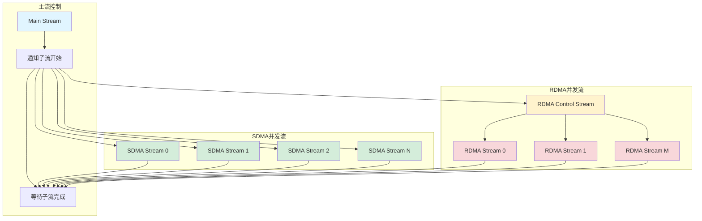

**并发架构说明：**

这个架构图展示了Direct FullMesh算法如何通过多流并发来充分利用硬件带宽。

**Stream层次结构：**

1. **Main Stream (主流)**
   - 作用：整体流程控制和协调
   - 职责：
     - 通知所有子流开始工作
     - 等待所有子流完成工作
     - 执行全局同步点
   
2. **SDMA并发流组 (SDMA Stream 0~N)**
   - **SDMA (Scalable DMA)**：可扩展的DMA引擎，华为NPU上的专用数据传输硬件单元
   - 作用：处理同一Pod内（本地设备间）的数据传输
   - 特点：
     - 低延迟、高带宽
     - 多个SDMA流可以并发执行，互不阻塞
     - 每个流负责与一组特定rank的通信
   - 并发数量：通常为4-8个流，由`sdmaConcurrentNum_`控制

3. **Local并发流组 (隐式，与SDMA对应)**
   - 作用：处理本地数据准备，与SDMA流配合
   - 职责：将用户数据拷贝到CCL缓冲区

4. **RDMA控制流 (RDMA Control Stream)**
   - 作用：协调所有RDMA子流的工作
   - 职责：
     - 接收主流的启动信号
     - 分发任务到各个RDMA子流
     - 收集RDMA子流的完成状态

5. **RDMA并发流组 (RDMA Stream 0~M)**
   - **RDMA (Remote DMA)**：跨服务器的远程内存访问
   - 作用：处理跨Pod（跨服务器）的数据传输
   - 特点：
     - 通过网络进行通信（如IB、RoCE）
     - 带宽相对SDMA较低，但可以达到远端
     - 多个RDMA流并发可以充分利用网络带宽
   - 并发数量：通常为2-4个流，由`rdmaConcurrentNum_`控制

**执行流程：**

```
Step 1: Main Stream发出"开始"信号
        ↓
Step 2: 所有子流（SDMA + RDMA）接收信号，开始并发执行
        ↓
Step 3: SDMA流处理本地Pod内的通信
        RDMA流处理跨Pod的通信
        （这些流完全并发，互不等待）
        ↓
Step 4: 各个子流完成后，向Main Stream发送"完成"信号
        ↓
Step 5: Main Stream等待所有子流完成
        ↓
Step 6: 继续下一轮或结束
```

**为什么需要这种架构？**

1. **硬件并行性**：NPU拥有多个DMA引擎，单流无法充分利用
2. **链路独立性**：不同rank对之间的通信可以使用独立的物理链路
3. **延迟隐藏**：当一个流等待远端响应时，其他流可以继续工作
4. **负载均衡**：将通信任务分散到多个流，避免单点瓶颈

**分轮通信策略：**

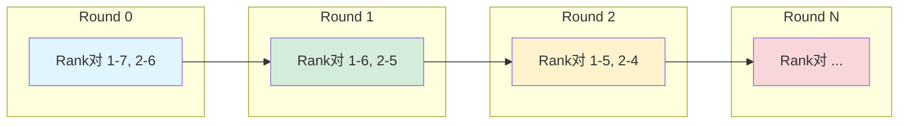

**分轮通信策略详解：**

在Direct FullMesh算法中，由于并发流数量有限（如4个SDMA流），无法同时与所有其他rank通信。因此采用**分轮策略**，将所有通信对分成多轮执行。

**核心思想：Pairwise配对**

每一轮中，精心安排通信对，使得：
1. 每个rank只与少数几个rank通信（受并发流数量限制）
2. 通信对尽可能对称（rank i与rank j通信，同时rank j也与rank i通信）
3. 避免链路冲突

**示例（8个rank，4个SDMA流）：**

假设当前rank = 1，并发流数 = 4

**Round 0:**
- Stream 0: Rank 1 ↔ Rank 7 (距离 = 6)
- Stream 1: Rank 1 ↔ Rank 6 (距离 = 5)
- Stream 2: Rank 1 ↔ Rank 2 (距离 = 1)
- Stream 3: Rank 1 ↔ Rank 3 (距离 = 2)

**Round 1:**
- Stream 0: Rank 1 ↔ Rank 5 (距离 = 4)
- Stream 1: Rank 1 ↔ Rank 4 (距离 = 3)
- (只需2个流，因为剩余通信对较少)

**距离计算：**
```
distance = |rank_i - rank_j|
或
distance = min(|rank_i - rank_j|, rankSize - |rank_i - rank_j|)  // 环形距离
```

**配对策略：**
```cpp
// 对于并发数 = 4，分成2对
// 左侧对：与"距离较远的左边rank"通信
// 右侧对：与"距离较远的右边rank"通信

Round 0:
  leftRemoteRank  = (rank - 1) % rankSize
  rightRemoteRank = (rank + 1) % rankSize
  leftRemoteRank  = (rank - 2) % rankSize
  rightRemoteRank = (rank + 2) % rankSize

Round 1:
  leftRemoteRank  = (rank - 3) % rankSize
  rightRemoteRank = (rank + 3) % rankSize
  ...
```

**为什么这样设计？**

1. **负载均衡**：每轮的数据量尽可能接近，避免某轮特别慢
2. **链路复用**：相近距离的通信可能共享物理链路，分轮避免冲突
3. **流水线友好**：下一轮可以预取数据，与当前轮并行

**数据分块机制：**

对于大数据量，采用分块传输：
- 每个数据块大小 = `cclBufferSize / (sdmaConcurrentNum * 2)`
- 向下对齐到16KB
- 奇偶轮使用不同的buffer区域避免冲突

**数据分块机制详解：**

当要传输的数据量超过CCL缓冲区大小时，需要将数据切分成多个块（Block）分批传输。

**Block大小计算：**

```cpp
// CCL缓冲区总大小，例如 256MB
cclBufferSize = 256 * 1024 * 1024;

// SDMA并发流数量，例如 4
sdmaConcurrentNum = 4;

// 每个Block大小 = 总大小 / (并发数 * 2)
// 除以2是因为需要同时支持发送和接收
blockSize = cclBufferSize / (sdmaConcurrentNum * 2);
blockSize = 256MB / (4 * 2) = 32MB;

// 向下对齐到16KB边界（硬件要求）
blockSize = (blockSize / 16KB) * 16KB;
```

**为什么除以2？**
- CCL缓冲区需要同时支持：
  1. 发送数据的暂存（从用户缓冲区拷贝来）
  2. 接收数据的暂存（拷贝到用户缓冲区前）
- 因此需要分成两半使用

**奇偶轮Buffer区域划分：**

```
CCL缓冲区布局 (假设4个SDMA流)：

奇数轮 (Round 0, 2, 4, ...)：
[Block0][Block1][Block2][Block3] - 发送区
[Block4][Block5][Block6][Block7] - 接收区

偶数轮 (Round 1, 3, 5, ...)：
[Block4][Block5][Block6][Block7] - 发送区
[Block0][Block1][Block2][Block3] - 接收区
```

**为什么交替使用？**
- **避免数据覆盖**：上一轮的数据可能还在使用（如DMA传输尚未完成）
- **流水线并行**：当前轮使用一半buffer时，下一轮可以准备另一半buffer的数据
- **乒乓缓冲 (Ping-Pong Buffer)**：经典的异步I/O优化技术

**分步传输示例：**

假设Rank 0要向Rank 1发送128MB数据，blockSize = 32MB

```
Step 1: 拷贝前32MB到CCL缓冲区Block0
Step 2: 通过SDMA发送Block0的32MB到Rank 1
Step 3: 拷贝第二个32MB到CCL缓冲区Block0 (此时可以复用，因为Step2已完成)
Step 4: 通过SDMA发送第二个32MB到Rank 1
...
重复4次完成全部128MB传输
```

**关键优化点：**
1. **对齐要求**：16KB对齐可以提高DMA效率，减少硬件处理开销
2. **流水线**：拷贝和传输可以部分重叠，下一块数据的拷贝与当前块的传输并行
3. **同步最小化**：只在必要的边界点同步，块内传输无需同步

**代码关键实现：**
```cpp
// 计算并发流数量
sdmaConcurrentNum_ = min(devNumInlocalPod_, MAX_SDMA_CONCURRENT);
rdmaConcurrentNum_ = min(totalRdmaRankNum_, MAX_RDMA_CONCURRENT);

// 数据块大小计算
sdmaDataBlockSize_ = (cclInMem_.size() / max(1, sdmaConcurrentNum_ * 2));
sdmaDataBlockSize_ = align_down(sdmaDataBlockSize_, 16KB);

// 分轮通信
for (u32 round = 0; round < commRounds_; round++) {
    UpdateRemoteRankSet(round, groupRankSize);  // 确定本轮通信的rank对
    UpdateOpBaseSubStreamInfo(round);            // 更新发送/接收信息
    
    // 并发执行SDMA传输
    for (auto& info : subStreamReadInfo_) {
        // SDMA异步读取远端数据
    }
}
```

**优势：**
- 充分利用硬件并发能力
- 适合全连接拓扑
- 大数据量下性能优异

**劣势：**
- 需要较大的CCL缓冲区
- 实现复杂度高
- 对拓扑要求较高

---

#### 3.2.3 Staged Pairwise算法

**核心思想：**
- 结合分层拓扑和Pairwise算法
- 两级通信：server内和server间
- 每一级内使用Pairwise模式

**分层架构：**

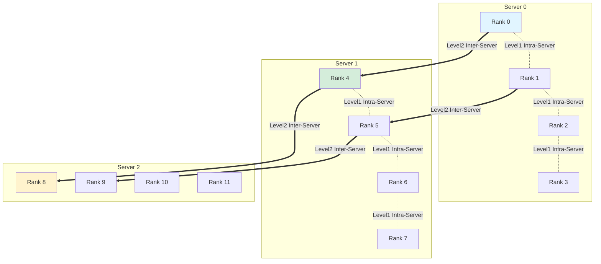

**分层架构详细说明：**

Staged Pairwise算法针对**多层级网络拓扑**进行优化，通过识别和利用网络层次来提高效率。

**网络层次定义：**

1. **Server内通信 (Intra-Server / Level 1)**
   - 范围：同一物理服务器内的NPU/GPU之间
   - 特点：
     - 高带宽（通常100+ GB/s）
     - 低延迟（微秒级）
     - 使用PCIe、NVLink或HCCS等高速互联
   - 示例：Server 0中的Rank 0-3之间的通信

2. **Server间通信 (Inter-Server / Level 2)**
   - 范围：不同物理服务器之间
   - 特点：
     - 较低带宽（通常10-100 GB/s）
     - 较高延迟（毫秒级）
     - 使用InfiniBand、RoCE等网络
   - 示例：Server 0的Rank 0 与 Server 1的Rank 4之间的通信

**为什么要分层？**

1. **带宽差异大**：Server内带宽可能是Server间的10倍以上
2. **延迟差异大**：Server内延迟可能只有Server间的1/100
3. **成本差异**：高速网络端口昂贵，Server间通常端口较少
4. **拓扑限制**：跨Server通信可能需要经过交换机，存在路径竞争

**通信策略：**

核心思想：**先近后远，分层完成**

**阶段1：Server内AlltoAll**
- 每个Server内的所有rank执行一次完整的Pairwise AlltoAll
- Rank 0-3之间交换数据（Server 0内）
- Rank 4-7之间交换数据（Server 1内）
- Rank 8-11之间交换数据（Server 2内）
- 这些可以**并行**进行，因为使用不同的物理链路

**阶段2：Server间AlltoAll**
- 每个Server选择代表rank（通常是rank 0, 4, 8等）
- 这些代表rank之间执行Pairwise AlltoAll
- 或者所有rank都参与，但只与对应位置的跨Server rank通信
- 示例：
  - Rank 0 ↔ Rank 4 ↔ Rank 8
  - Rank 1 ↔ Rank 5 ↔ Rank 9
  - Rank 2 ↔ Rank 6 ↔ Rank 10
  - Rank 3 ↔ Rank 7 ↔ Rank 11

**通信流程：**

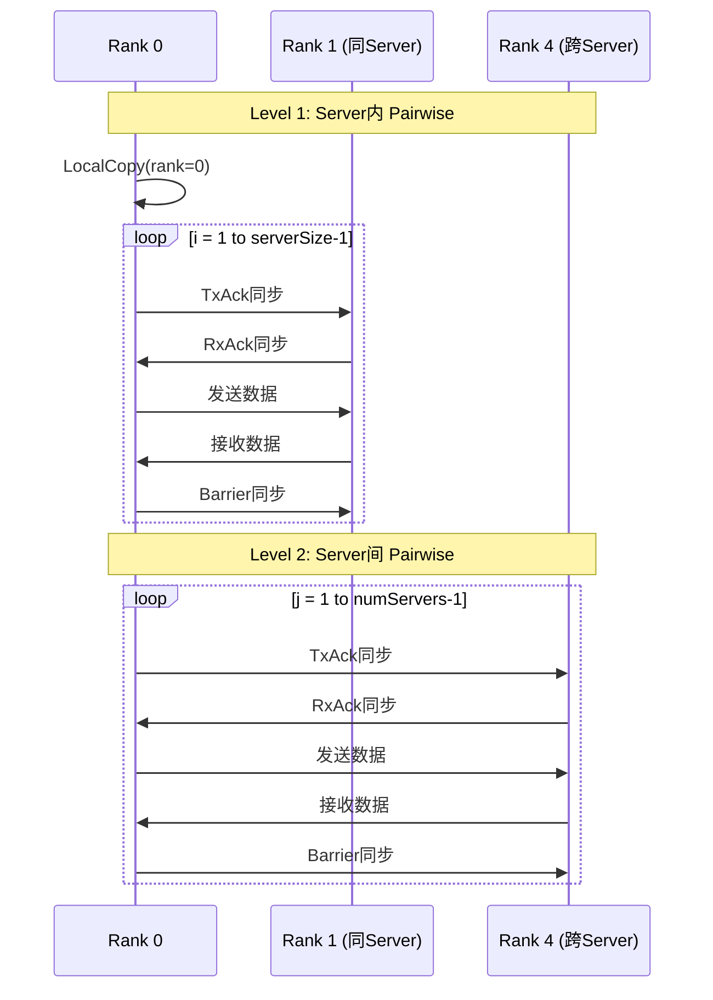

**通信流程分步解析：**

这个序列图展示了Staged Pairwise的完整执行过程。

**初始化阶段：**
```
R0->>R0: LocalCopy(rank=0)
```
- 每个rank首先处理自己到自己的数据
- 将sendBuffer[0]的数据拷贝到recvBuffer[0]
- 这是最快的路径，无需网络通信

**Level 1: Server内Pairwise循环**

```
loop i = 1 to serverSize-1
```

假设Server内有4个rank (0,1,2,3)，当前是Rank 0，循环3次：

**第1轮 (i=1):**
```
Step 1: Rank 0 与 Rank 1 配对
  - prevRank = (0 + 4 - 1) % 4 = 3  (从Rank 3接收)
  - nextRank = (0 + 1) % 4 = 1      (向Rank 1发送)

Step 2: TxAck/RxAck 同步
  - Rank 0 告诉 Rank 3："我准备好接收了"
  - Rank 0 等待 Rank 1："你准备好接收了吗？"

Step 3: 数据传输
  - Rank 0 → Rank 1: 发送数据
  - Rank 3 → Rank 0: 发送数据（同时进行）

Step 4: Barrier同步
  - 确保本轮所有传输完成
  - 防止下一轮覆盖正在传输的数据
```

**第2轮 (i=2):**
```
配对：Rank 0 ↔ Rank 2, Rank 1 ↔ Rank 3
重复 Step 2-4
```

**第3轮 (i=3):**
```
配对：Rank 0 ↔ Rank 3, Rank 1 ↔ Rank 2
重复 Step 2-4
```

**Level 1完成后的状态：**
- Server 0内的所有rank已经完成了彼此间的数据交换
- Server 1内的所有rank已经完成了彼此间的数据交换
- Server 2内的所有rank已经完成了彼此间的数据交换

**Level 2: Server间Pairwise循环**

```
loop j = 1 to numServers-1
```

假设有3个Server，当前是Rank 0（位于Server 0），循环2次：

**第1轮 (j=1):**
```
Step 1: 跨Server配对
  - Rank 0 (Server 0) ↔ Rank 4 (Server 1)
  - Rank 1 (Server 0) ↔ Rank 5 (Server 1)
  - Rank 2 (Server 0) ↔ Rank 6 (Server 1)
  - Rank 3 (Server 0) ↔ Rank 7 (Server 1)

Step 2-4: 与Level 1相同的同步和传输流程
  - 但使用的是RDMA网络，延迟更高
```

**第2轮 (j=2):**
```
配对：
  - Rank 0 (Server 0) ↔ Rank 8 (Server 2)
  - Rank 1 (Server 0) ↔ Rank 9 (Server 2)
  - ...
```

**关键技术点：**

1. **TxAck (Transmit Acknowledge)**
   - 含义：发送方准备好发送的确认信号
   - 实现：在Stream上记录一个同步点（类似CUDA的cudaEventRecord）
   - 作用：确保发送方不会过早发送，等待接收方准备好

2. **RxAck (Receive Acknowledge)**
   - 含义：接收方准备好接收的确认信号
   - 实现：在Stream上等待对方的同步点（类似CUDA的cudaStreamWaitEvent）
   - 作用：确保接收方已经准备好缓冲区

3. **Barrier同步**
   - 含义：一轮通信的完成标记
   - 实现：双向的信号交换，确保发送和接收都完成
   - 作用：防止下一轮开始时数据还在传输中

4. **为什么要这么多同步？**
   - **避免数据竞争**：确保写操作不会覆盖正在读取的数据
   - **保证顺序**：确保数据按正确的顺序到达
   - **资源复用**：同一块缓冲区在不同轮次被复用，必须确保安全

**优势：**
- 适配分层网络拓扑
- 充分利用server内高速互联
- 减少跨server通信次数

**劣势：**
- 需要明确的拓扑感知
- 两级通信增加复杂度

---

#### 3.2.4 AIV优化算法

**核心思想：**
- 针对910B/910_93等特定芯片优化
- 使用AIV（AI Vector）指令加速
- 多种子变体应对不同场景

**算法选择策略：**
```cpp
if (deviceType == DEV_TYPE_910B && !isSingleMeshAggregation) {
    algName = "AlltoAllStagedAIVRdmaExecutor";  // 910B多server
} else if (deviceType == DEV_TYPE_910_93 && serverNum > 1) {
    algName = "AlltoAllMeshAivFor91093Executor"; // 91093多server
} else if (isGraphMode && deviceType == DEV_TYPE_910_93 && 
           sendCount * dataSize <= AIV_SMALL_COUNT_THRESHOLD) {
    algName = "AlltoAllMeshAivSmallCountExecutor"; // 小count优化
} else {
    algName = "AlltoAllMeshAivExecutor";          // 通用AIV
}
```

**优势：**
- 充分利用硬件特性
- 针对性能热点优化
- 覆盖多种使用场景

---

### 3.3 算法选择逻辑

HCCL的算法选择采用**多级决策树**：

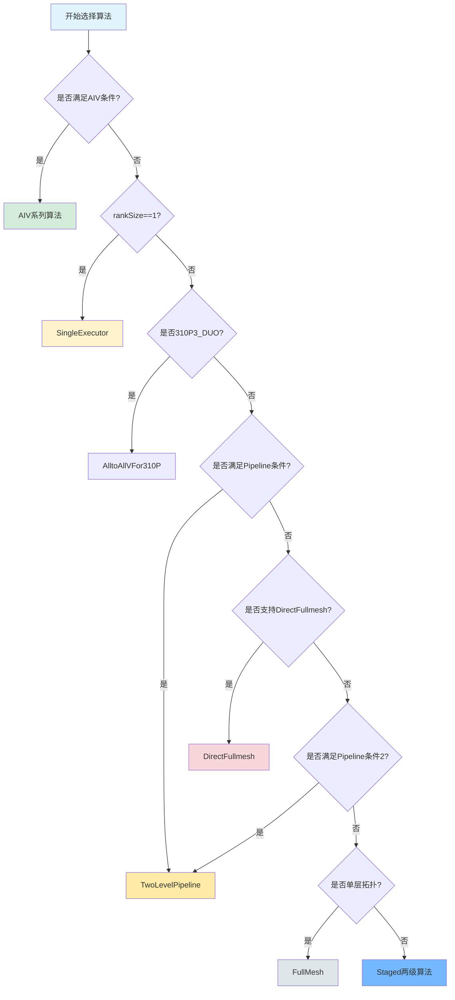

**算法选择决策树详解：**

这是HCCL中AlltoAll算法的智能选择系统，根据多个因素动态决定使用哪种算法。

**决策节点逐级解析：**

**Level 0: AIV条件检查**
```
Q: 是否满足AIV (AI Vector) 条件?
```
- **AIV**：华为NPU上的AI向量指令集，提供硬件加速的集合通信操作
- **检查条件：**
  1. 硬件类型是910B或910_93
  2. 不是单mesh聚合模式
  3. 数据规模符合要求
- **如果满足**：进入AIV算法系列
  - AlltoAllStagedAIVRdmaExecutor (910B多server)
  - AlltoAllMeshAivFor91093Executor (91093多server)
  - AlltoAllMeshAivSmallCountExecutor (小count优化)
  - AlltoAllMeshAivExecutor (通用AIV)

**Level 1: 单Rank检查**
```
Q: rankSize == 1?
```
- **含义**：只有一个参与通信的rank
- **场景**：单卡训练或测试
- **选择**：SingleExecutor
  - 直接本地拷贝，无需网络通信
  - 最快路径，几乎零延迟

**Level 2: 310P3_DUO检查**
```
Q: 是否310P3 DUO配置?
```
- **310P3 DUO**：华为Ascend 310P3的双芯片配置
- **特点**：两个NPU通过特殊互联方式连接
- **选择**：AlltoAllVFor310P
  - 针对310P3优化的专用算法
  - 利用双芯片的特殊拓扑

**Level 3: Pipeline条件检查1**
```
Q: 是否满足Pipeline条件?
```
- **检查内容：**
  ```cpp
  bool IsA3PipelineCondition(param) {
      return (deviceType == DEV_TYPE_910_93) &&
             (useSuperPodMode) &&
             (dataSize >= PIPELINE_MIN_SIZE);
  }
  ```
- **SuperPod**：多个Pod聚合成的超大规模集群
- **Pipeline最小大小**：通常为80MB
- **选择**：TwoLevelPipeline
  - 采用流水线方式，减少气泡时间
  - 适合超大规模、大数据量场景

**Level 4: DirectFullmesh检查**
```
Q: 是否支持DirectFullmesh?
```
- **检查条件：**
  ```cpp
  bool IsSupportDirectFullmesh() {
      return (拓扑是全连接) &&
             (CCL缓冲区足够大) &&
             (!是AICPU展开模式) &&
             (设备类型支持);
  }
  ```
- **关键因素：**
  1. **拓扑要求**：必须是FullMesh（全连接）
  2. **内存要求**：CCL缓冲区 >= 最大发送/接收数据量
  3. **设备支持**：不是310P3（它有专门算法）
- **选择**：DirectFullmesh
  - 最高性能的算法（当条件满足时）
  - 充分利用并发和带宽

**Level 5: Pipeline条件检查2**
```
Q: 是否满足Pipeline条件（第二次检查）?
```
- **检查内容：**
  ```cpp
  bool IsSatisfyAlltoallPipelineCondition() {
      return (cclBufferSize >= PIPELINE_MIN_CCL_SIZE) &&
             (其他条件);
  }
  ```
- **PIPELINE_MIN_CCL_SIZE**：80MB
- **含义**：即使不满足第一次Pipeline条件，如果CCL缓冲区够大，也可以尝试Pipeline

**Level 6: 单层拓扑检查**
```
Q: 是否单层拓扑?
```
- **单层拓扑情况：**
  1. SuperPod内通信
  2. 用户强制配置为单层（环境变量）
  3. 所有rank在同一平面（isAllRankSamePlane）
  4. 单设备模块的P2P通信（rankSize <= 8）
  5. 多模块但设备数不一致
  6. 多SuperPod但Server数不一致
- **选择**：FullMesh算法
  - 不分层，直接使用FullMesh
  - 910B卡数不一致时也走这个分支

**Level 7: 默认选择**
```
否则: Staged两级算法
```
- **选择**：Staged (分层Pairwise)
  - 最通用的算法
  - 兼容性最好
  - 适合多层拓扑

**决策因素权重：**

1. **硬件特性** (最高优先级)
   - 特定硬件的专用优化（AIV、310P3）
   - 直接影响算法可用性

2. **拓扑结构** (高优先级)
   - 全连接 vs 分层
   - Pod/Server结构
   - 影响通信路径

3. **数据规模** (中优先级)
   - 大数据量倾向Pipeline或DirectFullmesh
   - 小数据量可用简单算法
   - 影响性能但不影响正确性

4. **资源可用性** (中优先级)
   - CCL缓冲区大小
   - 影响算法可行性

5. **用户配置** (低优先级)
   - 环境变量强制指定
   - 可覆盖默认选择

**环境变量示例：**
```bash
# 强制使用Pairwise算法
export HCCL_ALGO_LEVEL1=NA
export HCCL_ALGO_LEVEL2=PAIRWISE

# 启用AICPU展开模式
export HCCL_AICPU_UNFOLD=1

# 设置CCL缓冲区大小
export HCCL_CCL_BUFFER_SIZE=256M
```

**算法选择逻辑：**
1. 硬件类型（910B, 910_93, 310P等）
2. 拓扑结构（单server、多server、SuperPod）
3. 数据规模（count大小）
4. 工作模式（图模式vs算子模式）
5. 用户配置（环境变量）

**决策因素详细说明：**

每个因素都在不同层级影响算法选择，形成一个多维决策空间。

**1. 硬件类型 (Device Type)**
- **910B (Ascend 910B)**
  - 特性：双芯片设计，支持AIV指令
  - 优选算法：AIV系列（AlltoAllStagedAIVRdmaExecutor）
  - 特殊处理：多server场景有专门优化
  
- **910_93 (Ascend 910 93)**
  - 特性：单芯片，支持部分AIV
  - 优选算法：AlltoAllMeshAivFor91093Executor
  - 限制：小count时使用AlltoAllMeshAivSmallCountExecutor
  
- **310P3 (Ascend 310P3)**
  - 特性：推理芯片，双芯片配置
  - 专用算法：AlltoAllVFor310P
  - 不支持：DirectFullmesh等高级算法

**2. 拓扑结构 (Topology)**
- **单Server (Single Server)**
  - 特点：所有设备通过PCIe/HCCS直连
  - 带宽：100+ GB/s
  - 延迟：< 10 μs
  - 优选：DirectFullmesh（充分利用高带宽）
  
- **多Server (Multi-Server)**
  - 特点：Server间通过网络连接
  - 带宽：10-100 GB/s
  - 延迟：10-100 μs
  - 优选：Staged（分层处理Server内外通信）
  
- **SuperPod**
  - 特点：多个Pod组成的超大集群
  - 规模：数百到数千卡
  - 优选：Pipeline（流水线减少气泡）

**3. 数据规模 (Data Size)**
- **小数据 (< 1MB)**
  - 特点：延迟敏感
  - 优选：Pairwise或简单FullMesh
  - 原因：减少同步开销
  
- **中等数据 (1MB - 80MB)**
  - 特点：带宽和延迟都重要
  - 优选：DirectFullmesh（ZCopy模式）
  - 原因：平衡延迟和带宽利用
  
- **大数据 (> 80MB)**
  - 特点：带宽敏感
  - 优选：Pipeline或DirectFullmesh（BCopy模式）
  - 原因：充分利用带宽，隐藏延迟

**4. 工作模式 (Workflow Mode)**
- **算子模式 (Op-Based)**
  - 特点：单独执行一个通信操作
  - 优化目标：单次操作最快
  - 选择：考虑BCopy vs ZCopy
  - 内存管理：需要明确的暂存区
  
- **图模式 (Graph Mode)**
  - 特点：多个操作融合执行
  - 优化目标：整体流程最优
  - 选择：优先ZCopy（减少拷贝）
  - 内存管理：统一规划

**5. 用户配置 (User Configuration)**

用户可以通过环境变量强制指定算法：

```bash
# 算法配置
HCCL_ALGO_LEVEL1=<algorithm>  # 第一层算法
HCCL_ALGO_LEVEL2=<algorithm>  # 第二层算法

# 可选值：
# - NA: 不使用
# - RING: Ring算法
# - PAIRWISE: Pairwise算法
# - MESH: Mesh算法
# - NHR: NHR算法
# - NB: NB算法
```

**综合决策示例：**

**场景1：单Server，8卡，100MB数据**
```
硬件：910B → 支持AIV
拓扑：单Server → FullMesh可用
数据：100MB → 大数据
CCL缓冲区：256MB → 足够
→ 选择：DirectFullmesh with AIV
```

**场景2：4个Server，每Server 8卡，10MB数据**
```
硬件：910_93 → 支持AIV
拓扑：多Server → 需要分层
数据：10MB → 中等数据
→ 选择：Staged（两级Pairwise）
```

**场景3：SuperPod，256卡，500MB数据**
```
硬件：910B
拓扑：SuperPod → 超大规模
数据：500MB → 超大数据
CCL缓冲区：512MB → 足够Pipeline
→ 选择：TwoLevelPipeline
```

**场景4：单卡测试**
```
RankSize：1
→ 选择：SingleExecutor（直接本地拷贝）
```

---

## 4. NCCL All2All算法实现分析

### 4.1 算法概览

NCCL采用了一种**轻量级、低延迟**的All2All实现方案，称为**LL-A2A（Low-Latency AlltoAll）**。

### 4.2 LL-A2A核心设计

#### 4.2.1 数据结构

**ncclLLA2AHandle结构：**
```cpp
struct ncclLLA2AHandle {
  ncclDevResourceHandle_t bufHandle;  // 资源缓冲区句柄
  uint32_t nSlots;                    // 槽位数量
};
```

**ncclLLA2ASession结构：**
```cpp
template<typename Coop>
struct ncclLLA2ASession_internal {
  Coop coop;                    // 协作线程组
  ncclDevComm const& comm;      // 通信器
  ncclTeam team;                // 团队信息
  ncclLLA2AHandle handle;       // 句柄
  int block;                    // 块索引
  int pitch;                    // 跨度
  bool multimem;                // 是否多内存
  ncclMultimemHandle mmHandle;  // 多内存句柄
  uint32_t epoch;               // 时期标记
  uint32_t slotsOffset;         // 槽位偏移
};
```

#### 4.2.2 通信模型

**基于Epoch的同步机制：**

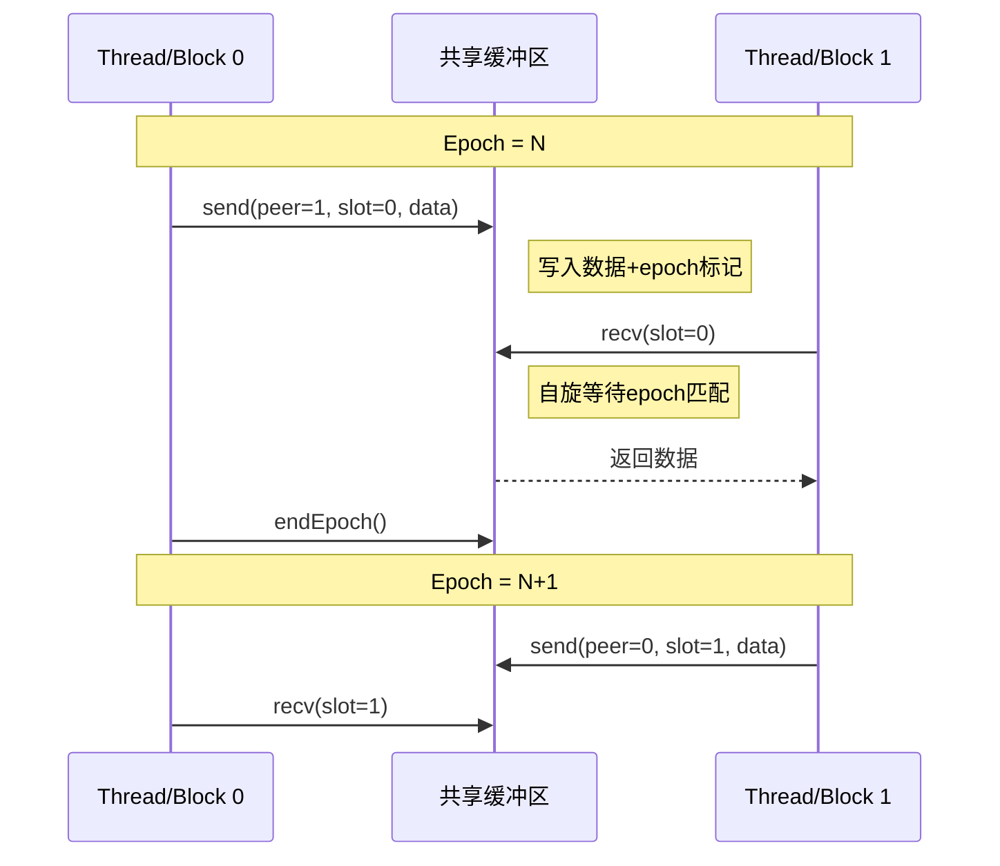

**Epoch机制详细解析：**

Epoch是NCCL LL-A2A中的核心同步机制，用于区分不同轮次的数据，避免新旧数据混淆。

**什么是Epoch？**
- **Epoch**：时期、纪元，是一个单调递增的计数器
- **作用**：标记数据的"版本号"，确保读取的是最新数据
- **类型**：32位无符号整数 (uint32_t)

**Epoch的生命周期：**

**初始化：**
```cpp
// 创建Session时，从缓冲区读取当前epoch
uint4* line = getBufferPointer();
this->epoch = line->x + 2;  // 在上一次epoch基础上+2
```

**发送时：**
```cpp
// 每次send时，将epoch写入数据标记
asm volatile("st.volatile.v4.u32 [%0],{%1,%3,%2,%3};" ::
    "l"(bufferPtr),
    "r"(data_low),      // 数据低32位
    "r"(data_high),     // 数据高32位
    "r"(epoch)          // epoch标记（写入两次）
);
```
- 数据格式：`[data_low, epoch, data_high, epoch]`
- **为什么写两次epoch？** 提供冗余校验，确保数据完整性

**接收时：**
```cpp
// 自旋等待epoch匹配
while (true) {
    // Volatile读取，确保每次都从内存读
    asm volatile("ld.volatile.v4.u32 {%0,%1,%2,%3},[%4];" ...);
    
    // 检查两个epoch标记是否都匹配
    if (tmp.y == epoch && tmp.w == epoch) {
        break;  // 数据有效，退出自旋
    }
    // 否则继续等待
}
```

**结束周期：**
```cpp
void endEpoch() {
    // 1. 清空本地槽位（可选，高epoch时跳过优化）
    if (epoch < 0xFFFFFFFC) {  // 避免溢出前的特殊处理
        for (int i = 0; i < nSlots; i++) {
            buffer[i] = {0, 0, 0, 0};
        }
    }
    
    // 2. Epoch递增
    if (epoch == 0xFFFFFFFF) {
        epoch = 2;  // 溢出后重置为2（避免0和1）
    } else {
        epoch += 1;
    }
    
    // 3. 重新计算槽位偏移
    slotsOffset = calcSlotOffset();
}
```

**为什么Epoch从2开始？**
- **Epoch 0**：保留，表示未初始化
- **Epoch 1**：保留，表示已清空但未使用
- **Epoch 2+**：正常使用范围
- 这避免了与默认值（0）的混淆

**Epoch如何避免数据竞争？**

**场景1：正常情况**
```
时刻T0: Rank 0发送数据 (epoch=5)
        Buffer: [data, 5, data, 5]

时刻T1: Rank 1读取数据
        检查: buffer.epoch == 5 ? 是 → 读取成功
```

**场景2：旧数据残留**
```
时刻T0: Rank 0上次发送 (epoch=4)
        Buffer: [old_data, 4, old_data, 4]

时刻T1: Rank 1尝试读取 (期望epoch=5)
        检查: buffer.epoch == 5 ? 否 → 继续等待

时刻T2: Rank 0发送新数据 (epoch=5)
        Buffer: [new_data, 5, new_data, 5]

时刻T3: Rank 1再次读取
        检查: buffer.epoch == 5 ? 是 → 读取成功
```

**场景3：多轮通信**
```
Round 1 (epoch=2):
  - 所有send/recv完成
  - endEpoch() → epoch变为3

Round 2 (epoch=3):
  - 使用新的epoch标记
  - 旧数据(epoch=2)不会被误读

Round 3 (epoch=4):
  - 继续递增
```

**Slot计算：**
```cpp
uint32_t calcSlotOffset() const {
    return block * (1 + 2*nSlots) + 1 + (epoch & 1) * nSlots;
}
```
- 使用epoch的奇偶性来选择不同的槽位区域
- 避免读写冲突

**Slot计算详细解析：**

Slot（槽位）是LL-A2A中数据存储的基本单元，类似于邮箱系统中的信箱格子。

**为什么需要Slot？**
1. **多数据传输**：一次AlltoAll可能需要传输多个数据元素
2. **并发支持**：不同线程/块可以同时操作不同的slot
3. **乒乓缓冲**：通过slot区域切换，支持流水线操作

**Slot内存布局：**

```
完整缓冲区布局（假设2个block，3个slot）：

Block 0:
  [Epoch计数器: 16B]
  [Slot区域0: slot0(16B) slot1(16B) slot2(16B)]  ← epoch为偶数时使用
  [Slot区域1: slot0(16B) slot1(16B) slot2(16B)]  ← epoch为奇数时使用

Block 1:
  [Epoch计数器: 16B]
  [Slot区域0: slot0(16B) slot1(16B) slot2(16B)]
  [Slot区域1: slot0(16B) slot1(16B) slot2(16B)]
```

**calcSlotOffset公式拆解：**

```cpp
slotsOffset = block * (1 + 2*nSlots) + 1 + (epoch & 1) * nSlots;
              └─────┬────────┘         └┬┘   └────┬────┘
                    │                   │         │
                Block偏移            跳过Epoch   区域选择
```

**各部分详解：**

**1. Block偏移：`block * (1 + 2*nSlots)`**
- `block`：当前块索引（通常对应线程块ID）
- `1`：Epoch计数器占用1个单元（16字节）
- `2*nSlots`：两个slot区域，每个区域有nSlots个slot
- 作用：定位到当前block的起始位置

**2. 跳过Epoch：`+ 1`**
- 跳过block开头的Epoch计数器
- 进入slot区域的起始位置

**3. 区域选择：`+ (epoch & 1) * nSlots`**
- `epoch & 1`：取epoch的最低位（0或1）
  - epoch为偶数（如2,4,6...）→ 结果为0 → 使用区域0
  - epoch为奇数（如3,5,7...）→ 结果为1 → 使用区域1
- `* nSlots`：偏移到第二个区域
- 作用：根据epoch奇偶性选择不同的slot区域

**计算示例：**

假设：
- `block = 1`（线程块1）
- `nSlots = 3`（每个区域3个slot）
- `epoch = 4`（偶数）

```
slotsOffset = 1 * (1 + 2*3) + 1 + (4 & 1) * 3
            = 1 * 7 + 1 + 0 * 3
            = 7 + 1 + 0
            = 8

解释：从缓冲区的第8个单元开始（每单元16字节），即Block 1的Slot区域0
```

如果epoch变为5（奇数）：
```
slotsOffset = 1 * (1 + 2*3) + 1 + (5 & 1) * 3
            = 1 * 7 + 1 + 1 * 3
            = 7 + 1 + 3
            = 11

解释：从第11个单元开始，即Block 1的Slot区域1
```

**为什么用奇偶性切换？**

**优点：**
1. **避免数据冲突**：当前epoch写入区域1时，上一epoch的区域0数据仍然有效
2. **支持流水线**：可以边读旧数据边写新数据
3. **简单高效**：只需一个位运算，开销极小

**乒乓缓冲示例：**
```
Epoch 2 (偶数) → 使用区域0
  - 线程A写入slot[0], slot[1]
  - 线程B读取slot[0], slot[1]

Epoch 3 (奇数) → 切换到区域1
  - 线程A写入新数据到slot[0], slot[1]（区域1）
  - 线程B可能还在读取旧数据（区域0）← 不冲突！

Epoch 4 (偶数) → 切换回区域0
  - 区域0可以安全复用（上上次的数据已经不需要了）
```

**Slot索引计算：**

当访问特定slot时：
```cpp
// 访问slot编号为elt的数据
uint4* slotPtr = basePtr + slotsOffset + elt;

// 如果数据跨多个16字节单元
uint4* slotPtr = basePtr + slotsOffset + elt + u * pitch;
// pitch：跨度，用于访问大数据的不同部分
```

**内存对齐：**
- 每个slot固定16字节（128位）
- 对齐要求确保原子操作和volatile访问的效率
- 符合GPU内存访问的coalescing要求

**Slot容量计算：**
```cpp
int ncclLLA2ACalcSlots(int maxElts, int maxEltSize) {
    return maxElts * divUp(maxEltSize, 8);
}
```
- `maxElts`：最大元素数量
- `maxEltSize`：单个元素的最大字节数
- `divUp(maxEltSize, 8)`：每个元素需要多少个8字节单元
- 返回值：需要多少个slot

**示例：**
- 传输32个float4（每个16字节）
- `nSlots = 32 * divUp(16, 8) = 32 * 2 = 64`
- 每个区域需要64个slot
- 总共需要：1（epoch）+ 2 * 64 = 129个单元
- 内存需求：129 * 16字节 = 2064字节 ≈ 2KB

---

#### 4.2.3 核心操作

**1. send操作 - 点对点发送：**

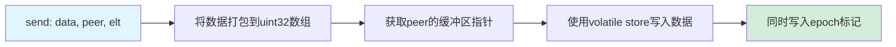

**send操作详细步骤：**

send操作将数据发送给特定的peer（对端rank），这是点对点通信的基础。

**Step 1: 数据打包**
```cpp
union { T tmp; uint32_t u32[divUp(sizeof(T), 8)][2]; };
tmp = data;
```
- 将任意类型T的数据解释为32位整数数组
- `divUp(sizeof(T), 8)`：计算需要多少个8字节块
- `[2]`：每个8字节块分为两个32位整数
- 示例：float4（16字节）→ 2个8字节块 → 4个uint32

**为什么这样打包？**
- GPU内存访问以4字节（32位）为基本单位
- Volatile操作需要明确的数据类型
- 支持任意大小的数据类型（模板泛型）

**Step 2: 获取peer缓冲区指针**
```cpp
uint4* buf = getPeerPointer(comm, handle.bufHandle, team, peer);
buf += slotsOffset + elt;
```
- `getPeerPointer`：获取对端rank的共享内存指针
  - 在NVLink/IB等支持远程内存访问的互联上，可以直接写入对端内存
  - 这是Zero-Copy的关键：无需CPU参与，GPU直接操作远程内存
- `slotsOffset`：当前epoch对应的slot区域偏移
- `elt`：元素索引（slot编号）

**远程内存访问原理：**
```
Rank 0                           Rank 1
┌─────────────┐                 ┌─────────────┐
│ GPU Memory  │                 │ GPU Memory  │
│             │                 │             │
│ [Local Buf] │  NVLink/IB     │ [Remote Buf]│
│             │ ══════════════► │             │
│ getPeerPtr()│  直接写入       │ Rank1的内存 │
└─────────────┘                 └─────────────┘
```

**Step 3: Volatile写入数据+Epoch**
```cpp
for (int u=0; u < divUp(sizeof(T), 8); u++) {
    asm volatile("st.volatile.v4.u32 [%0],{%1,%3,%2,%3};" ::
        "l"(buf + u*pitch),
        "r"(u32[u][0]), "r"(u32[u][1]), "r"(epoch)
    );
}
```

**汇编指令详解：**
- `st.volatile.v4.u32`：存储指令
  - `st`：store（存储）
  - `volatile`：易失性，强制每次都写入内存（不使用缓存）
  - `v4`：向量4，一次写入4个32位值
  - `u32`：无符号32位整数
- `[%0]`：目标地址 = `buf + u*pitch`
- `{%1,%3,%2,%3}`：要写入的4个值
  - `%1` = `u32[u][0]`：数据低32位
  - `%3` = `epoch`：epoch标记（第1次）
  - `%2` = `u32[u][1]`：数据高32位
  - `%3` = `epoch`：epoch标记（第2次，冗余）

**写入格式：**
```
内存布局（16字节）：
[u32[0] | epoch | u32[1] | epoch]
 0-3字节 4-7字节  8-11字节 12-15字节
```

**为什么使用volatile？**
1. **可见性保证**：立即写入内存，对其他GPU可见
2. **禁止优化**：编译器不会重排序或合并写操作
3. **原子性**：v4指令确保4个值作为一个整体写入

**为什么epoch写两次？**
1. **错误检测**：如果两个epoch不一致，说明数据损坏
2. **对齐填充**：凑齐16字节，利用GPU的128位事务
3. **冗余校验**：提高可靠性

**pitch参数的作用：**
- `pitch`：跨度，用于访问大对象的不同部分
- 对于float4（16字节）：需要2次写入，第二次地址 = `buf + pitch`
- pitch通常等于maxElts（最大元素数），实现2D数组布局

**性能考虑：**
- **Coalesced访问**：多个线程写入连续地址，提高带宽利用
- **无锁设计**：通过epoch标记避免显式锁，减少同步开销
- **硬件加速**：volatile v4指令由GPU硬件优化，延迟极低（数十纳秒）

```cpp
template<typename T>
void send(int peer, int elt, T data) {
    // 将数据分解为32位块
    union { T tmp; uint32_t u32[divUp(sizeof(T), 8)][2]; };
    tmp = data;
    
    // 获取peer的缓冲区
    uint4* buf = getPeerPointer(peer);
    buf += slotsOffset + elt;
    
    // 原子写入：数据+epoch标记
    for (int u=0; u < divUp(sizeof(T), 8); u++) {
        asm volatile("st.volatile.v4.u32 [%0],{%1,%3,%2,%3};" ::
            "l"(buf + u*pitch),
            "r"(u32[u][0]), "r"(u32[u][1]), "r"(epoch)
        );
    }
}
```

**2. bcast操作 - 广播：**

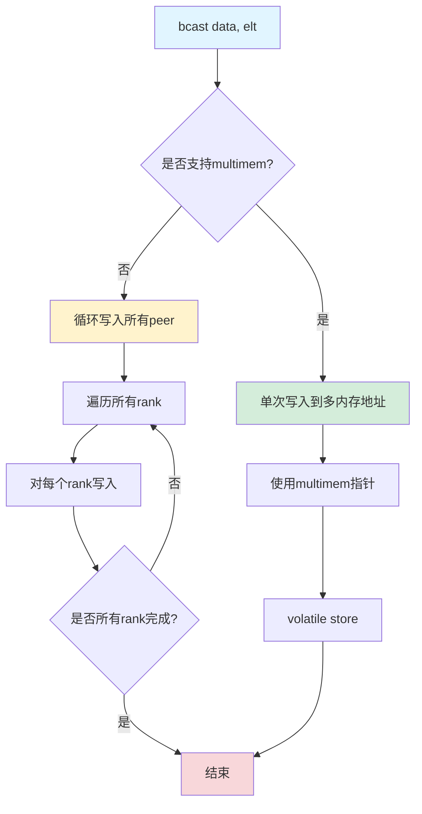

**bcast操作详细步骤：**

bcast（broadcast）是广播操作，将数据发送给团队中的所有rank（包括自己）。

**策略选择（基于硬件特性）：**

**方案1: Multimem加速（如果硬件支持）**
```cpp
if (this->multimem) {
    // 使用多内存地址一次性写入所有rank
}
```
- **Multimem**：Multi-Memory，NVIDIA GPU的一个高级特性
- **原理**：将多个GPU的内存映射到同一个虚拟地址空间
- **优势**：一次写操作可以同时更新所有GPU的对应位置
- **延迟**：接近单次写入的延迟（硬件并行）
- **示例**：
  ```
  单次st.volatile → 数据同时出现在所有GPU的内存中
  
  GPU 0   GPU 1   GPU 2   GPU 3
    ↓       ↓       ↓       ↓
  [data]  [data]  [data]  [data]
  ```

**方案2: 循环写入（标准方案）**
```cpp
else {
    // 循环遍历所有rank，逐个写入
    for (int r = 0; r < team.nRanks; r++) {
        // 写入到rank r
    }
}
```

**循环写入的优化：**

**外层循环：按8个rank分批**
```cpp
int dr = 0;  // 已处理的rank数
int r = this->team.rank;  // 从当前rank开始
#pragma unroll 1  // 告诉编译器不要完全展开
for (; dr+8 <= this->team.nRanks; dr += 8) {
    #pragma unroll  // 内层完全展开
    for (int ur=0; ur < 8; ur++) {
        // 写入到rank r
        r = (r + 1) % this->team.nRanks;
    }
}
```

**为什么每次处理8个？**
1. **指令并行**：8是GPU warp大小的常见因子
2. **循环展开**：内层8次迭代可以完全展开，减少分支开销
3. **内存合并**：8个连续写操作可能合并为一个内存事务

**为什么从当前rank开始循环？**
```cpp
int r = this->team.rank;
```
- **负载均衡**：不同rank从不同位置开始，避免所有rank同时访问rank 0
- **减少拥塞**：分散网络流量，避免热点
- **示例**：
  ```
  Rank 0: 写入顺序 0→1→2→3→4→5→6→7
  Rank 1: 写入顺序 1→2→3→4→5→6→7→0
  Rank 2: 写入顺序 2→3→4→5→6→7→0→1
  ...
  ```

**尾部处理（不足8个的剩余rank）**
```cpp
#pragma unroll
for (int ur=0; ur < 8; ur++, dr++) {
    if (dr == this->team.nRanks) break;
    // 写入到rank r
    r = (r + 1) % this->team.nRanks;
}
```
- 使用`#pragma unroll`：因为最多8次，展开后效率高
- 提前退出：`if (dr == this->team.nRanks) break;`

**写入操作细节：**
```cpp
uint4* buf = getPeerPointer(..., r);
buf += this->slotsOffset + elt;
for (int u=0; u < divUp(sizeof(T),8); u++) {
    asm volatile("st.volatile.v4.u32 [%0],{%1,%3,%2,%3};" ::
        "l"(buf + u*pitch),
        "r"(u32[u][0]), "r"(u32[u][1]), "r"(epoch)
    );
}
```
- 与send操作完全相同的写入逻辑
- 区别只是循环遍历所有rank

**性能分析：**

假设8个rank，float4数据（16字节）：
- **Multimem方案**：
  - 1次volatile写入 × 2（分两个8字节块）= 2次内存操作
  - 延迟：~100ns
  
- **循环写入方案**：
  - 8个rank × 2次写入 = 16次内存操作
  - 延迟：~800ns（假设完美流水线）
  - 实际可能更高（因为跨GPU通信）

**Multimem优势明显，为什么不总是使用？**
1. **硬件要求**：需要特定GPU型号和驱动支持
2. **内存限制**：Multimem内存区域大小受限
3. **兼容性**：不是所有配置都支持
4. **配置复杂**：需要额外的初始化步骤

**3. recv操作 - 接收：**

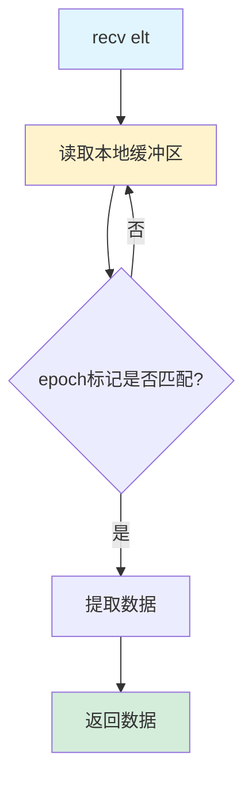

```cpp
template<typename T>
T recv(int elt) {
    uint4* buf = getLocalPointer();
    buf += slotsOffset + elt;
    
    // 自旋等待epoch匹配
    while (true) {
        asm volatile("ld.volatile.v4.u32 {%0,%1,%2,%3},[%4];"
            : "=r"(tmp.x), "=r"(tmp.y), "=r"(tmp.z), "=r"(tmp.w)
            : "l"(buf));
        
        // 检查epoch标记
        if (tmp.y == epoch && tmp.w == epoch) break;
    }
    
    return extractData(tmp);
}
```

**4. recvReduce操作 - 接收并归约：**

recvReduce是一个高级操作，它将数据接收和归约（Reduce）操作融合在一起，避免多次内存访问。

**应用场景：**
- AllReduce中的Reduce阶段
- 需要对接收到的多个数据进行聚合
- 减少中间结果的内存占用

**核心思想：边接收边归约**

```cpp
template<int Unroll, typename Elt, typename EltToAcc, typename Reduce>
auto recvReduce(int eltStart, int eltCount, int eltStride,
                EltToAcc eltToAcc, Reduce reduce) {
    Acc acc;  // 累加器
    for (int i = 0; i < eltCount; i += Unroll) {
        // 批量接收Unroll个元素
        Elt got[Unroll];
        recvUnrolled(eltStart + i*eltStride, 
                     min(Unroll, eltCount-i), 
                     eltStride, got);
        
        // 立即归约，不存储中间结果
        for (int j = 0; j < Unroll && i+j < eltCount; j++) {
            acc = reduce(acc, eltToAcc(got[j]));
        }
    }
    return acc;
}
```

**参数解释：**
- `Unroll`：展开因子，一次处理多少个元素（编译时常量）
- `Elt`：元素类型
- `EltToAcc`：元素到累加器的转换函数
  ```cpp
  // 示例：float → double提高精度
  auto eltToAcc = [](float x) { return (double)x; };
  ```
- `Reduce`：归约函数
  ```cpp
  // 示例：求和
  auto reduce = [](double a, double b) { return a + b; };
  // 示例：求最大值
  auto reduce = [](float a, float b) { return max(a, b); };
  ```

**执行流程示例：**

假设需要从8个slot接收数据并求和，Unroll=4：

```
Iteration 0 (i=0):
  Step 1: recvUnrolled(0, 4, 1, got)
          → got[0], got[1], got[2], got[3]接收完成
  Step 2: acc = 0
          acc = reduce(0, got[0])        = got[0]
          acc = reduce(got[0], got[1])   = got[0] + got[1]
          acc = reduce(..., got[2])      = got[0] + got[1] + got[2]
          acc = reduce(..., got[3])      = got[0] + got[1] + got[2] + got[3]

Iteration 1 (i=4):
  Step 1: recvUnrolled(4, 4, 1, got)
          → got[0], got[1], got[2], got[3]接收完成
  Step 2: acc = reduce(acc, got[0])      = sum(slot[0..4])
          acc = reduce(acc, got[1])      = sum(slot[0..5])
          acc = reduce(acc, got[2])      = sum(slot[0..6])
          acc = reduce(acc, got[3])      = sum(slot[0..7])

Return: acc (所有8个slot的和)
```

**性能优势：**

**传统方式（分离接收和归约）：**
```cpp
// 步骤1：接收所有数据到数组
Elt data[eltCount];
for (int i = 0; i < eltCount; i++) {
    data[i] = recv(i);  // eltCount次内存写入
}

// 步骤2：遍历数组进行归约
Acc acc = 0;
for (int i = 0; i < eltCount; i++) {
    acc = reduce(acc, data[i]);  // eltCount次内存读取
}

// 总计：eltCount次写入 + eltCount次读取 = 2*eltCount次内存访问
```

**recvReduce方式（融合）：**
```cpp
Acc acc = recvReduce<Unroll>(...);

// 总计：eltCount次读取（接收）
// 节省：eltCount次写入 + eltCount次读取
```

**内存访问对比：**
- 假设eltCount = 1024
- 传统方式：2048次内存访问
- recvReduce：1024次内存访问
- **节省50%的内存带宽**！

**Unroll的作用：**

```cpp
// Unroll=1（无展开）
for (int i = 0; i < eltCount; i += 1) {
    Elt got[1];
    recvUnrolled(..., 1, ..., got);
    acc = reduce(acc, got[0]);
}
// 优点：内存占用小
// 缺点：循环开销大

// Unroll=8（展开8倍）
for (int i = 0; i < eltCount; i += 8) {
    Elt got[8];
    recvUnrolled(..., 8, ..., got);
    #pragma unroll
    for (int j = 0; j < 8; j++) {
        acc = reduce(acc, got[j]);
    }
}
// 优点：循环开销小，指令并行度高
// 缺点：寄存器占用多
```

**最佳Unroll值选择：**
- 太小（如1）：循环开销大
- 太大（如32）：寄存器溢出到本地内存
- 通常选择：4-8（平衡性能和资源）

**实际应用案例：AllReduce**

```cpp
// Phase 1: ReduceScatter（接收并归约）
float localSum = recvReduce<8>(
    0, numElements, 1,
    [](float x) { return x; },           // 直接使用
    [](float a, float b) { return a+b; } // 求和
);

// Phase 2: AllGather（分发结果）
for (int peer = 0; peer < nRanks; peer++) {
    bcast(peer, localSum);
}
```

这种融合优化是NCCL高性能的关键技术之一。

**5. endEpoch操作 - 结束周期：**

**5. endEpoch操作 - 结束周期：**

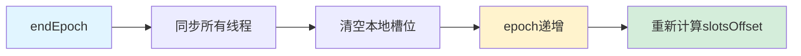

---

### 4.3 LL-A2A工作流程

**完整通信流程：**

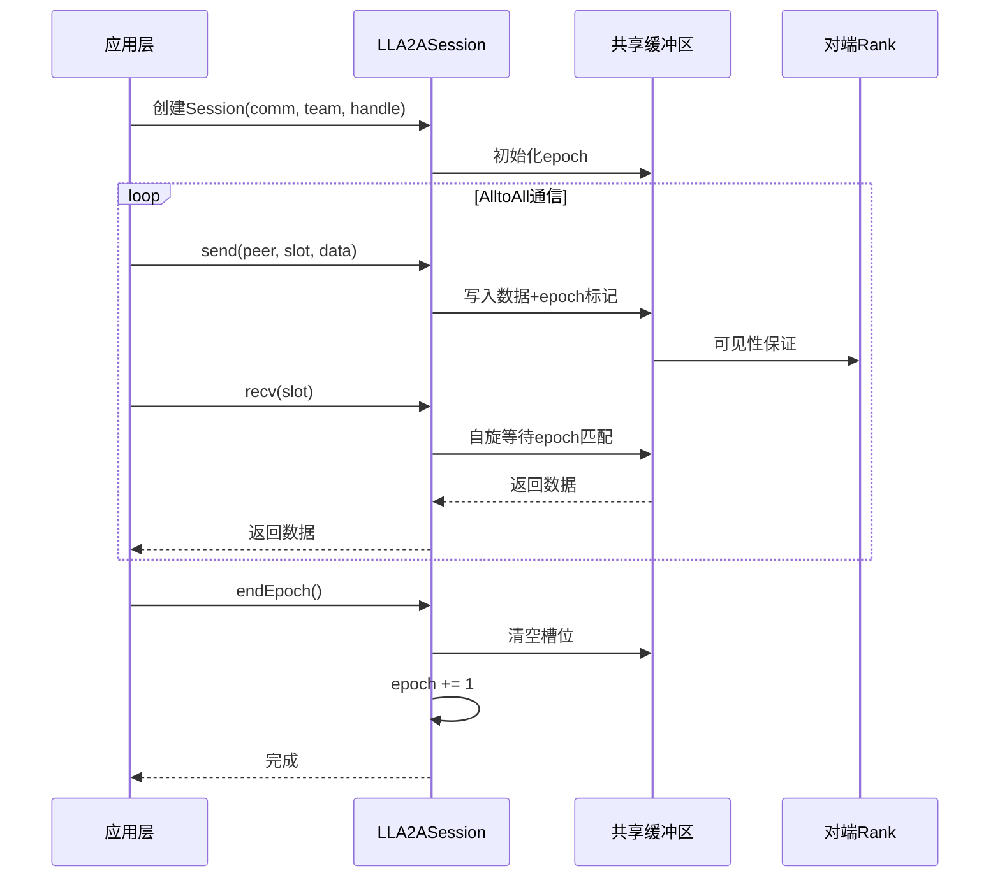

### 4.4 资源管理

**缓冲区大小计算：**
```cpp
int ncclLLA2ACalcSlots(int maxElts, int maxEltSize) {
    return maxElts * divUp(maxEltSize, 8);
}

ncclResult_t ncclLLA2ACreateRequirement(
    int nBlocks, int nSlots, 
    ncclLLA2AHandle_t* outHandle,
    ncclDevResourceRequirements_t* outReq) {
    
    outHandle->nSlots = nSlots;
    
    // 缓冲区大小 = nBlocks * (1 + 2*nSlots) * 16字节
    outReq->bufferSize = nBlocks * (1 + 2*nSlots) * 16;
    outReq->bufferAlign = 16;
    
    return ncclSuccess;
}
```

**内存布局：**
```
Block 0: [epoch | slot_region_0 | slot_region_1]
Block 1: [epoch | slot_region_0 | slot_region_1]
...
Block N: [epoch | slot_region_0 | slot_region_1]
```

每个block包含：
- 1个epoch计数器（16字节）
- 2个槽位区域，每个包含nSlots个槽位
- 通过epoch的奇偶性选择使用哪个区域

---

## 5. 对比分析

### 5.1 设计理念对比

| 维度 | HCCL | NCCL |
|------|------|------|
| **设计哲学** | 多算法适配，拓扑感知 | 轻量级，通用性 |
| **算法数量** | 5+种主要算法变体 | 1种核心算法 |
| **优化方向** | 针对特定硬件和拓扑深度优化 | 低延迟、低开销、易用性 |
| **复杂度** | 高（决策树复杂） | 低（单一算法路径） |

### 5.2 通信模式对比

**HCCL通信模式：**

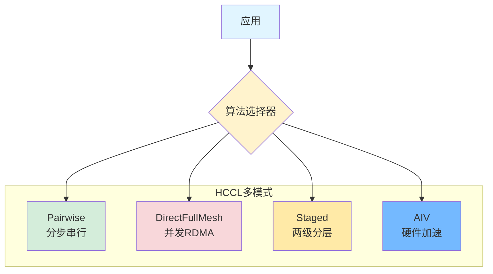

**NCCL通信模式：**

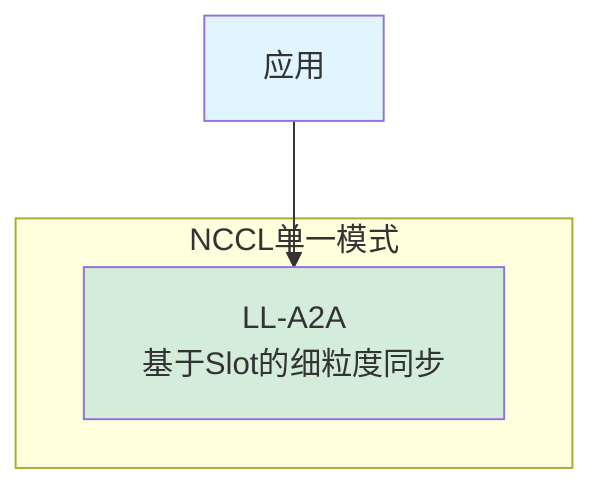

### 5.3 NCCL LL-A2A与HCCL算法的相似性分析

**重要发现：NCCL的LL-A2A在通信模式上更接近HCCL的Direct FullMesh，而非Pairwise**

虽然从实现细节上看，NCCL LL-A2A和HCCL的算法差异很大，但从**通信逻辑和并发模型**的角度分析，LL-A2A的设计理念与Direct FullMesh有显著的相似性：

#### 相似点对比

| 维度 | NCCL LL-A2A | HCCL Direct FullMesh | HCCL Pairwise |
|-----|-------------|---------------------|---------------|
| **通信模式** | 所有线程/块可以同时与多个peer通信 | 多个SDMA流并发与多个rank通信 | 每轮只与一个peer通信 |
| **并发度** | 高（协作线程组内并发） | 高（多SDMA/RDMA流并发） | 低（串行执行p-1轮） |
| **同步粒度** | 细粒度（基于slot和epoch） | 粗粒度（基于流同步） | 中等粒度（基于轮次） |
| **通信轮次** | 灵活（可以一轮完成小数据） | O(1)到O(p/C)轮 | O(p)轮（固定） |
| **端口利用** | 充分（多线程并发访问） | 充分（多流并发） | 保守（避免竞争） |
| **设计目标** | 低延迟 + 高并发 | 高吞吐 + 充分利用硬件 | 避免端口拥塞 |

#### 核心相似性：并发通信模型

**1. 非串行化的通信模式**

```
NCCL LL-A2A:
  Thread 0 可以同时向 {peer1, peer2, peer3...} 发送不同的slot
  ↓
  通过协作线程组，多个线程并发处理不同的peer通信

HCCL Direct FullMesh:
  Main Stream 同时启动 {SDMA流1, SDMA流2, RDMA流1...}
  ↓
  每个流处理与一组rank的通信，完全并发

HCCL Pairwise (对比):
  Round k: 只与 peer (rank+k) mod p 通信
  ↓
  必须等待当前轮完成才能进入下一轮
```

**2. 空间换时间的思想**

```
NCCL LL-A2A:
  预分配slot缓冲区 → 支持多个数据元素并发传输
  使用epoch机制 → 避免串行化的全局同步

HCCL Direct FullMesh:
  使用多个CCL缓冲区 → 每个流独立的发送/接收缓冲区
  多流架构 → 硬件层面的并发

HCCL Pairwise (对比):
  顺序使用暂存区 → 每轮串行执行
  强制同步点 → 轮次之间必须同步
```

**3. 细粒度同步 vs 粗粒度同步**

```
NCCL LL-A2A:
  每个slot独立同步（通过epoch标记）
  ↓
  无需等待所有数据就绪，可以逐个处理

HCCL Direct FullMesh:
  每个流独立完成后通知主流
  ↓
  流之间并发，但单流内可能需要等待

HCCL Pairwise (对比):
  每轮结束后全局同步
  ↓
  所有节点必须完成当前轮才能进入下一轮
```

#### 关键差异

虽然逻辑上相似，但实现层面差异明显：

| 维度 | NCCL LL-A2A | HCCL Direct FullMesh |
|-----|-------------|---------------------|
| **并发实现** | GPU线程级并发（CUDA） | 硬件DMA引擎级并发（SDMA/RDMA） |
| **同步机制** | Volatile内存访问 + Epoch | 信号量 + 流同步 |
| **硬件抽象** | 通用GPU模型 | NPU专用硬件特性 |
| **编程模型** | Device端直接编程 | Host端流编排 |
| **复杂度** | 低（单一算法） | 高（需要算法选择器） |

#### 为什么NCCL不采用Pairwise？

1. **GPU特性**：
   - GPU有大量线程（数千到上万），天然适合并发
   - Pairwise的串行化会浪费GPU的并行能力

2. **延迟优先**：
   - GPU训练对延迟极度敏感（每个iteration都有通信）
   - Pairwise的O(p)轮延迟累积不可接受

3. **编程模型**：
   - NCCL的Device API允许GPU内核直接发起通信
   - 细粒度同步更符合GPU的SIMT（单指令多线程）模型

#### 为什么HCCL需要Pairwise？

1. **RDMA友好**：
   - NPU训练常使用RDMA网络，单端口多流可能竞争
   - Pairwise保证每轮每端口只有一条连接

2. **大数据量优化**：
   - 大数据量时，传输时间远大于启动延迟
   - Pairwise虽然轮次多，但每轮带宽利用充分

3. **拓扑多样性**：
   - NPU部署拓扑多样（单机、多机、多pod）
   - 需要多种算法适配不同场景

#### 结论

**从通信逻辑的角度：**
- NCCL LL-A2A ≈ HCCL Direct FullMesh（并发、非串行化）
- NCCL LL-A2A ≠ HCCL Pairwise（串行、分轮执行）

**但实现手段完全不同：**
- NCCL：GPU线程级并发 + Volatile同步
- HCCL：硬件DMA流并发 + 信号量同步

**这体现了：**
- 相同的设计目标（低延迟、高并发）
- 不同的硬件特性（GPU vs NPU）
- 不同的实现路径（软件并发 vs 硬件并发）

### 5.4 核心技术对比表

| 技术特性 | HCCL | NCCL LL-A2A |
|---------|------|-------------|
| **同步机制** | Transport层TxAck/RxAck + 信号量 | Epoch标记 + Volatile内存访问 |
| **内存管理** | 分层：用户缓冲区、CCL缓冲区、暂存区 | 统一槽位缓冲区 |
| **并发控制** | 多流并发（SDMA流 + RDMA流） | 协作线程组内并发 |
| **数据路径** | BCopy（经暂存区）/ ZCopy（直接RDMA） | 直接内存访问（volatile） |
| **拓扑感知** | 强（显式分层、pod/server感知） | 弱（依赖底层transport抽象） |
| **硬件优化** | 深度集成（AIV指令、910B特性） | 通用GPU优化（CUDA、volatile） |

### 5.5 算法特性矩阵

| 算法 | 适用场景 | 通信轮次 | 延迟 | 带宽利用 | 实现复杂度 |
|-----|---------|---------|------|---------|-----------|
| **HCCL Pairwise** | RDMA单网口、中小规模 | O(p) | 中 | 中 | 中 |
| **HCCL DirectFullMesh** | 全连接、大数据量、多网口 | O(1) | 低 | 高 | 高 |
| **HCCL Staged** | 分层拓扑、多server | O(p₁+p₂) | 中高 | 中高 | 高 |
| **HCCL AIV** | 910B/91093专用硬件 | 取决于子算法 | 低 | 高 | 高 |
| **NCCL LL-A2A** | 通用GPU场景、低延迟要求 | 灵活 | 极低 | 中高 | 低 |

注：
- $p$ = 总节点数
- $p_1$ = 单层内节点数
- $p_2$ = 层数

### 5.6 性能模型对比

#### HCCL Pairwise
$$
T_{HCCL\_Pairwise} = (p-1)\alpha + \beta\sum_{k=1}^{p-1}\max_i(n_{i,i+k}) + \gamma_{sync}(p-1)
$$

**公式解释：**
- **$(p-1)\alpha$**：$(p-1)$ 轮通信的启动延迟累积
- **$\beta\sum_{k=1}^{p-1}\max_i(n_{i,i+k})$**：所有轮次的数据传输时间总和，每轮取瓶颈节点对的数据量
- **$\gamma_{sync}(p-1)$**：每轮通信的同步开销（TxAck/RxAck等信号量操作）
- **特点**：延迟和同步开销随节点数线性增长，但无端口竞争

#### HCCL DirectFullMesh
$$
T_{HCCL\_FullMesh} = \lceil\frac{p-1}{C_{sdma}}\rceil(\alpha + \beta\max_i\sum_j n_{ij}/C_{sdma}) + \gamma_{sync}\lceil\frac{p-1}{C_{sdma}}\rceil
$$

**公式解释：**
- **$\lceil\frac{p-1}{C_{sdma}}\rceil$**：由于SDMA流数量有限，需要分多轮执行，向上取整
- **$\alpha + \beta\max_i\sum_j n_{ij}/C_{sdma}$**：每轮的时间 = 启动延迟 + 数据传输时间
  - 数据被分配到 $C_{sdma}$ 个并发流，理想情况下并发传输
  - $\max_i\sum_j n_{ij}$：负载最重的节点的总发送量
- **$\gamma_{sync}\lceil\frac{p-1}{C_{sdma}}\rceil$**：每轮的同步开销
- **特点**：通过并发显著减少通信轮次，适合大数据量

其中 $C_{sdma}$ = SDMA并发流数量（通常为4-8）

#### HCCL Staged
$$
T_{HCCL\_Staged} = T_{intra} + T_{inter}
$$
$$
T_{intra} = (p_1-1)\alpha_1 + \beta_1\sum_{k=1}^{p_1-1}\max_i(n_{i,i+k}^{intra})
$$
$$
T_{inter} = (p_2-1)\alpha_2 + \beta_2\sum_{k=1}^{p_2-1}\max_i(n_{i,i+k}^{inter})
$$

**公式解释：**
- **分两阶段串行执行**：先Server内（$T_{intra}$），后Server间（$T_{inter}$）
- **$T_{intra}$（Server内通信）**：
  - $(p_1-1)\alpha_1$：Server内节点间的 $(p_1-1)$ 轮启动延迟
  - $\beta_1$ 为Server内高带宽链路的倒数（通常很小）
  - $n^{intra}$：Server内部交换的数据量
- **$T_{inter}$（Server间通信）**：
  - $(p_2-1)\alpha_2$：Server间的 $(p_2-1)$ 轮启动延迟
  - $\beta_2$ 为Server间网络带宽的倒数（通常较大）
  - $n^{inter}$：Server间交换的数据量
- **特点**：分层处理，利用拓扑特性，避免低带宽链路成为瓶颈

#### NCCL LL-A2A
$$
T_{NCCL\_LLA2A} = n_{epochs}(\alpha_{epoch} + \beta_{slot}\cdot n_{slots} + \gamma_{spin})
$$

**公式解释：**
- **$n_{epochs}$**：需要的epoch周期数（通常与数据分块策略相关）
- **$\alpha_{epoch}$**：每个epoch的初始化开销（epoch切换、缓冲区切换等）
- **$\beta_{slot}\cdot n_{slots}$**：传输所有slot的时间
  - $n_{slots}$：需要传输的slot数量
  - $\beta_{slot}$：每个slot的传输时间（slot大小 × 带宽倒数）
- **$\gamma_{spin}$**：自旋等待的开销（volatile内存访问、epoch匹配检查）
- **特点**：细粒度同步，延迟极低但有自旋开销，适合小数据量频繁通信

其中：
- $\alpha$ = 通信启动延迟
- $\beta$ = 带宽倒数
- $\gamma$ = 同步开销
- $n_{epochs}$ = epoch轮数
- $\gamma_{spin}$ = 自旋等待开销

### 5.7 优缺点总结

#### HCCL优势
1. ✅ **拓扑适应性强** - 针对不同拓扑有专门优化算法
2. ✅ **硬件利用充分** - 深度集成NPU特性（AIV、SDMA）
3. ✅ **大规模性能优异** - DirectFullMesh在全连接大数据量场景表现好
4. ✅ **可配置性高** - 支持用户通过环境变量选择算法

#### HCCL劣势
1. ❌ **实现复杂** - 多种算法维护成本高
2. ❌ **决策开销** - 运行时算法选择逻辑复杂
3. ❌ **移植性** - 部分算法强依赖特定硬件特性
4. ❌ **小数据延迟** - 部分算法在小数据量下延迟较高

#### NCCL优势
1. ✅ **设计简洁** - 单一算法路径，易理解维护
2. ✅ **延迟极低** - 基于volatile内存访问，减少同步开销
3. ✅ **通用性好** - 适用各种GPU拓扑
4. ✅ **可扩展性** - 支持灵活的epoch和slot配置

#### NCCL劣势
1. ❌ **拓扑优化不足** - 没有针对特定拓扑的深度优化
2. ❌ **内存开销** - 需要额外的slot缓冲区
3. ❌ **自旋等待** - recv时的自旋可能浪费计算资源
4. ❌ **大规模挑战** - 单一算法在极大规模下可能不如专门优化

---

## 6. 关键差异总结表

| 对比维度 | HCCL | NCCL LL-A2A |
|---------|------|-------------|
| **算法策略** | 多算法动态选择 | 单一通用算法 |
| **通信模式** | Pairwise串行 / FullMesh并发 / 分层混合 | Slot-based细粒度同步 |
| **同步方式** | Transport层显式同步（Ack/Signal） | 内存Epoch标记隐式同步 |
| **并发机制** | 多流显式并行（SDMA/RDMA） | 协作线程组并发 |
| **内存模型** | 三层（用户/CCL/暂存） | 单层（Slot缓冲） |
| **拓扑感知** | 强感知（Server/Pod/SuperPod） | 弱感知（依赖Transport） |
| **硬件集成** | 深度集成（AIV/910B/SDMA） | 通用GPU（CUDA/Volatile） |
| **数据拷贝** | BCopy（经暂存）/ ZCopy（直接） | 直接内存访问 |
| **适用规模** | 大规模优化充分 | 中小规模延迟优异 |
| **实现复杂度** | 高（>5种算法） | 低（单一算法） |
| **可维护性** | 较低（决策树复杂） | 高（逻辑清晰） |
| **可扩展性** | 通过添加新算法扩展 | 通过参数调整扩展 |

---

## 7. 场景推荐

### 7.1 推荐使用HCCL的场景

1. **华为NPU硬件** - 910B、910_93等
2. **明确拓扑结构** - 多server、多pod场景
3. **大规模训练** - 全连接拓扑下的大数据量通信
4. **性能极致优化** - 愿意投入调优成本

### 7.2 推荐使用NCCL的场景

1. **NVIDIA GPU硬件** - 全系列GPU
2. **通用训练场景** - 不确定拓扑结构
3. **低延迟要求** - 小batch、频繁通信
4. **快速部署** - 降低运维复杂度

---

## 8. 未来演进方向

### HCCL可能的优化方向
1. **智能算法选择** - 基于机器学习的运行时算法选择
2. **统一编程接口** - 简化上层使用复杂度
3. **自适应调优** - 根据实际运行情况动态调整参数

### NCCL可能的优化方向
1. **拓扑感知增强** - 在保持简洁性前提下增加拓扑优化
2. **多算法支持** - 为特定场景提供可选的优化算法
3. **混合内存模型** - 结合slot和传统buffer优势

---

## 9. 总结

HCCL和NCCL在All2All实现上体现了两种不同的设计哲学：

- **HCCL** 选择了"**多样性和针对性**"路线，通过提供多种算法变体来适应不同的硬件拓扑和应用场景，追求在特定场景下的极致性能。

- **NCCL** 选择了"**简洁性和通用性**"路线，通过一个精心设计的低延迟算法来覆盖大部分使用场景，追求易用性和可维护性。

两种方案各有优劣，选择哪种方案应基于：
1. 硬件平台（NPU vs GPU）
2. 应用特征（数据规模、通信模式）
3. 工程资源（调优成本、运维能力）
4. 性能要求（延迟 vs 吞吐量）

在实际应用中，理解两种实现的核心差异，有助于做出更明智的技术选型和性能优化决策。

### 9.1 MoE专家并行场景下的All2All通信瓶颈

在Mixture of Experts（MoE）大模型训练中，All2All通信是专家并行的核心操作。每个Transformer层包含2次All2All通信（Token分发到专家 + 专家输出汇聚），高频次的通信带来了显著的性能挑战：

**主要瓶颈：**

1. **通信频率高** 
   - 每个MoE层执行2次All2All，深度模型（如GPT-MoE-1.3T）可能有数十个MoE层
   - 通信延迟累积效应明显，即使单次All2All延迟仅几毫秒，总开销也可达训练时间的30-50%

2. **负载不均衡**
   - Token路由到专家的分布不均（某些专家"热门"，某些"冷门"）
   - 导致All2All中某些节点数据量远大于其他节点，形成通信长尾
   - 当前HCCL/NCCL的All2All算法假设均衡分布，对不均衡场景优化不足

3. **通信与计算重叠难度大**
   - All2All是同步栅障操作，难以与专家计算完全流水线化
   - 需要等待所有节点完成通信后才能进入下一阶段
   - 目前的Pipeline优化主要在层间，层内MoE的通信-计算重叠仍是挑战

4. **大规模扩展性瓶颈**
   - All2All的通信量随节点数 $p$ 增长：每个节点需与 $p-1$ 个其他节点交换数据
   - 在千卡、万卡级别训练时，All2All成为主要的可扩展性瓶颈
   - 网络拓扑（如跨机架、跨数据中心）的带宽差异进一步放大问题

### 9.2 未来发展趋势

针对MoE专家并行和All2All通信的瓶颈，未来的优化方向包括：

**算法层面：**

1. **自适应负载均衡算法**
   - 动态感知Token分布不均，调整通信策略（如分批次传输、优先级调度）
   - 探索Non-blocking All2All变体，允许部分节点提前开始计算

2. **分层All2All**
   - 利用硬件拓扑（节点内 > 机架内 > 跨机架），设计多级All2All
   - 类似HCCL的Staged算法，但需更智能的层次划分和自动调优

3. **通信-计算融合**
   - 在通信过程中进行轻量级预处理（如数据压缩、量化）
   - 探索计算-通信协同调度，最大化流水线并行度

**硬件层面：**

1. **专用通信加速**
   - 类似HCCL的AIV（All-In-Vector），通过硬件指令加速All2All
   - 探索SmartNIC/DPU卸载通信逻辑，释放主计算资源

2. **新型网络拓扑**
   - 针对All2All优化的网络拓扑（如Dragonfly+、Rail-optimized）
   - 利用光交换、RDMA over Converged Ethernet (RoCE) v2等新技术降低延迟

**系统层面：**

1. **智能路由策略**
   - 基于机器学习的Token-to-Expert路由优化，减少通信不均衡
   - 动态专家复制（热门专家多副本）结合局部All2Reduce

2. **异构专家并行**
   - 结合Expert Parallelism、Data Parallelism和Tensor Parallelism
   - 减少All2All的粒度和频率（如分组专家、层次化MoE）

3. **通信感知的模型设计**
   - 探索通信高效的MoE架构变体（如Shared-Expert MoE、Switch Transformer改进）
   - 在模型设计阶段就考虑通信开销，而非事后优化

**标准化与工具链：**

1. **统一的通信原语接口**
   - 推动HCCL、NCCL等库在API层面的标准化
   - 提供高层抽象，简化上层框架（如Megatron-LM、DeepSpeed）的集成

2. **性能分析与可视化**
   - 开发MoE专用的通信profiling工具
   - 实时监控All2All的负载分布、瓶颈节点、拓扑热点

**小结：**

MoE大模型的快速发展对All2All通信提出了更高要求。未来需要从算法、硬件、系统和工具链多个维度协同优化，才能突破当前的通信瓶颈，支撑万亿参数级别的MoE模型高效训练。HCCL的多算法适配性和NCCL的低延迟设计都将在这一演进过程中发挥重要作用，但需要持续创新以应对MoE场景的独特挑战。

---

## 参考资料

1. CANN-HCCL源码：[https://gitee.com/ascend/cann-hccl](https://gitee.com/ascend/cann-hccl)
2. NCCL源码：[https://github.com/NVIDIA/nccl](https://github.com/NVIDIA/nccl)
3. HCCL算法文档：[https://gitee.com/ascend/cann-hccl/tree/master/docs](https://gitee.com/ascend/cann-hccl/tree/master/docs)
4. NCCL文档：[https://docs.nvidia.com/deeplearning/nccl](https://docs.nvidia.com/deeplearning/nccl)
5. Megatron-LM (MoE实现参考)：[https://github.com/NVIDIA/Megatron-LM](https://github.com/NVIDIA/Megatron-LM)

---

*本文档基于2025年11月2日的HCCL和NCCL源码分析完成。*
