# Megatron-LM 代码库架构分析报告

## 目录

1. [项目概述](#1-项目概述)
2. [整体架构](#2-整体架构)
3. [核心模块分析](#3-核心模块分析)
4. [并行策略详解](#4-并行策略详解)
5. [模型实现](#5-模型实现)
6. [训练流程](#6-训练流程)
7. [关键技术特性](#7-关键技术特性)
8. [代码组织结构](#8-代码组织结构)

---

## 1. 项目概述

### 1.1 项目定位

Megatron-LM 是 NVIDIA 开发的用于大规模 Transformer 模型训练的 GPU 优化库，包含两个核心部分：

- **Megatron-LM**: 参考实现，包含完整的训练脚本和工具
- **Megatron Core**: 可组合的生产级库，提供模块化的构建块

### 1.2 主要特点

- GPU 优化的 Transformer 实现
- 多种并行策略（TP、PP、DP、EP、CP）
- 支持多种模型架构（GPT、LLaMA、Mixtral、Mamba、DeepSeek-V3 等）
- FP8、FP16、BF16、FP4 混合精度训练
- 分布式优化器和检查点
- MoE（Mixture of Experts）支持，包括 Shared Experts
- MLA（Multi-Latent Attention）高效注意力机制
- 动态推理引擎（Dynamic Inference Engine）
- 容错训练（NVRx 集成）
- HyperCommGrid N维通信网格管理
- 推理引擎和模型导出（TensorRT-LLM）

### 1.3 生态系统

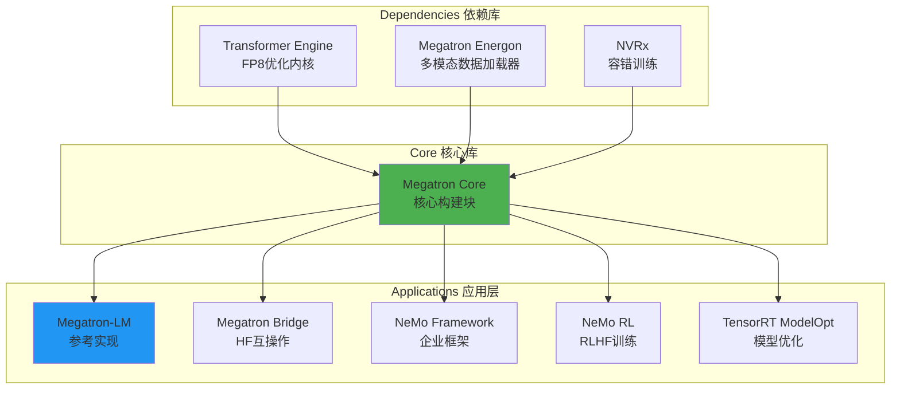

---

## 2. 整体架构

### 2.1 项目结构

```
Megatron-LM/
├── megatron/                          # 核心代码目录
│   ├── core/                          # Megatron Core 生产库
│   │   ├── models/                    # 模型实现
│   │   │   ├── gpt/                   # GPT 模型
│   │   │   ├── bert/                  # BERT 模型
│   │   │   ├── T5/                    # T5 模型
│   │   │   ├── mamba/                 # Mamba（SSM）模型
│   │   │   ├── multimodal/            # 多模态模型
│   │   │   ├── retro/                 # RETRO 模型
│   │   │   └── vision/                # 视觉模型
│   │   ├── transformer/               # Transformer 构建块
│   │   │   ├── transformer_layer.py   # Transformer 层
│   │   │   ├── transformer_block.py   # Transformer 块
│   │   │   ├── transformer_config.py  # 配置类
│   │   │   ├── attention.py           # 注意力机制
│   │   │   └── mlp.py                 # MLP 层
│   │   ├── tensor_parallel/           # 张量并行
│   │   ├── pipeline_parallel/         # 流水线并行
│   │   ├── distributed/               # 分布式训练（FSDP、DDP）
│   │   ├── optimizer/                 # 优化器
│   │   ├── datasets/                  # 数据集加载器
│   │   ├── inference/                 # 推理引擎
│   │   ├── export/                    # 模型导出
│   │   ├── quantization/              # 量化
│   │   ├── fusions/                   # 融合内核
│   │   └── dist_checkpointing/        # 分布式检查点
│   ├── training/                      # 训练循环和工具
│   ├── legacy/                        # 遗留组件
│   └── post_training/                 # 后训练（RLHF 等）
├── examples/                          # 示例脚本
│   ├── gpt3/                          # GPT-3 示例
│   ├── llama/                         # LLaMA 示例
│   ├── mixtral/                       # Mixtral 示例
│   ├── multimodal/                    # 多模态示例
│   └── post_training/                 # 后训练示例
├── tools/                             # 工具脚本
│   ├── preprocess_data.py            # 数据预处理
│   ├── checkpoint/                    # 检查点转换工具
│   └── run_text_generation_server.py # 推理服务器
└── tests/                             # 测试套件
    ├── unit_tests/                    # 单元测试
    └── functional_tests/              # 功能测试
```

### 2.2 系统架构图

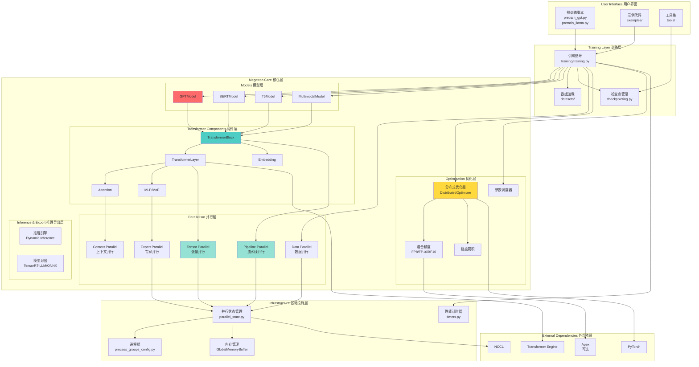

---

## 3. 核心模块分析

### 3.1 Transformer 组件

#### 3.1.1 TransformerConfig

配置类，管理所有 Transformer 相关的配置参数：

```python
@dataclass
class TransformerConfig(ModelParallelConfig):
    # 模型架构
    num_layers: int                        # Transformer 层数
    hidden_size: int                       # 隐藏层大小
    num_attention_heads: int               # 注意力头数
    ffn_hidden_size: Optional[int]         # FFN 隐藏层大小
    
    # 并行配置
    tensor_model_parallel_size: int = 1    # 张量并行大小
    pipeline_model_parallel_size: int = 1  # 流水线并行大小
    expert_model_parallel_size: int = 1    # 专家并行大小
    context_parallel_size: int = 1         # 上下文并行大小
    
    # 精度配置
    fp16: bool = False                     # FP16 训练
    bf16: bool = False                     # BF16 训练
    fp8: Optional[str] = None              # FP8 训练
    
    # MoE 配置
    num_moe_experts: Optional[int] = None  # MoE 专家数
    moe_router_topk: int = 2               # TopK 路由
```

#### 3.1.2 TransformerLayer

基础 Transformer 层实现：

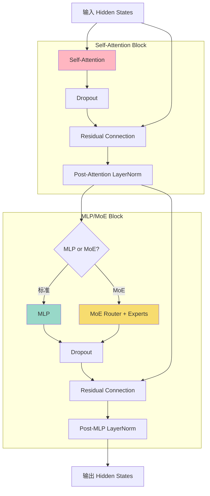

#### 3.1.3 Attention 机制

支持多种注意力实现：

- **标准 Multi-Head Attention (MHA)**
- **Grouped Query Attention (GQA)**
- **Multi-Query Attention (MQA)**
- **Flash Attention**（通过 Transformer Engine）
- **Context Parallel Attention**

```python
# 关键参数
class Attention:
    num_attention_heads: int           # 注意力头数
    num_query_groups: int              # 查询组数（GQA）
    kv_channels: int                   # K/V 通道数
    attention_dropout: float           # Dropout 概率
    attn_mask_type: AttnMaskType       # 掩码类型
    qkv_format: str                    # QKV 格式（sbhd/bshd等）
```

### 3.2 模型实现

#### 3.2.1 GPTModel 架构

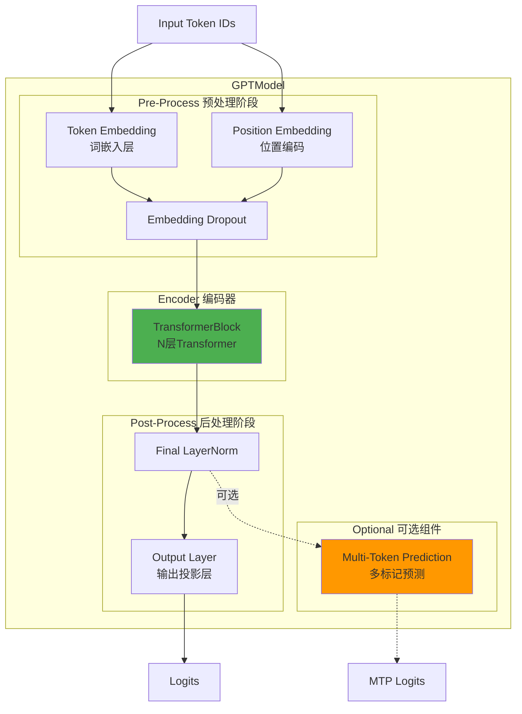

#### 3.2.2 支持的模型类型

| 模型类型 | 实现位置 | 特性 |
|---------|---------|------|
| GPT | `megatron/core/models/gpt/` | 自回归语言模型，因果注意力 |
| BERT | `megatron/core/models/bert/` | 双向编码器，MLM训练 |
| T5 | `megatron/core/models/T5/` | 编码器-解码器架构 |
| Mamba | `megatron/core/models/mamba/` | 状态空间模型（SSM） |
| Multimodal | `megatron/core/models/multimodal/` | 多模态模型（LLaVA、MiMo、NVLM） |
| RETRO | `megatron/core/models/retro/` | 检索增强模型 |
| Vision | `megatron/core/models/vision/` | 视觉模型（CLIP、RADIO、ViT） |
| MiMo | `megatron/core/models/mimo/` | 多图像多输出视频VLM |

---

## 4. 并行策略详解

### 4.1 并行策略概览

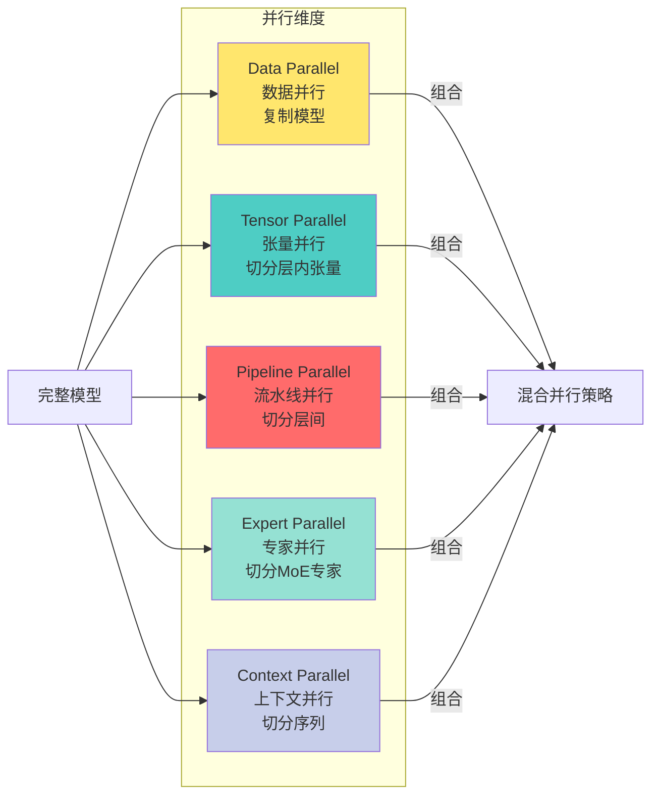

### 4.2 Tensor Parallel（张量并行）

**原理**: 在层内切分张量（权重矩阵和激活），不同 GPU 计算不同部分

```mermaid
graph TB
    subgraph "Column Parallel 列并行"
        Input1[Input<br/>Shape: [s, b, h]]
        
        subgraph "GPU 0"
            Weight1_0[W1[:, 0:h/2]]
            Output1_0[Output[:, :, 0:h/2]]
        end
        
        subgraph "GPU 1"
            Weight1_1[W1[:, h/2:h]]
            Output1_1[Output[:, :, h/2:h]]
        end
        
        AllGather1[All-Gather<br/>合并输出]
        ConcatOutput1[Concatenated Output]
        
        Input1 --> Weight1_0
        Input1 --> Weight1_1
        Weight1_0 --> Output1_0
        Weight1_1 --> Output1_1
        Output1_0 --> AllGather1
        Output1_1 --> AllGather1
        AllGather1 --> ConcatOutput1
    end
    
    subgraph "Row Parallel 行并行"
        Input2[Input<br/>Shape: [s, b, h]]
        Split[Split 输入]
        
        subgraph "GPU 0 "
            Input2_0[Input[:, :, 0:h/2]]
            Weight2_0[W2[0:h/2, :]]
            Output2_0[Partial Output]
        end
        
        subgraph "GPU 1 "
            Input2_1[Input[:, :, h/2:h]]
            Weight2_1[W2[h/2:h, :]]
            Output2_1[Partial Output]
        end
        
        AllReduce2[All-Reduce<br/>求和]
        FinalOutput2[Final Output]
        
        Input2 --> Split
        Split --> Input2_0
        Split --> Input2_1
        Input2_0 --> Weight2_0
        Input2_1 --> Weight2_1
        Weight2_0 --> Output2_0
        Weight2_1 --> Output2_1
        Output2_0 --> AllReduce2
        Output2_1 --> AllReduce2
        AllReduce2 --> FinalOutput2
    end
    
    style Weight1_0 fill:#FFB6C1
    style Weight1_1 fill:#FFB6C1
    style Weight2_0 fill:#98D8C8
    style Weight2_1 fill:#98D8C8
```

**核心组件**:
- `ColumnParallelLinear`: 列并行线性层
- `RowParallelLinear`: 行并行线性层
- `VocabParallelEmbedding`: 词表并行嵌入层

**通信模式**:
- All-Gather: 收集所有 GPU 的输出
- All-Reduce: 对所有 GPU 的输出求和

### 4.3 Pipeline Parallel（流水线并行）

**原理**: 将模型按层切分到不同 GPU，采用流水线调度策略

```mermaid
gantt
    title 1F1B Pipeline Schedule
    dateFormat X
    axisFormat %s
    
    section GPU-0
    F1 : 0, 1
    F2 : 1, 2
    F3 : 2, 3
    F4 : 3, 4
    B1 : 4, 5
    B2 : 5, 6
    B3 : 6, 7
    B4 : 7, 8
    
    section GPU-1
    Idle : 0, 1
    F1  : 1, 2
    F2  : 2, 3
    F3  : 3, 4
    B1  : 4, 5
    B2  : 5, 6
    B3  : 6, 7
    B4  : 7, 8
    
    section GPU-2
    Idle : 0, 2
    F1   : 2, 3
    F2   : 3, 4
    F3   : 4, 5
    B1   : 5, 6
    B2   : 6, 7
    B3   : 7, 8
    
    section GPU-3
    Idle : 0, 3
    F1   : 3, 4
    F2   : 4, 5
    F3   : 5, 6
    F4   : 6, 7
    B1   : 7, 8
```

**说明**:
- **F1-F4**: 前向传播（Forward pass）批次1-4
- **B1-B4**: 反向传播（Backward pass）批次1-4
- **Idle**: 空闲等待
- **GPU-0**: 处理 Layer 0-7
- **GPU-1**: 处理 Layer 8-15
- **GPU-2**: 处理 Layer 16-23
- **GPU-3**: 处理 Layer 24-31
```

**调度策略**:
- **1F1B (1-Forward-1-Backward)**: 交替执行前向和反向传播
- **Interleaved 1F1B**: 虚拟流水线并行，减少气泡
- **Combined 1F1B**: 结合数据并行和流水线并行

**核心文件**:
- `pipeline_parallel/schedules.py`: 调度算法实现
- `pipeline_parallel/p2p_communication.py`: 点对点通信

### 4.4 Data Parallel（数据并行）

**原理**: 复制模型到多个 GPU，每个 GPU 处理不同的数据批次

**实现方式**:
1. **DDP (DistributedDataParallel)**: PyTorch 原生 DDP
2. **FSDP (Fully Sharded Data Parallel)**: 全分片数据并行
3. **ZeRO**: 分片优化器状态

```python
# DDP 配置
ddp_config = DistributedDataParallelConfig(
    grad_reduce_in_fp32=True,                # FP32 梯度规约
    overlap_grad_reduce=True,                 # 重叠梯度通信
    use_distributed_optimizer=True,           # 分布式优化器
)
```

### 4.5 Expert Parallel（专家并行）

**原理**: 在 MoE 模型中，将专家分布到不同 GPU

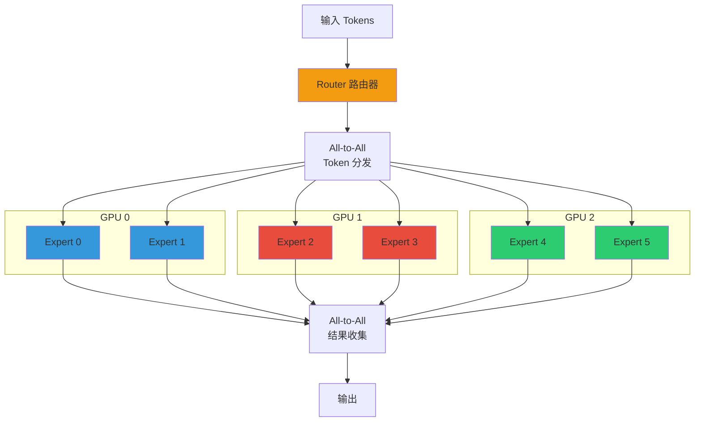

**关键特性**:
- TopK 路由选择
- 负载均衡损失
- Token Dropping
- 专家容量因子

### 4.6 Context Parallel（上下文并行）

**原理**: 在序列维度上切分长序列，适用于超长上下文

```python
# 序列切分示例
# 原始序列长度: 128K tokens
# Context Parallel Size: 4
# 每个 GPU 处理: 32K tokens

# GPU 0: tokens[0:32K]
# GPU 1: tokens[32K:64K]
# GPU 2: tokens[64K:96K]
# GPU 3: tokens[96K:128K]
```

**通信需求**:
- All-Gather: 在注意力计算时收集 K/V
- Ring Attention: 环形注意力机制

### 4.7 并行策略选择指南

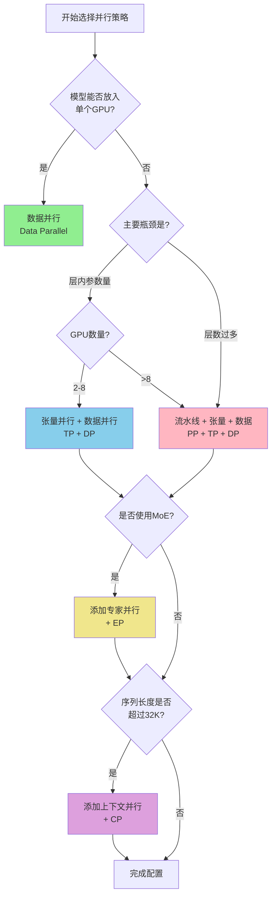

**经验法则**:

| 模型大小 | GPU 数量 | 推荐策略 |
|---------|---------|---------|
| < 1B | 1-8 | DP only |
| 1B - 13B | 8-64 | TP=2-4, DP=rest |
| 13B - 70B | 64-256 | TP=4-8, PP=2-4, DP=rest |
| 70B - 175B | 256-1024 | TP=8, PP=4-8, DP=rest |
| > 175B | > 1024 | TP=8, PP=16+, DP=rest |

---

## 5. 模型实现

### 5.1 模型层次结构

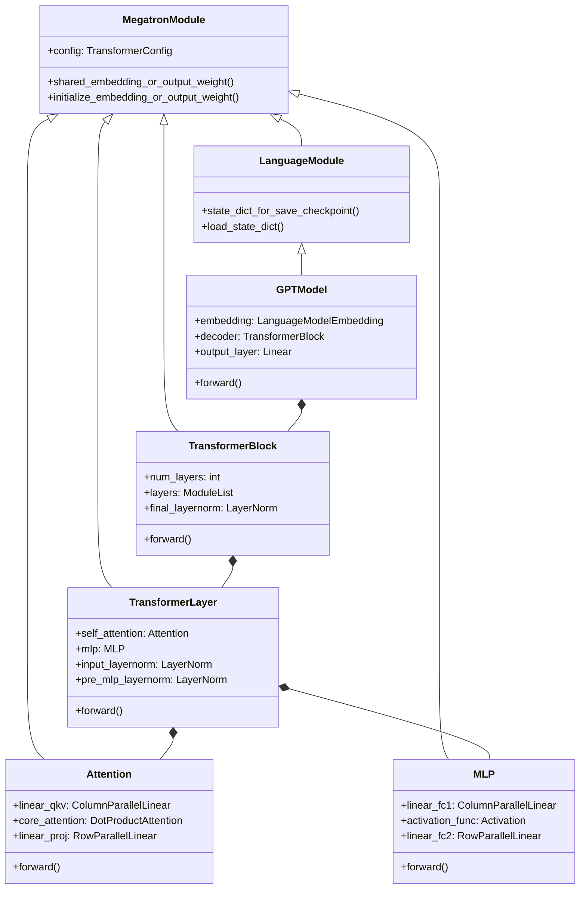

### 5.2 MoE（Mixture of Experts）实现

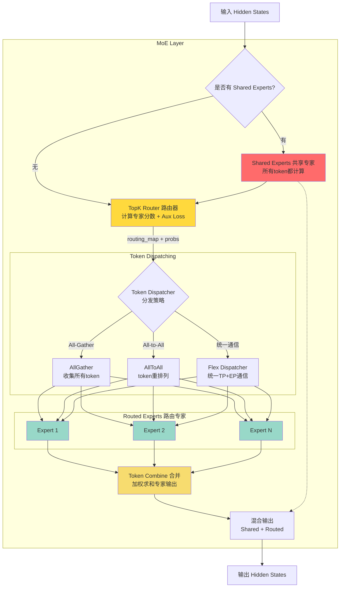

**MoE 关键参数**:

```python
# MoE 配置
moe_config = TransformerConfig(
    num_moe_experts=64,                    # 专家总数
    moe_router_topk=2,                     # 每个token选择的专家数
    moe_aux_loss_coeff=0.01,              # 辅助损失系数
    moe_token_dispatcher_type='alltoall',  # Token分发类型
    expert_model_parallel_size=8,          # 专家并行度
    moe_router_load_balancing_type='aux_loss',  # 负载均衡类型
    moe_router_dtype='fp32',               # 路由器精度（推荐fp32）
    moe_grouped_gemm=True,                 # 分组GEMM优化
    # Shared Experts 配置（如 DeepSeek-V3）
    moe_shared_expert_intermediate_size=None,  # 共享专家FFN大小
    moe_shared_expert_overlap=True,        # 共享专家计算重叠
    # 负载均衡策略
    moe_aux_loss_free=False,               # 无辅助损失策略
    moe_expert_capacity_factor=1.0,        # 专家容量因子
    moe_pad_expert_input_to_capacity=False,  # 填充到容量
)
```

**DeepSeek-V3 特性**:
- **Node-limited routing**: 节点限制路由
- **Device-limited routing**: 设备限制路由
- **Aux-loss-free**: 无辅助损失负载均衡
- **Shared Experts**: 所有token都经过的共享专家层
- **Fine-grained parallelism**: 细粒度并行优化

### 5.3 Multi-Token Prediction (MTP)

**概念**: 在训练时同时预测多个未来 token，提升训练效率

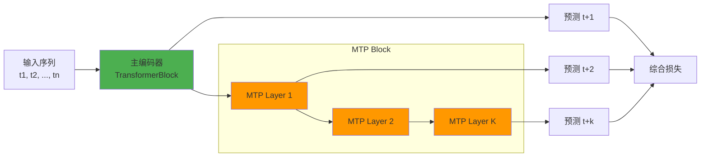

---

## 6. 训练流程

### 6.1 训练主循环

```mermaid
flowchart TD
    Start([开始训练])
    Init[初始化<br/>initialize_megatron]
    
    subgraph "初始化阶段"
        ParseArgs[解析命令行参数]
        InitDist[初始化分布式环境<br/>parallel_state]
        BuildModel[构建模型<br/>model_provider]
        BuildOptim[构建优化器<br/>get_megatron_optimizer]
        BuildData[构建数据加载器<br/>build_train_valid_test_datasets]
        LoadCkpt[加载检查点<br/>load_checkpoint]
    end
    
    subgraph "训练循环"
        EpochLoop{遍历 Epoch}
        BatchLoop{遍历 Batch}
        
        GetBatch[获取数据批次]
        ForwardBackward[前向+反向传播<br/>forward_backward_func]
        
        subgraph "前向反向传播"
            Forward[前向传播]
            ComputeLoss[计算损失]
            Backward[反向传播]
        end
        
        ReduceGrad[梯度规约<br/>All-Reduce]
        ClipGrad[梯度裁剪]
        UpdateParams[更新参数<br/>optimizer.step]
        UpdateLR[更新学习率]
        LogMetrics[记录指标]
        
        CheckSave{是否保存?}
        SaveCkpt[保存检查点]
        CheckEval{是否评估?}
        Evaluate[评估模型]
    end
    
    End([训练结束])
    
    Start --> Init
    Init --> ParseArgs
    ParseArgs --> InitDist
    InitDist --> BuildModel
    BuildModel --> BuildOptim
    BuildOptim --> BuildData
    BuildData --> LoadCkpt
    
    LoadCkpt --> EpochLoop
    EpochLoop -->|继续| BatchLoop
    EpochLoop -->|完成| End
    
    BatchLoop -->|继续| GetBatch
    BatchLoop -->|完成| EpochLoop
    
    GetBatch --> ForwardBackward
    ForwardBackward --> Forward
    Forward --> ComputeLoss
    ComputeLoss --> Backward
    
    Backward --> ReduceGrad
    ReduceGrad --> ClipGrad
    ClipGrad --> UpdateParams
    UpdateParams --> UpdateLR
    UpdateLR --> LogMetrics
    
    LogMetrics --> CheckSave
    CheckSave -->|是| SaveCkpt
    CheckSave -->|否| CheckEval
    SaveCkpt --> CheckEval
    
    CheckEval -->|是| Evaluate
    CheckEval -->|否| BatchLoop
    Evaluate --> BatchLoop
    
    style Init fill:#90EE90
    style ForwardBackward fill:#FFB6C1
    style UpdateParams fill:#87CEEB
```

### 6.2 混合精度训练流程

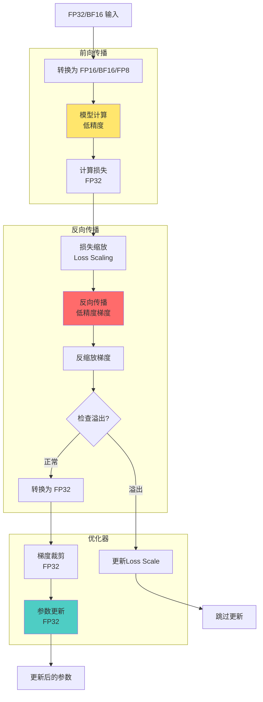

---

## 7. 关键技术特性

### 7.1 FP8 训练

**Transformer Engine 集成**:

```python
# FP8 配置
config = TransformerConfig(
    fp8='hybrid',                    # FP8 模式: hybrid/e4m3/e5m2
    fp8_margin=0,                    # FP8 边界
    fp8_interval=1,                  # 缩放因子更新间隔
    fp8_amax_history_len=1024,       # 历史最大值长度
    fp8_amax_compute_algo='max',     # 计算算法
)
```

**精度对比**:

| 精度类型 | 指数位 | 尾数位 | 动态范围 | 适用场景 |
|---------|-------|-------|---------|---------|
| FP32 | 8 | 23 | 10^38 | 基准 |
| FP16 | 5 | 10 | 10^4 | 通用训练 |
| BF16 | 8 | 7 | 10^38 | 稳定训练 |
| FP8 E4M3 | 4 | 3 | 10^2 | 前向传播 |
| FP8 E5M2 | 5 | 2 | 10^4 | 反向传播 |

### 7.2 序列并行（Sequence Parallel）

**与张量并行结合**:

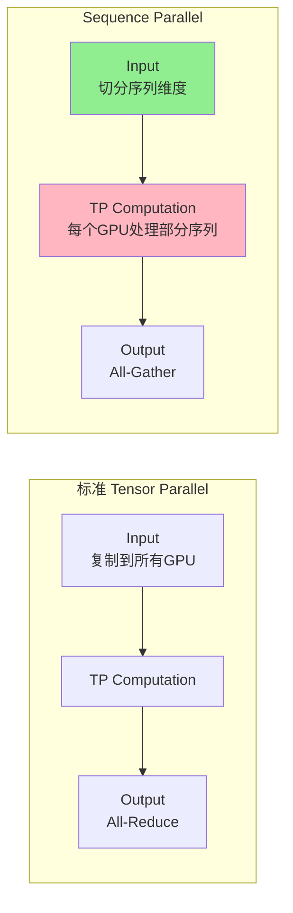

**优势**:
- 减少激活内存占用
- 降低通信量
- 更好的扩展性

### 7.3 重计算（Activation Recomputation）

**策略**:
1. **Full Recomputation**: 重计算所有激活
2. **Selective Recomputation**: 仅重计算部分层
3. **Partial Recomputation**: 重计算注意力层

```python
# 配置重计算
config = TransformerConfig(
    recompute_granularity='selective',  # full/selective/partial
    recompute_method='uniform',         # uniform/block
    recompute_num_layers=1,            # 重计算层数
)
```

### 7.4 分布式优化器

**特性**:
- 分片优化器状态（类似 ZeRO-1）
- 重叠通信和计算
- 支持梯度累积

```python
# 分布式优化器配置
optimizer_config = OptimizerConfig(
    optimizer='adam',
    lr=1e-4,
    weight_decay=0.1,
    adam_beta1=0.9,
    adam_beta2=0.999,
    use_distributed_optimizer=True,
    overlap_grad_reduce=True,
    overlap_param_gather=True,
)
```

### 7.5 Flash Attention

通过 Transformer Engine 集成：

**优势**:
- 降低 HBM 访问
- O(N) 内存复杂度
- 2-4倍加速

```python
# 启用 Flash Attention
config = TransformerConfig(
    attention_backend='flash',  # transformer_engine/torch
    attention_dropout=0.0,
)
```

### 7.6 Multi-Latent Attention (MLA)

**概念**: DeepSeek-V3 引入的高效注意力机制，通过潜在压缩降低KV Cache内存

**架构特点**:

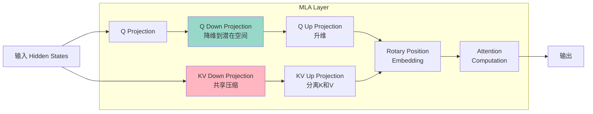

**关键优势**:
- **内存效率**: KV Cache 内存降低 75%+
- **计算效率**: 减少注意力计算复杂度
- **长序列支持**: 支持更长的上下文窗口

**配置示例**:

```python
# MLA 配置
mla_config = MLATransformerConfig(
    # 基础配置
    hidden_size=5120,
    num_attention_heads=128,
    
    # MLA 特定配置
    q_lora_rank=1536,              # Q的LoRA秩
    kv_lora_rank=512,              # KV的LoRA秩
    qk_rope_head_dim=64,           # RoPE维度
    v_head_dim=128,                # V头维度
    qk_nope_head_dim=128,          # 非RoPE部分维度
    
    # 优化选项
    use_fused_rope=True,           # 融合RoPE算子
    cache_kv_in_compressed_form=True,  # 缓存压缩形式的KV
)
```

### 7.7 HyperCommGrid

**概念**: N维通信网格，灵活管理多种并行策略的进程组

**特点**:
- 支持任意维度的并行组合
- 动态创建进程组
- 避免重复创建相同维度组合

**使用示例**:

```python
from megatron.core.hyper_comm_grid import HyperCommGrid

# 创建4维并行网格: DP x TP x PP x EP
grid = HyperCommGrid(
    dim_names=['dp', 'tp', 'pp', 'ep'],
    dim_sizes=[8, 4, 2, 4],
    world_size=256,
)

# 创建特定维度的进程组
grid.create_pg(['tp', 'pp'])  # TP+PP 组合
grid.create_pg(['dp', 'ep'])  # DP+EP 组合

# 获取进程组
tp_pp_group = grid.get_pg(['tp', 'pp'])
```

### 7.8 动态推理引擎

**特性**:
- **In-flight Batching**: 动态批处理，提升吞吐量
- **Chunked KV Cache**: 分块KV缓存管理
- **Multi-batch CUDA Graphs**: 多批次CUDA图优化
- **Async Support**: 异步推理支持

**推理引擎架构**:

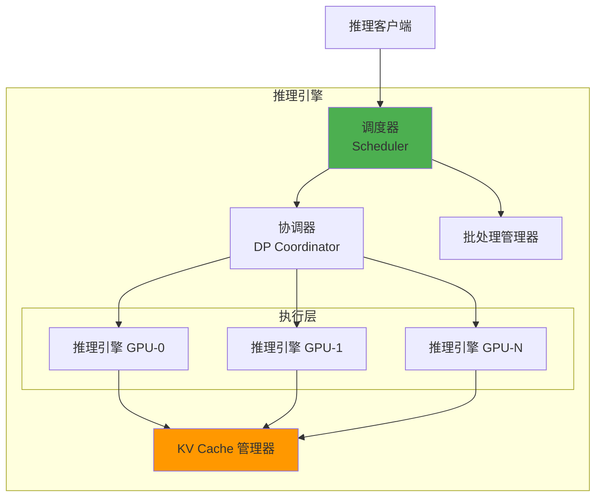

**使用示例**:

```python
from megatron.core.inference import DynamicInferenceEngine

# 创建推理引擎
engine = DynamicInferenceEngine(
    model=model,
    tokenizer=tokenizer,
    max_batch_size=64,
    max_sequence_length=8192,
    enable_cuda_graph=True,
)

# 异步推理
async def generate():
    response = await engine.generate_async(
        prompts=["Hello, how are you?"],
        max_new_tokens=100,
        temperature=0.7,
    )
    return response
```

### 7.9 容错训练（NVRx）

**NVIDIA Resiliency Extension 集成**:

**功能**:
- **Straggler Detection**: 掉队检测
- **Fault Detection**: 故障检测
- **Hang Detection**: 挂起检测
- **Automatic Recovery**: 自动恢复

**配置**:

```python
# 启用容错训练
--enable-ft-pipeline
--ft-timeout 300
--straggler-detector-enabled
--straggler-detector-window-size 10
```

### 7.10 CUDA Graphs

**优化内核启动开销**:

```python
# CUDA Graphs 配置
if args.use_cuda_graph:
    cuda_graph = FullCudaGraphWrapper(
        model=model,
        optimizer=optimizer,
        data_loader=train_data_iterator,
    )
```

**MoE CUDA Graphs 优化**:
- 支持动态专家选择
- 优化Token分发路径
- 减少内核启动开销

---

## 8. 代码组织结构

### 8.1 关键文件清单

#### 训练入口

| 文件 | 功能 |
|-----|------|
| `pretrain_gpt.py` | GPT 模型预训练入口 |
| `pretrain_bert.py` | BERT 模型预训练入口 |
| `pretrain_t5.py` | T5 模型预训练入口 |
| `pretrain_vlm.py` | 多模态模型预训练入口 |

#### 核心组件

| 目录/文件 | 功能 |
|---------|------|
| `megatron/core/transformer/` | Transformer 核心组件 |
| `megatron/core/models/` | 模型实现 |
| `megatron/core/parallel_state.py` | 并行状态管理 |
| `megatron/core/hyper_comm_grid.py` | N维通信网格管理 |
| `megatron/core/tensor_parallel/` | 张量并行实现 |
| `megatron/core/pipeline_parallel/` | 流水线并行实现 |
| `megatron/core/optimizer/` | 优化器实现 |
| `megatron/core/datasets/` | 数据集加载器 |
| `megatron/core/inference/` | 推理引擎 |
| `megatron/core/transformer/moe/` | MoE 实现 |
| `megatron/core/transformer/multi_latent_attention.py` | MLA 实现 |
| `megatron/training/training.py` | 训练主循环 |
| `megatron/training/checkpointing.py` | 检查点管理 |

#### 工具脚本

| 文件 | 功能 |
|-----|------|
| `tools/preprocess_data.py` | 数据预处理 |
| `tools/checkpoint/` | 检查点转换工具 |
| `tools/run_text_generation_server.py` | 推理服务器 |

### 8.2 配置管理

**层次化配置**:

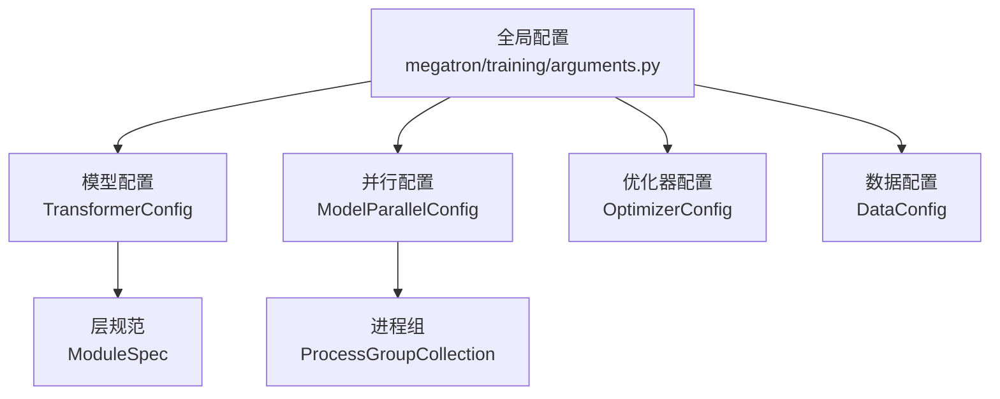

### 8.3 测试体系

```
tests/
├── unit_tests/                      # 单元测试
│   ├── data/                        # 数据加载测试
│   ├── dist_checkpointing/          # 检查点测试
│   ├── distributed/                 # 分布式测试
│   ├── inference/                   # 推理测试
│   ├── models/                      # 模型测试
│   ├── pipeline_parallel/           # 流水线并行测试
│   ├── tensor_parallel/             # 张量并行测试
│   └── transformer/                 # Transformer测试
└── functional_tests/                # 功能测试
    ├── test_scripts/                # 测试脚本
    └── test_results/                # 测试结果
```

---

## 9. 性能优化技巧

### 9.1 内存优化

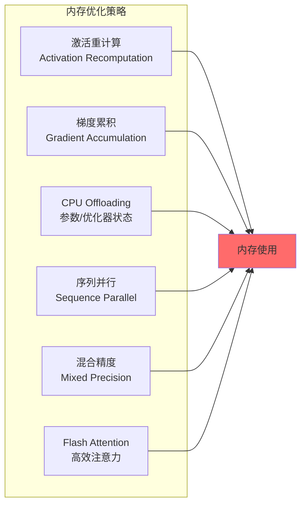

### 9.2 通信优化

1. **重叠通信和计算**
   - 梯度规约与反向传播重叠
   - 参数收集与前向传播重叠

2. **通信融合**
   - 多个小通信操作融合为一个大操作
   - 减少通信次数

3. **通信压缩**
   - FP16/BF16 梯度通信
   - 梯度压缩算法

### 9.3 计算优化

1. **内核融合**
   - LayerNorm + Dropout
   - Bias + GELU
   - Softmax + Mask

2. **高效算子**
   - Flash Attention
   - Fused Adam
   - Fused LayerNorm

3. **CUDA Graphs**
   - 减少内核启动开销

---

## 10. 最佳实践

### 10.1 启动配置示例

```bash
#!/bin/bash
# 关键参数配置示例

torchrun \
    --nproc_per_node 8 \
    --nnodes 8 \
    pretrain_gpt.py \
    --tensor-model-parallel-size 4 \
    --pipeline-model-parallel-size 2 \
    --num-layers 40 \
    --hidden-size 5120 \
    --num-attention-heads 40 \
    --seq-length 4096 \
    --micro-batch-size 1 \
    --global-batch-size 256 \
    --lr 1.5e-4 \
    --min-lr 1.5e-5 \
    --lr-decay-style cosine \
    --weight-decay 0.1 \
    --clip-grad 1.0 \
    --fp16 \
    --use-distributed-optimizer \
    --overlap-grad-reduce \
    --overlap-param-gather
```

**关键参数说明**:
- `tensor-model-parallel-size`: 张量并行度
- `pipeline-model-parallel-size`: 流水线并行度
- `global-batch-size`: 全局批次大小 = micro-batch-size × DP × 梯度累积步数
- `overlap-grad-reduce`: 重叠梯度通信与计算
- `use-distributed-optimizer`: 启用分布式优化器

### 10.2 调试技巧

1. **启用详细日志**
   ```bash
   export NCCL_DEBUG=INFO
   export TORCH_DISTRIBUTED_DEBUG=DETAIL
   ```

2. **检查张量形状**
   ```python
   from megatron.core import mpu
   print(f"TP rank: {mpu.get_tensor_model_parallel_rank()}")
   print(f"Tensor shape: {tensor.shape}")
   ```

3. **验证梯度**
   ```python
   # 检查梯度是否为 NaN
   for name, param in model.named_parameters():
       if param.grad is not None:
           if torch.isnan(param.grad).any():
               print(f"NaN gradient in {name}")
   ```

---

## 11. 总结

### 11.1 核心优势

1. **高性能**: GPU 优化的内核和通信策略
2. **可扩展**: 支持千卡级别的大规模训练
3. **灵活性**: 模块化设计，易于定制
4. **生态丰富**: 与多个框架和工具集成

### 11.2 适用场景

- 大规模预训练（1B - 1000B+ 参数）
- 多模态模型训练（文本、图像、视频）
- 细粒度 MoE 模型训练（DeepSeek-V3、Qwen3、Mixtral）
- 超长上下文模型（32K - 256K+ tokens）
- 高性能分布式推理
- Blackwell 平台优化训练
- 跨数据中心训练（N/S连接）

### 11.3 学习路径


### 11.4 参考资源

- **官方文档**: https://docs.nvidia.com/Megatron-Core/
- **GitHub 仓库**: https://github.com/NVIDIA/Megatron-LM
- **论文**:
  - [Megatron-LM: Training Multi-Billion Parameter Language Models Using Model Parallelism](https://arxiv.org/abs/1909.08053)
  - [Efficient Large-Scale Language Model Training on GPU Clusters Using Megatron-LM](https://arxiv.org/abs/2104.04473)
  - [Reducing Activation Recomputation in Large Transformer Models](https://arxiv.org/abs/2205.05198)

---

**报告结束**

_此报告基于 Megatron-LM v0.14.0 代码库分析生成_
