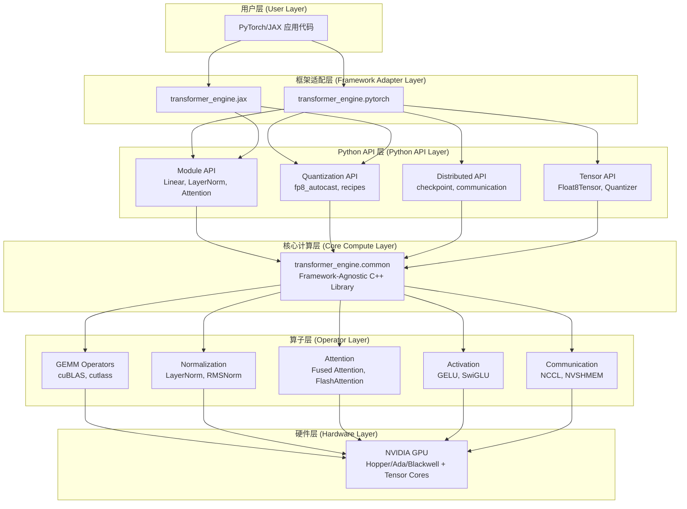
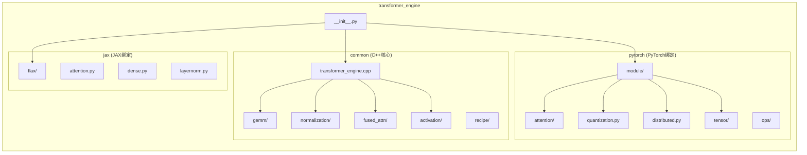
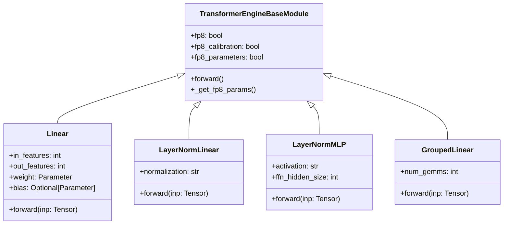
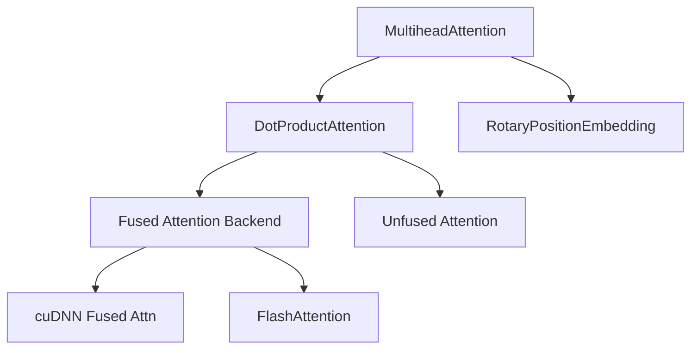
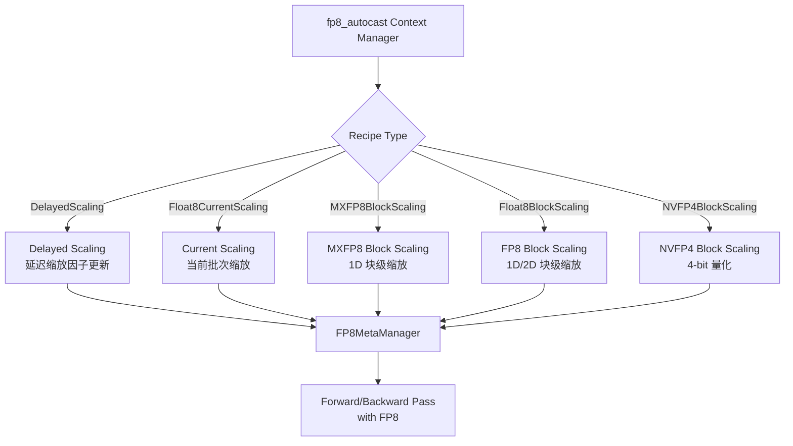
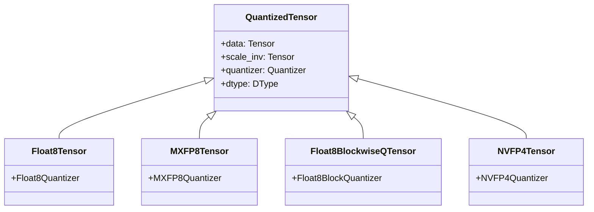
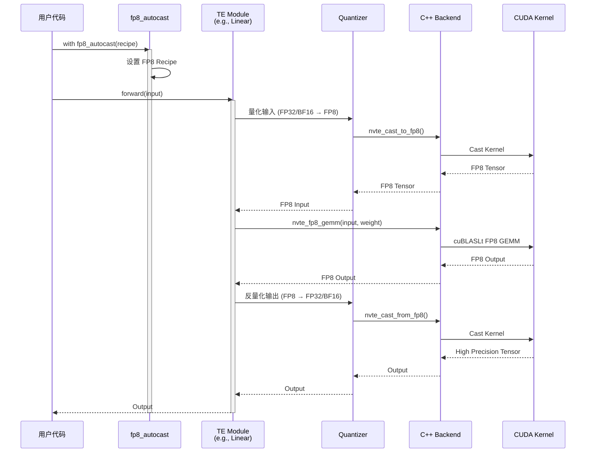
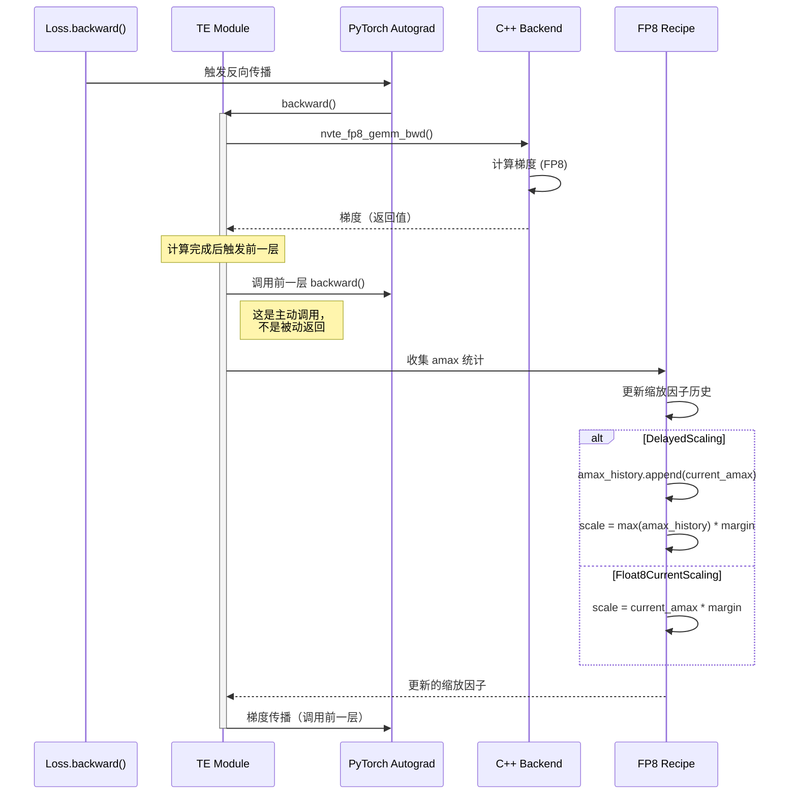
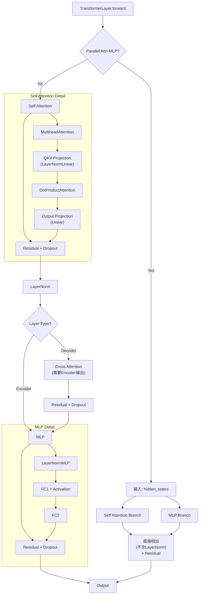
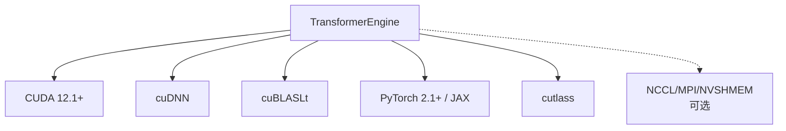

# Transformer Engine 架构设计分析文档

## 1. 项目概述

### 1.1 项目简介
**Transformer Engine (TE)** 是 NVIDIA 开发的高性能 Transformer 模型加速库，专门用于在 NVIDIA GPU（Hopper、Ada、Blackwell 架构）上加速 Transformer 模型的训练和推理。核心特性是支持 8 位浮点数（FP8）精度，在保持模型精度的同时显著降低内存占用和提升性能。

### 1.2 核心特性
- **FP8/FP4 混合精度训练**：支持 E4M3、E5M2、NVFP4 等多种低精度格式
- **框架无关**：提供 C++ API 以及 PyTorch、JAX 的 Python 绑定
- **高度优化**：融合算子、优化的 GEMM 内核、cuDNN 集成
- **CPU Offload**：支持激活值卸载到 CPU，降低 GPU 内存占用
- **易用性**：类似 automatic mixed precision 的 API 设计
- **分布式训练支持**：内置 MPI、NVSHMEM 支持

### 1.3 技术栈
- **核心语言**：C++、CUDA
- **Python 绑定**：Pybind11
- **深度学习框架**：PyTorch 2.1+、JAX
- **构建系统**：CMake、setuptools
- **依赖库**：
  - **CUDA 12.1+**：GPU 编程基础
  - **cuBLASLt**：NVIDIA 高性能线性代数库（Lightweight 版本），提供 FP8 GEMM 支持
  - **cuDNN**：深度神经网络加速库，提供融合注意力实现
  - **cutlass**：CUDA 模板化线性代数库，用于自定义高性能 kernel
  - **NCCL**（可选）：多 GPU 通信
  - **NVSHMEM**（可选）：对称内存访问，低延迟通信

---

## 2. 系统架构设计

### 2.1 整体架构层次



### 2.2 模块架构



---

## 3. 核心组件详细设计

### 3.1 Common Layer (核心 C++ 库)

#### 3.1.1 职责
- 实现框架无关的核心计算逻辑
- 管理 FP8/FP4 量化和缩放因子
- 提供高性能 CUDA 内核
- 类型转换和内存管理

#### 3.1.2 关键模块

**transformer_engine.cpp**
- 张量类型定义和验证
- DType 枚举（kFloat32, kFloat16, kBFloat16, kFloat8E4M3, kFloat8E5M2, kFloat4E2M1）
- 缩放模式管理（NVTE_DELAYED_TENSOR_SCALING, NVTE_MXFP8_1D_SCALING, NVTE_BLOCK_SCALING_1D/2D, NVTE_NVFP4_1D_SCALING）
- 张量合法性检查

**gemm/ (矩阵乘法)**
- `cublaslt_gemm.cu`：基于 cuBLASLt 的高性能 GEMM 实现
  - 支持 FP8/FP16/BF16 混合精度
  - Fast Accumulator、Epilogue Fusion、自动调优
  - 详见 11.4 节 cuBLASLt 详细对比
- `cutlass_grouped_gemm.cu`：基于 cutlass 的分组 GEMM（用于 MoE）

**normalization/ (归一化)**
- LayerNorm、RMSNorm 的 FP8 实现
- 融合的 bias 和 dropout 操作
- Zero-centered gamma 支持

**fused_attn/ (融合注意力)**
- 基于 cuDNN 的融合注意力实现
- 支持多种 mask 类型（causal, padding, arbitrary）
- 滑动窗口注意力（Sliding Window Attention）
- FlashAttention 集成

**activation/ (激活函数)**
- GELU, ReLU, SwiGLU, GEGLU 等
- 支持 FP8 输入输出
- 融合实现以减少内存访问

### 3.2 PyTorch Adapter Layer

#### 3.2.1 Module 子系统



**核心模块**：
1. **Linear**：基础线性层，支持 FP8 权重和激活
2. **LayerNormLinear**：融合 LayerNorm + Linear
3. **LayerNormMLP**：融合 LayerNorm + MLP（两层线性层）
4. **GroupedLinear**：分组线性层（用于 MoE 等场景）
5. **LayerNorm/RMSNorm**：归一化层

#### 3.2.2 Attention 子系统



**关键特性**：
- Multi-Query Attention (MQA)
- Grouped Query Attention (GQA)
- 多种 mask 类型支持
- RoPE（Rotary Position Embedding）
- Sliding Window Attention
- InferenceParams for KV cache
- FP8 DPA (Dot Product Attention) 支持
- FP8 MHA (Multi-Head Attention) 端到端优化

#### 3.2.3 Quantization 子系统



**Recipe 系统**：
- **DelayedScaling**：使用历史 amax 统计更新缩放因子
- **Float8CurrentScaling**：基于当前批次的 amax
- **MXFP8BlockScaling**：Microscaling FP8（适用于 Blackwell）
- **Float8BlockScaling**：块级量化（1D/2D）
- **NVFP4BlockScaling**：4-bit 量化（Blackwell 专用）

#### 3.2.4 Tensor 子系统



### 3.3 JAX Adapter Layer

#### 3.3.1 Flax 集成
- 提供 Flax 兼容的 Module
- JAX JIT 编译支持
- XLA FFI（Foreign Function Interface）集成

#### 3.3.2 核心模块
- `Dense`：线性层
- `LayerNorm`：归一化层
- `DotProductAttention`：注意力机制
- `LayerNormMLP`：融合 MLP

---

## 4. 数据流与调用关系
> 
> **时序图符号说明**：
> - `A->>B`（实线箭头）：A 调用 B 的方法或发送消息
> - `B-->>A`（虚线箭头）：B 返回结果给 A（函数返回值或响应）
> - `activate/deactivate`：表示组件处于活跃状态的生命周期
> - 箭头上的文字：说明具体的调用或返回内容

### 4.1 前向传播数据流



### 4.2 反向传播与缩放因子更新

> **特别说明**：反向传播中的箭头方向与 forward 不同
> - **实线箭头**：既可以表示"调用 backward()"，也可以表示"传递梯度"
> - 在 PyTorch Autograd 中，`backward()` 不是简单的返回值，而是**链式调用**机制
> - 每个模块计算完梯度后，会**主动调用**前一个节点的 `backward()`，因此用实线



**关键概念**：
- **Forward Pass**：`A → B → C`，每层返回输出（虚线返回）
- **Backward Pass**：`C.backward() → B.backward() → A.backward()`，链式调用（实线调用）
- Backward 不是简单的 return，而是触发前一层的计算（Autograd 的核心机制）

### 4.3 TransformerLayer 完整调用链



**关键数据流说明**：
```python
# ========== 代码对应（transformer.py 756-840 行） ==========

# 模式1: 标准顺序模式 (parallel_attention_mlp=False)
# --------------------------------------------------------
# 1. Self Attention 完整流程
attention_output = self.self_attention(hidden_states)
    # MultiheadAttention 内部流程 (multi_head_attention.py 773-1002 行)：
    # hidden_states → LayerNormLinear (含LayerNorm) → QKV分离
    # → DotProductAttention (Q*K^T, softmax, *V)
    # → Output Projection Linear → attention_output

# 2. 第一次残差连接 + Dropout
hidden_states = bias_dropout_add(attention_output, residual)

# 3. Decoder 模式额外的 Cross Attention
if layer_type == "decoder":
    # Query 来自 Self Attention 输出，Key/Value 来自 Encoder 输出
    cross_attn_output = self.inter_attention(
        hidden_states,  # Query
        encoder_output=encoder_output  # Key/Value
    )
    hidden_states = bias_dropout_add(cross_attn_output, hidden_states)

# 4. MLP 流程
mlp_output = self.layernorm_mlp(hidden_states)
    # 内部流程：LayerNorm → FC1 → Activation → FC2

# 5. 第二次残差连接 + Dropout
output = bias_dropout_add(mlp_output, hidden_states)

# 模式2: 并行注意力-MLP模式 (parallel_attention_mlp=True)
# --------------------------------------------------------
# 注意力和MLP并行计算，然后直接相加
self_attention_outputs = self.self_attention(hidden_states)
mlp_outputs = self.layernorm_mlp(hidden_states)  # 同时计算
output = bias_dropout_add(
    self_attention_outputs + mlp_outputs,  # 直接相加
    hidden_states  # 残差
)
```

**注意**：很多架构图会将 Self Attention 画成一个整体模块，从顶部引出输出线。这种表示方法虽然简洁，但容易让人误解 Output Projection Linear 没有对外输出。实际上，**Output Projection 的输出就是整个 Self Attention 模块的输出**。

---

### 4.4 架构图常见误解与代码对照

通过代码 review，以下是容易误解的几个要点：

| 架构图表示 | 常见误解 | 实际代码实现 | 代码位置 |
|-----------|---------|-------------|---------|
| **QKV Projection (LayerNormLinear)** | LayerNorm 在投影之前单独存在 | LayerNormLinear 内部**已包含** LayerNorm<br/>是融合实现 | `multi_head_attention.py:773`<br/>`self.qkv(hidden_states)` |
| **Output Projection 无输出连接** | 只有顶部的连接，底部没输出 | Output Projection 的输出**就是** Self Attention 模块的输出<br/>直接连到 Residual + Dropout | `multi_head_attention.py:1002-1018`<br/>`return (attention_output, ...)` |
| **并行模式的"合并"** | 两个分支各自做residual再合并 | 两个分支输出**直接相加**<br/>只做一次 residual | `transformer.py:836-840`<br/>`bias_dropout_add(attn + mlp, residual)` |
| **Decoder Cross Attention** | 图中只显示单输入 | 需要**两个输入**：<br/>• Query: Self Attn 输出<br/>• Key/Value: Encoder 输出 | `transformer.py:789-819`<br/>`inter_attention(hidden_states, encoder_output)` |
| **LayerNorm 位置** | 在每个模块外部 | Pre-LN：在模块**内部**<br/>Post-LN：在模块外部<br/>TE 默认使用 Pre-LN | `multi_head_attention.py:input_layernorm=True` |

**关键发现**：
1. **融合算子**：`LayerNormLinear` 和 `LayerNormMLP` 都是融合实现，内部包含 LayerNorm
2. **Pre-Layer Norm**：TE 默认使用 Pre-LN 架构（LayerNorm 在 Attention/MLP 之前）
3. **残差连接时机**：每个主要模块（Attention、MLP）之后都有残差连接
4. **并行模式**：是真正的并行（同时计算），不是串行后伪装的并行

---

## 5. 关键技术实现

### 5.1 FP8 量化策略

#### 5.1.1 延迟缩放（Delayed Scaling）
```python
# 伪代码
class DelayedScaling:
    def __init__(self, margin=0, interval=1, fp8_format=E4M3):
        self.amax_history = deque(maxlen=interval)
        self.margin = margin
        
    def get_scale(self, tensor):
        amax = tensor.abs().max()
        self.amax_history.append(amax)
        scale = max(self.amax_history) * (1 + self.margin) / fp8_max
        return scale
```

#### 5.1.2 块级缩放（Block Scaling）
- 将张量分成多个块，每个块独立计算缩放因子
- 减少量化误差，提高精度
- 适用于权重矩阵和激活

### 5.2 融合算子优化

#### 5.2.1 LayerNorm + Linear 融合
```
输入: [seq_len, batch, hidden_dim]
↓
LayerNorm (融合 bias + dropout)
↓
FP8 Cast
↓
FP8 GEMM (weight 预先量化)
↓
FP8 Cast Back
↓
输出: [seq_len, batch, out_dim]
```

**优势**：
- 减少内存访问次数
- 降低量化/反量化开销
- 提高 GPU 利用率

#### 5.2.2 Fused Attention
- 使用 cuDNN 融合的注意力实现
- 支持 FlashAttention-2 后端
- 自动选择最优实现

### 5.3 分布式训练支持

#### 5.3.1 User Buffer (UB)
- 重叠通信和计算
- 支持 FP8 通信
- 基于 NVSHMEM 的低延迟通信

#### 5.3.2 Checkpoint
```python
# 分布式 checkpoint
from transformer_engine.pytorch import checkpoint

# 保存
checkpoint(model, optimizer, save_dir, dist_group)

# 加载
checkpoint.load(model, optimizer, load_dir, dist_group)
```

---

## 6. 性能优化策略

### 6.1 内存优化
1. **FP8 量化**：减少 50% 内存占用
2. **Gradient Checkpointing**：重计算中间激活
3. **CPU Offloading**：将激活值卸载到 CPU 内存
   - 使用 `get_cpu_offload_context()` 管理卸载
   - 支持异步数据传输，减少性能影响
   - 适用于超大模型训练

### 6.2 计算优化
1. **Tensor Core 利用**：FP8 Tensor Core 吞吐量是 FP16 的 2 倍
2. **融合算子**：减少 kernel launch 开销
3. **cuDNN 集成**：使用 cuDNN 优化的注意力实现

### 6.3 通信优化
1. **FP8 All-Reduce**：减少通信数据量
2. **通信计算重叠**：User Buffer 机制
3. **NVSHMEM**：低延迟点对点通信

---

## 7. 扩展性与依赖

### 7.1 自定义 Recipe
```python
from transformer_engine.common.recipe import CustomRecipe

custom_recipe = CustomRecipe(
    margin=0.1, fp8_format=Format.HYBRID,
    amax_history_len=10, amax_compute_algo='max'
)
```

### 7.2 自定义算子
通过 C++ API 扩展新算子，使用 Pybind11 暴露到 Python

### 7.3 框架支持
PyTorch（完整支持）、JAX/Flax、其他框架（通过 C++ API）

### 7.4 依赖关系



---

## 8. 使用示例

### PyTorch 基础示例
```python
import torch
import transformer_engine.pytorch as te
from transformer_engine.common import recipe

# 创建模型
model = te.Linear(768, 3072, bias=True)

# 创建 FP8 Recipe
fp8_recipe = recipe.DelayedScaling(
    margin=0,
    fp8_format=recipe.Format.HYBRID
)

# 前向传播（启用 FP8）
with te.fp8_autocast(enabled=True, recipe=fp8_recipe):
    output = model(input)
```

### TransformerLayer 示例
```python
layer = te.TransformerLayer(
    hidden_size=1024,
    ffn_hidden_size=4096,
    num_attention_heads=16,
    num_gqa_groups=8,  # Grouped Query Attention
    layernorm_epsilon=1e-5,
    hidden_dropout=0.1,
    attention_dropout=0.1,
    self_attn_mask_type='causal',
    normalization='RMSNorm',
    activation='swiglu'
)

with te.fp8_autocast(enabled=True, recipe=fp8_recipe):
    output = layer(hidden_states, attention_mask)
```

### CPU Offload 示例
```python
from transformer_engine.pytorch import get_cpu_offload_context

# 创建 CPU Offload 上下文
cpu_offload_ctx, sync_fn = get_cpu_offload_context(
    enabled=True,
    num_layers=24
)

# 在训练循环中使用
with cpu_offload_ctx:
    output = model(input)
    loss = criterion(output, target)
    
# 同步等待异步传输完成
sync_fn()
loss.backward()
```

---

## 9. 架构设计优势

1. **模块化**：清晰分层（User API → Adapter → Core → Hardware），松耦合易扩展
2. **高性能**：零拷贝设计、融合算子、硬件感知优化
3. **易用性**：Pythonic API、自动管理缩放因子、灵活的 Recipe 系统
4. **工业级**：完备测试、齐全文档、持续集成

---

## 10. 技术挑战与解决方案

### 10.1 数值稳定性
**挑战**：FP8 动态范围小，容易溢出/下溢
**解决方案**：
- Delayed Scaling 策略
- Amax 历史追踪
- Margin 参数调整

### 10.2 性能瓶颈
**挑战**：量化/反量化开销
**解决方案**：
- 融合算子
- 预量化权重
- 端到端 FP8 流程

### 10.3 框架兼容性
**挑战**：不同框架的 autograd 机制不同
**解决方案**：
- 框架无关的 C++ 核心
- 适配层抽象差异
- Custom Autograd Functions

### 10.4 cuBLASLt vs cuBLAS 选择
**挑战**：为什么使用 cuBLASLt 而不是传统 cuBLAS？
**原因分析**：
- **FP8 支持**：cuBLAS 不支持 FP8 数据类型，cuBLASLt 从 CUDA 11.8+ 开始原生支持
- **灵活性**：cuBLASLt 的描述符（Descriptor）API 允许精细控制每个操作细节
- **性能优化**：
  - Fast Accumulator（快速累加器）：针对 Hopper 架构的分块累加优化
  - Epilogue Fusion：将 bias、激活函数等后处理融合到 GEMM kernel 中
  - 自动调优：根据矩阵大小和硬件特性自动选择最优算法
- **缩放因子集成**：直接支持 FP8 的 scale 和 scale_inv 参数，无需额外的 kernel launch

**代码对比**：
```cpp
// cuBLAS (传统 API，不支持 FP8)
cublasSgemm(handle, CUBLAS_OP_N, CUBLAS_OP_N, 
            m, n, k, &alpha, A, lda, B, ldb, &beta, C, ldc);

// cuBLASLt (描述符 API，支持 FP8)
cublasLtMatmul(handle, matmulDesc, &alpha,
               A, Adesc,  // 可指定 FP8 类型和缩放因子
               B, Bdesc, 
               &beta, C, Cdesc, C, Cdesc,
               &algo, workspace, workspaceSize, stream);
```

---

## 11. 未来发展方向

### 12.1 新硬件支持
- **Blackwell 架构优化**：MXFP8、NVFP4
- **多 GPU 架构**：更好的多卡支持

### 12.2 新功能
- **更多融合算子**：Softmax, Dropout 等
- **量化感知训练（QAT）**
- **混合精度策略优化**

### 12.3 生态系统集成
- **Megatron-LM 集成**
- **HuggingFace Transformers 支持**
- **ONNX 导出优化**

---

## 12. 总结

Transformer Engine 是 NVIDIA 开发的**高度模块化、性能优先、易于使用**的 Transformer 加速库。其核心架构设计为大规模 Transformer 模型的高效训练和推理提供了坚实基础，特点包括：分层清晰、框架无关、高性能 FP8 量化、易扩展的 Recipe 系统，以及工业级的测试和文档体系。

---

## 附录

**关键文件**：
- C++ 核心：`transformer_engine/common/` (transformer_engine.cpp, gemm/, fused_attn/, normalization/)
- PyTorch：`transformer_engine/pytorch/` (module/, attention/, quantization.py)
- JAX：`transformer_engine/jax/` (flax/, attention.py)

**资源链接**：
- 官方文档：https://docs.nvidia.com/deeplearning/transformer-engine/
- GitHub：https://github.com/NVIDIA/TransformerEngine

---
